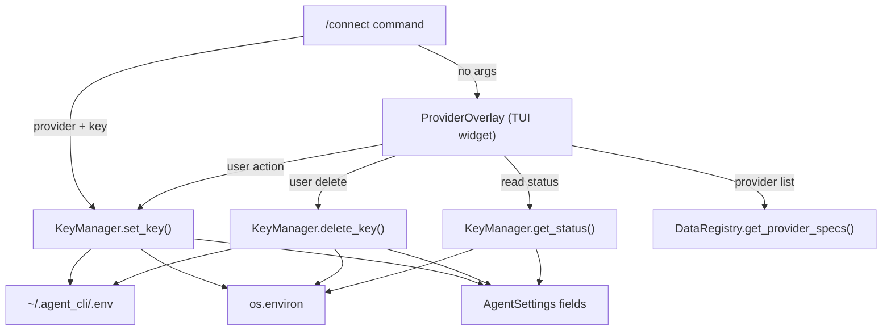

# Feature Implementation Plan: ProviderOverlay — API Key Management

---

## 1. Overview

| Field              | Value                                            |
|:-------------------|:-------------------------------------------------|
| **Feature**        | User-friendly TUI overlay for managing LLM provider API keys |
| **Source**         | N/A — standalone                                 |
| **Motivation**     | Users currently must manually edit `~/.agent_cli/.env` to configure API keys. A TUI widget makes onboarding and key rotation frictionless. |
| **User-Facing?**   | Yes — new `/connect` command and interactive overlay |
| **Scope**          | Built-in providers only. Includes provider data refactor (split [providers.json](file:///x:/agent_cli/agent_cli/data/providers.json) → per-file), dead field cleanup (`default_model`), `KeyManager` service, overlay widget, `/connect` command. |
| **Estimated Effort** | M — 4 phases across data, service, UI, and integration layers |

### 1.1 Requirements

| # | Requirement | Priority | Acceptance Criterion |
|:-:|:------------|:--------:|:---------------------|
| R1 | Split [providers.json](file:///x:/agent_cli/agent_cli/data/providers.json) into per-provider files in `data/providers/` | Must | DataRegistry loads from directory; old file removed |
| R2 | Remove dead `default_model` from provider config/spec | Must | Field removed from dataclasses, data files, and all parsing code |
| R3 | Add `require_verification` flag per provider | Must | Ollama = `false`, all others = `true`; field available in [ProviderSpec](file:///x:/agent_cli/agent_cli/core/infra/config/config_models.py#109-120) and [ProviderConfig](file:///x:/agent_cli/agent_cli/core/infra/config/config_models.py#58-75) |
| R4 | Add `api_key_env` to all key-bearing providers | Must | Every provider that requires verification declares its env var name |
| R5 | `KeyManager` service persists keys to `~/.agent_cli/.env` | Must | Write/delete operations update the `.env` file atomically |
| R6 | Keys hot-reload into running app (no restart needed) | Must | After set/delete, `os.environ` + [AgentSettings](file:///x:/agent_cli/agent_cli/core/infra/config/config.py#96-364) fields updated |
| R7 | `/connect` opens the ProviderOverlay | Must | Command registered, overlay toggles visibility |
| R8 | `/connect <provider> <key>` sets a key directly | Must | Key saved without opening the overlay |
| R9 | ProviderOverlay shows all built-in providers with status (✅/❌) | Must | Status reflects current key availability |
| R10 | User can set/change a key via inline input (session-overlay rename style) | Must | Press Enter on a provider → input appears → type key → Enter saves |
| R11 | User can delete a key via keyboard shortcut | Must | `ctrl+d` removes the key from `.env` and runtime |
| R12 | Keys set via shell environment variables are locked | Must | Row shows ✅ + 🔒 and is non-interactive (no edit/delete) |

### 1.2 Assumptions & Open Questions

- ✅ `python-dotenv` is available as a transitive dependency via `pydantic-settings` — use `dotenv.set_key()` and `dotenv.unset_key()` for file I/O.
- ✅ `~/.agent_cli/.env` is the canonical key storage path (already configured in `AgentSettings.model_config`).
- ✅ No key validation — accept any non-empty string.
- ✅ Provider list is data-driven from `data/providers/` — no user TOML providers shown.

### 1.3 Out of Scope

- Key validation (test API calls)
- User-added TOML providers in the overlay
- Provider-specific configuration (base_url editing, etc.)
- Keyring integration in the overlay (existing keyring fallback in `AgentSettings.resolve_api_key` is untouched)

---

## 2. Codebase Context

### 2.1 Related Existing Code

| Component | File Path | Relevance |
|:----------|:----------|:----------|
| [SessionOverlay](file:///x:/agent_cli/agent_cli/core/ux/tui/views/common/session_overlay.py#21-436) | [core/ux/tui/views/common/session_overlay.py](file:///x:/agent_cli/agent_cli/core/ux/tui/views/common/session_overlay.py) | **Primary UI pattern** — rename-input flow is the template for key-input flow |
| [ProviderOverlay](file:///x:/agent_cli/agent_cli/core/ux/tui/views/provider_manager/provider_overlay.py#6-18) (scaffold) | [core/ux/tui/views/provider_manager/provider_overlay.py](file:///x:/agent_cli/agent_cli/core/ux/tui/views/provider_manager/provider_overlay.py) | Existing 18-line scaffold to flesh out |
| [AgentSettings](file:///x:/agent_cli/agent_cli/core/infra/config/config.py#96-364) | [core/infra/config/config.py](file:///x:/agent_cli/agent_cli/core/infra/config/config.py) | API key fields, `.env` loading, [resolve_api_key()](file:///x:/agent_cli/agent_cli/core/infra/config/config.py#313-334) |
| [ProviderManager](file:///x:/agent_cli/agent_cli/core/providers/manager.py#31-295) | [core/providers/manager.py](file:///x:/agent_cli/agent_cli/core/providers/manager.py) | [_resolve_api_key()](file:///x:/agent_cli/agent_cli/core/providers/manager.py#221-245) — the runtime key resolution chain |
| [DataRegistry](file:///x:/agent_cli/agent_cli/core/infra/registry/registry.py#31-814) | [core/infra/registry/registry.py](file:///x:/agent_cli/agent_cli/core/infra/registry/registry.py) | [_load_json("providers.json")](file:///x:/agent_cli/agent_cli/core/infra/registry/registry.py#391-406), [_get_provider_specs_cached()](file:///x:/agent_cli/agent_cli/core/infra/registry/registry.py#495-535), [get_builtin_providers()](file:///x:/agent_cli/agent_cli/core/infra/registry/registry.py#105-119) |
| [ProviderConfig](file:///x:/agent_cli/agent_cli/core/infra/config/config_models.py#58-75) / [ProviderSpec](file:///x:/agent_cli/agent_cli/core/infra/config/config_models.py#109-120) | [core/infra/config/config_models.py](file:///x:/agent_cli/agent_cli/core/infra/config/config_models.py) | Data models for provider configuration |
| [cmd_sessions](file:///x:/agent_cli/agent_cli/core/ux/commands/handlers/session.py#11-35) | [core/ux/commands/handlers/session.py](file:///x:/agent_cli/agent_cli/core/ux/commands/handlers/session.py) | Pattern for overlay-opening commands |
| [_build_command_registry](file:///x:/agent_cli/agent_cli/core/infra/registry/bootstrap.py#903-1039) | `core/infra/registry/bootstrap.py:L903` | Where commands are registered |
| `AgentCLIApp.compose` | `core/ux/tui/app.py:L64` | Where [ProviderOverlay](file:///x:/agent_cli/agent_cli/core/ux/tui/views/provider_manager/provider_overlay.py#6-18) is already yielded |
| [app.tcss](file:///x:/agent_cli/agent_cli/assets/app.tcss) | `assets/app.tcss:L801-861` | Existing ProviderOverlay CSS scaffold |

### 2.2 Patterns & Conventions to Follow

- **Overlay pattern**: Full-screen transparent container with centered panel, `layer: overlay`, toggled via `.visible` CSS class. See [SessionOverlay](file:///x:/agent_cli/agent_cli/core/ux/tui/views/common/session_overlay.py#21-436).
- **Inline input pattern**: Hidden `Input` widget revealed via `.visible` class, focuses on show, captured via [on_input_submitted](file:///x:/agent_cli/agent_cli/core/ux/tui/views/common/session_overlay.py#116-129). See `SessionOverlay._begin_rename_selected_session()`.
- **Command registration**: [CommandDef](file:///x:/agent_cli/agent_cli/core/ux/commands/base.py#49-59) instances registered in [_build_command_registry()](file:///x:/agent_cli/agent_cli/core/infra/registry/bootstrap.py#903-1039) in bootstrap.
- **Data loading**: Directory-based loading already exists for models ([_load_offerings](file:///x:/agent_cli/agent_cli/core/infra/registry/registry.py#407-476)). Providers should follow a similar pattern.
- **Imports**: Absolute imports from root (`agent_cli.core...`).
- **Helpers**: [_notify()](file:///x:/agent_cli/agent_cli/core/ux/tui/views/common/session_overlay.py#431-436), [_get_app_context()](file:///x:/agent_cli/agent_cli/core/ux/tui/views/common/session_overlay.py#410-415) as private methods on overlay widgets.

### 2.3 Integration Points

| Integration Point | File Path | How It Connects |
|:------------------|:----------|:----------------|
| DataRegistry init | `registry.py:L61` | Change from [_load_json("providers.json")](file:///x:/agent_cli/agent_cli/core/infra/registry/registry.py#391-406) to directory loading |
| [_get_provider_specs_cached](file:///x:/agent_cli/agent_cli/core/infra/registry/registry.py#495-535) | `registry.py:L495-534` | Parse new fields (`require_verification`, `api_key_env`), remove `default_model` |
| [get_builtin_providers](file:///x:/agent_cli/agent_cli/core/infra/registry/registry.py#105-119) | `registry.py:L105-118` | Remove `default_model` mapping, add `require_verification` |
| [load_providers](file:///x:/agent_cli/agent_cli/core/infra/config/config.py#371-420) in config.py | `config.py:L371-419` | Remove `default_model` from merge logic |
| [ProviderConfig](file:///x:/agent_cli/agent_cli/core/infra/config/config_models.py#58-75) dataclass | `config_models.py:L58-74` | Remove `default_model`, add `require_verification` |
| [ProviderSpec](file:///x:/agent_cli/agent_cli/core/infra/config/config_models.py#109-120) dataclass | `config_models.py:L109-119` | Remove `default_model`, add `require_verification` |
| [_build_command_registry](file:///x:/agent_cli/agent_cli/core/infra/registry/bootstrap.py#903-1039) | `bootstrap.py:L903` | Register `/connect` command |
| `AgentCLIApp.__init__` | `app.py:L42` | Wire [ProviderOverlay](file:///x:/agent_cli/agent_cli/core/ux/tui/views/provider_manager/provider_overlay.py#6-18) instance for command access |
| [app.tcss](file:///x:/agent_cli/agent_cli/assets/app.tcss) | `assets/app.tcss:L801-861` | Expand CSS for full overlay UI |

---

## 3. Design

### 3.1 Architecture Overview

The feature introduces a `KeyManager` service that owns all API key mutations (`.env` file + runtime state). The [ProviderOverlay](file:///x:/agent_cli/agent_cli/core/ux/tui/views/provider_manager/provider_overlay.py#6-18) widget provides the TUI surface, reading provider metadata from [DataRegistry](file:///x:/agent_cli/agent_cli/core/infra/registry/registry.py#31-814) and delegating key operations to `KeyManager`. The `/connect` command serves as the entry point, with a dual-mode interface (overlay toggle vs. direct set).



### 3.2 New Components

| Component | Type | File Path | Responsibility |
|:----------|:-----|:----------|:---------------|
| `KeyManager` | Class | `core/infra/config/key_manager.py` | Atomic key set/delete across `.env`, `os.environ`, and [AgentSettings](file:///x:/agent_cli/agent_cli/core/infra/config/config.py#96-364); status queries |
| `cmd_connect` | Function | [core/ux/commands/handlers/core.py](file:///x:/agent_cli/agent_cli/core/ux/commands/handlers/core.py) | `/connect` command handler (dual mode) |
| Per-provider JSON | Data | `data/providers/{name}.json` × 7 | Individual provider definitions |

### 3.3 Modified Components

| Component | File Path | What Changes | Why |
|:----------|:----------|:-------------|:----|
| [ProviderConfig](file:///x:/agent_cli/agent_cli/core/infra/config/config_models.py#58-75) | [config_models.py](file:///x:/agent_cli/agent_cli/core/infra/config/config_models.py) | Remove `default_model`, add `require_verification: bool = True` | Dead field removal + new flag |
| [ProviderSpec](file:///x:/agent_cli/agent_cli/core/infra/config/config_models.py#109-120) | [config_models.py](file:///x:/agent_cli/agent_cli/core/infra/config/config_models.py) | Remove `default_model`, add `require_verification: bool = True` | Mirror ProviderConfig |
| `DataRegistry.__init__` | [registry.py](file:///x:/agent_cli/agent_cli/core/infra/registry/registry.py) | Load providers from directory instead of single JSON | Provider data refactor |
| `DataRegistry._get_provider_specs_cached` | [registry.py](file:///x:/agent_cli/agent_cli/core/infra/registry/registry.py) | Parse `require_verification`, remove `default_model` parsing | New field + cleanup |
| `DataRegistry.get_builtin_providers` | [registry.py](file:///x:/agent_cli/agent_cli/core/infra/registry/registry.py) | Remove `default_model=`, add `require_verification=` | Field changes |
| [load_providers](file:///x:/agent_cli/agent_cli/core/infra/config/config.py#371-420) | [config.py](file:///x:/agent_cli/agent_cli/core/infra/config/config.py) | Remove `default_model` from merge logic | Dead field cleanup |
| [ProviderOverlay](file:///x:/agent_cli/agent_cli/core/ux/tui/views/provider_manager/provider_overlay.py#6-18) | [provider_overlay.py](file:///x:/agent_cli/agent_cli/core/ux/tui/views/provider_manager/provider_overlay.py) | Full rewrite — dynamic provider list, status, key input, keyboard nav | Core UI implementation |
| [AgentCLIApp](file:///x:/agent_cli/agent_cli/core/ux/tui/app.py#29-260) | [app.py](file:///x:/agent_cli/agent_cli/core/ux/tui/app.py) | Store [ProviderOverlay](file:///x:/agent_cli/agent_cli/core/ux/tui/views/provider_manager/provider_overlay.py#6-18) as named attribute for command access | Enable `/connect` wiring |
| [_build_command_registry](file:///x:/agent_cli/agent_cli/core/infra/registry/bootstrap.py#903-1039) | [bootstrap.py](file:///x:/agent_cli/agent_cli/core/infra/registry/bootstrap.py) | Register `/connect` command | New command |
| [app.tcss](file:///x:/agent_cli/agent_cli/assets/app.tcss) | [assets/app.tcss](file:///x:/agent_cli/agent_cli/assets/app.tcss) | Expand ProviderOverlay CSS for full overlay | Styling |

### 3.4 Data Model / Schema Changes

**Per-provider file format** (`data/providers/{name}.json`):

```json
{
  "adapter_type": "openai",
  "api_key_env": "OPENAI_API_KEY",
  "require_verification": true,
  "base_url": null,
  "api_profile": {}
}
```

**[ProviderConfig](file:///x:/agent_cli/agent_cli/core/infra/config/config_models.py#58-75) (after changes)**:
```python
@dataclass
class ProviderConfig:
    adapter_type: str
    base_url: Optional[str] = None
    api_key_env: Optional[str] = None
    supports_native_tools: bool = True
    max_context_tokens: Optional[int] = None
    api_profile: Dict[str, Any] = field(default_factory=dict)
    require_verification: bool = True  # NEW
    # default_model: REMOVED
```

**[ProviderSpec](file:///x:/agent_cli/agent_cli/core/infra/config/config_models.py#109-120) (after changes)**:
```python
@dataclass
class ProviderSpec:
    name: str
    adapter_type: str
    base_url: Optional[str] = None
    api_key_env: Optional[str] = None
    max_context_tokens: Optional[int] = None
    api_profile: Dict[str, Any] = field(default_factory=dict)
    require_verification: bool = True  # NEW
    # default_model: REMOVED
```

**Provider-to-env-var mapping** (declared in data files):

| Provider | File | `api_key_env` | `require_verification` |
|:---------|:-----|:--------------|:----------------------|
| openai | `openai.json` | `OPENAI_API_KEY` | `true` |
| azure | `azure.json` | `AZURE_OPENAI_API_KEY` | `true` |
| anthropic | `anthropic.json` | `ANTHROPIC_API_KEY` | `true` |
| google | `google.json` | `GOOGLE_API_KEY` | `true` |
| huggingface | `huggingface.json` | `HF_TOKEN` | `true` |
| openrouter | `openrouter.json` | `OPENROUTER_API_KEY` | `true` |
| ollama | `ollama.json` | *(none)* | `false` |

### 3.5 API / Interface Contract

**KeyManager**:
```python
class KeyManager:
    def __init__(self, settings: AgentSettings, dotenv_path: Path | None = None): ...

    def set_key(self, provider_name: str, env_var: str, value: str) -> bool:
        """Write key to .env, os.environ, and settings. Returns True on success."""

    def delete_key(self, provider_name: str, env_var: str) -> bool:
        """Remove key from .env, os.environ, and settings. Returns True on success."""

    def is_key_set(self, provider_name: str) -> bool:
        """Check if a key is currently available (any source)."""

    def get_key_source(self, env_var: str) -> str:
        """Detect where a key comes from.
        Returns:
            'env'    — set via shell environment variable (NOT in .env) → locked
            'dotenv' — set via ~/.agent_cli/.env → editable
            'none'   — not set anywhere
        """
```

**Key source detection logic**:
- Read `~/.agent_cli/.env` via `dotenv.dotenv_values()` to get dotenv-managed keys
- If `env_var` exists in the `.env` file → source is `"dotenv"` (user-managed, editable)
- Else if `env_var` exists in `os.environ` → source is `"env"` (external, locked)
- Else → `"none"` (not set)

**`/connect` command**:
```
/connect                    → Opens ProviderOverlay
/connect <provider> <key>   → Sets key directly via KeyManager
```

### 3.6 Design Decisions

| Decision | Alternatives Considered | Why This Choice |
|:---------|:-----------------------|:----------------|
| Use `dotenv.set_key()`/`unset_key()` for .env I/O | Custom file parser | `python-dotenv` already a transitive dependency; battle-tested edge case handling |
| 3-step hot-reload (`.env` + `os.environ` + settings) | Restart-only; Re-instantiate settings | Hot-reload is essential UX; re-instantiation would reset all runtime state |
| Provider list from [DataRegistry](file:///x:/agent_cli/agent_cli/core/infra/registry/registry.py#31-814) (data-driven) | Hardcoded list in overlay | Consistent with codebase pattern; auto-includes future providers |
| Session-overlay rename-style key input | Modal dialog; dedicated screen | Consistent UX pattern; users already know the interaction model |
| `require_verification` as data field | Hardcode ollama exception | Data-driven approach scales to future providers (e.g., local LLaMA) |
| Lock env-var-set keys (non-interactive) | Allow override; warning only | Prevents confusion — if a key comes from the shell environment, the user set it intentionally outside the app. Overriding it in `.env` would create hidden precedence conflicts. |
| Dynamic alias introspection for settings field lookup | Hardcoded `_SETTINGS_FIELD_MAP` dict | Fully data-driven — provider's `api_key_env` matches the [AgentSettings](file:///x:/agent_cli/agent_cli/core/infra/config/config.py#96-364) field alias. Adding a provider never requires editing `KeyManager`. |

---

## 4. Testing Strategy

### 4.1 Test Plan

| Requirement | Test Name | Type | Description |
|:-----------:|:----------|:-----|:------------|
| R1 | `test_provider_files_load_from_directory` | Unit | DataRegistry loads all providers from `data/providers/` |
| R2 | `test_default_model_removed_from_specs` | Unit | [ProviderSpec](file:///x:/agent_cli/agent_cli/core/infra/config/config_models.py#109-120) and [ProviderConfig](file:///x:/agent_cli/agent_cli/core/infra/config/config_models.py#58-75) have no `default_model` attribute |
| R3 | `test_require_verification_field` | Unit | Ollama has `require_verification=False`, others `True` |
| R4 | `test_api_key_env_declared` | Unit | All providers with `require_verification=True` have non-empty `api_key_env` |
| R5 | `test_key_manager_set_writes_env_file` | Unit | `KeyManager.set_key()` writes to `.env` file |
| R6 | `test_key_manager_set_updates_os_environ` | Unit | After `set_key()`, `os.environ` contains the value |
| R7-R8 | `test_connect_command_opens_overlay` | Integration | `/connect` with no args triggers overlay |
| R11 | `test_key_manager_delete_removes_from_env` | Unit | `KeyManager.delete_key()` removes line from `.env` |
| R12 | `test_key_source_detection` | Unit | `get_key_source()` returns `"env"`, `"dotenv"`, or `"none"` correctly |

### 4.2 Edge Cases & Error Scenarios

| Scenario | Expected Behavior | Test Name |
|:---------|:------------------|:----------|
| `.env` file doesn't exist yet | `KeyManager` creates it on first write | `test_key_manager_creates_env_file` |
| Set key for provider without `api_key_env` (ollama) | Returns `False`, no-op | `test_key_manager_set_no_env_var` |
| Empty key string | Rejected, returns `False` | `test_key_manager_rejects_empty_key` |
| Delete key that isn't set | No-op, returns `True` | `test_key_manager_delete_missing_key` |
| Key set in os.environ but not .env | `get_key_source()` returns `"env"` | `test_key_source_env_only` |
| Key set in .env file | `get_key_source()` returns `"dotenv"` | `test_key_source_dotenv` |
| Key set in both os.environ and .env | `get_key_source()` returns `"dotenv"` (managed) | `test_key_source_both` |

### 4.3 Existing Tests to Modify

| Test | File | Modification Needed |
|:-----|:-----|:--------------------|
| Data integrity tests | [dev/tests/data/test_data_integrity.py](file:///x:/agent_cli/dev/tests/data/test_data_integrity.py) | Update to validate per-provider files instead of [providers.json](file:///x:/agent_cli/agent_cli/data/providers.json) |
| Provider base tests | [dev/tests/providers/test_provider_base.py](file:///x:/agent_cli/dev/tests/providers/test_provider_base.py) | Verify `default_model` removal doesn't break provider instantiation |

---

## 5. Implementation Phases

---

### Phase 1: Provider Data Refactor

**Goal**: Split [providers.json](file:///x:/agent_cli/agent_cli/data/providers.json) into per-provider files, remove `default_model`, add `require_verification` and `api_key_env` — all existing functionality preserved.

**Prerequisites**: None

#### Steps

1. **Create per-provider JSON files** — `data/providers/{name}.json`
   - File: `agent_cli/data/providers/openai.json`
   ```json
   {
     "adapter_type": "openai",
     "api_key_env": "OPENAI_API_KEY",
     "require_verification": true
   }
   ```
   - File: `agent_cli/data/providers/azure.json`
   ```json
   {
     "adapter_type": "openai",
     "base_url": "https://YOUR-RESOURCE.openai.azure.com/openai/v1",
     "api_key_env": "AZURE_OPENAI_API_KEY",
     "require_verification": true
   }
   ```
   - File: `agent_cli/data/providers/anthropic.json`
   ```json
   {
     "adapter_type": "anthropic",
     "base_url": "https://api.anthropic.com",
     "api_key_env": "ANTHROPIC_API_KEY",
     "require_verification": true
   }
   ```
   - File: `agent_cli/data/providers/google.json`
   ```json
   {
     "adapter_type": "google",
     "api_key_env": "GOOGLE_API_KEY",
     "require_verification": true
   }
   ```
   - File: `agent_cli/data/providers/huggingface.json`
   ```json
   {
     "adapter_type": "openai_compatible",
     "base_url": "https://router.huggingface.co/v1",
     "api_key_env": "HF_TOKEN",
     "require_verification": true
   }
   ```
   - File: `agent_cli/data/providers/openrouter.json`
   ```json
   {
     "adapter_type": "openai_compatible",
     "base_url": "https://openrouter.ai/api/v1",
     "api_key_env": "OPENROUTER_API_KEY",
     "require_verification": true,
     "api_profile": {
       "web_search": {
         "mutations": [
           { "op": "append_model_suffix", "value": ":online" },
           { "op": "merge_body", "value": { "plugins": [{ "id": "web" }] } }
         ]
       }
     }
   }
   ```
   - File: `agent_cli/data/providers/ollama.json`
   ```json
   {
     "adapter_type": "openai_compatible",
     "base_url": "http://localhost:11434/v1",
     "require_verification": false
   }
   ```

2. **Remove `default_model` from data models**
   - File: [agent_cli/core/infra/config/config_models.py](file:///x:/agent_cli/agent_cli/core/infra/config/config_models.py)
   - Remove `default_model: Optional[str] = None` from both [ProviderConfig](file:///x:/agent_cli/agent_cli/core/infra/config/config_models.py#58-75) (line 71) and [ProviderSpec](file:///x:/agent_cli/agent_cli/core/infra/config/config_models.py#109-120) (line 117)
   - Add `require_verification: bool = True` to both classes

3. **Update [DataRegistry](file:///x:/agent_cli/agent_cli/core/infra/registry/registry.py#31-814) to load providers from directory**
   - File: [agent_cli/core/infra/registry/registry.py](file:///x:/agent_cli/agent_cli/core/infra/registry/registry.py)
   - Add new method `_load_providers_dir(directory: str)` modeled after [_load_offerings()](file:///x:/agent_cli/agent_cli/core/infra/registry/registry.py#407-476):
     - Iterate `data/providers/*.json`
     - Filename (minus [.json](file:///x:/agent_cli/agent_cli/data/providers.json)) becomes the provider name
     - Return `dict[str, dict[str, Any]]`
   - Change [__init__](file:///x:/agent_cli/agent_cli/core/providers/adapter_registry.py#30-33): replace `self._providers = self._load_json("providers.json")` with `self._providers = self._load_providers_dir("providers")`
   - Update [_get_provider_specs_cached()](file:///x:/agent_cli/agent_cli/core/infra/registry/registry.py#495-535):
     - Change `self._mapping(self._providers.get("providers"))` → `self._providers` (no wrapper key needed)
     - Remove `default_model` parsing (lines 522-526)
     - Add `require_verification` parsing
   - Update [get_builtin_providers()](file:///x:/agent_cli/agent_cli/core/infra/registry/registry.py#105-119):
     - Remove `default_model=spec.default_model` (line 112)
     - Add `require_verification=spec.require_verification`
   - Update [__init__](file:///x:/agent_cli/agent_cli/core/providers/adapter_registry.py#30-33) logging to use new structure

4. **Update [load_providers()](file:///x:/agent_cli/agent_cli/core/infra/config/config.py#371-420) in config.py**
   - File: [agent_cli/core/infra/config/config.py](file:///x:/agent_cli/agent_cli/core/infra/config/config.py)
   - Remove `default_model` from merge logic (lines 395, 410)
   - Add `require_verification` to merge logic with default from existing or `True`

5. **Delete old [providers.json](file:///x:/agent_cli/agent_cli/data/providers.json)**
   - File: [agent_cli/data/providers.json](file:///x:/agent_cli/agent_cli/data/providers.json) — DELETE

#### Checkpoint

- [ ] All 7 provider files exist in `data/providers/`
- [ ] [providers.json](file:///x:/agent_cli/agent_cli/data/providers.json) deleted
- [ ] App starts successfully: `python -m agent_cli`
- [ ] [ProviderConfig](file:///x:/agent_cli/agent_cli/core/infra/config/config_models.py#58-75) and [ProviderSpec](file:///x:/agent_cli/agent_cli/core/infra/config/config_models.py#109-120) have `require_verification`, no `default_model`
- [ ] Tests pass: `pytest dev/tests/ -v`

---

### Phase 2: KeyManager Service

**Goal**: Encapsulate all API key mutations (`.env` + `os.environ` + [AgentSettings](file:///x:/agent_cli/agent_cli/core/infra/config/config.py#96-364)) in a single service class.

**Prerequisites**: Phase 1 checkpoint passed

#### Steps

1. **Create `KeyManager` class**
   - File: `agent_cli/core/infra/config/key_manager.py`
   - Details:
   ```python
   class KeyManager:
       def __init__(self, settings: AgentSettings, dotenv_path: Path | None = None):
           self._settings = settings
           self._dotenv_path = dotenv_path or Path.home() / ".agent_cli" / ".env"

       def set_key(self, provider_name: str, env_var: str, value: str) -> bool:
           """3-step atomic write: .env → os.environ → settings field."""
           # 1. Write to .env file (create if missing)
           # 2. os.environ[env_var] = value
           # 3. Auto-discover settings field via _find_settings_field(env_var)
           #    and update it if found

       def delete_key(self, provider_name: str, env_var: str) -> bool:
           """3-step atomic delete: .env → os.environ → settings field."""
           # 1. Remove from .env file
           # 2. del os.environ[env_var]
           # 3. Auto-discover settings field and set to None

       def is_key_set(self, provider_name: str) -> bool:
           """Check if a key is available via settings.resolve_api_key()."""
           key = self._settings.resolve_api_key(provider_name)
           return bool(key and str(key).strip())

       def get_key_source(self, env_var: str) -> str:
           """Detect key source: 'env' (shell, locked), 'dotenv' (managed), or 'none'."""
           # 1. Check .env file via dotenv.dotenv_values()
           # 2. Check os.environ
           # 3. Return 'none'

       def _find_settings_field(self, env_var: str) -> str | None:
           """Reverse-lookup: find AgentSettings field whose alias matches env_var.

           The api_key_env from provider data files (e.g., "OPENAI_API_KEY")
           matches the Pydantic alias on AgentSettings fields. This makes the
           mapping fully data-driven — no hardcoded map needed.

           Example: _find_settings_field("OPENAI_API_KEY") → "openai_api_key"
           """
           for field_name, field_info in AgentSettings.model_fields.items():
               if field_info.alias == env_var:
                   return field_name
           return None
   ```

   > **Why no hardcoded map?** The `api_key_env` declared in each provider’s
   > data file already matches the Pydantic `alias` on the corresponding
   > [AgentSettings](file:///x:/agent_cli/agent_cli/core/infra/config/config.py#96-364) field. `_find_settings_field()` introspects the model
   > metadata at runtime, so adding a new provider only requires:
   > 1. A new `data/providers/{name}.json` with `api_key_env`
   > 2. A new field in [AgentSettings](file:///x:/agent_cli/agent_cli/core/infra/config/config.py#96-364) with a matching `alias`
   > No `KeyManager` code changes needed.

2. **Wire `KeyManager` into [AppContext](file:///x:/agent_cli/agent_cli/core/infra/registry/bootstrap.py#81-326)**
   - File: [agent_cli/core/infra/registry/bootstrap.py](file:///x:/agent_cli/agent_cli/core/infra/registry/bootstrap.py)
   - Add `key_manager: KeyManager | None = None` field to [AppContext](file:///x:/agent_cli/agent_cli/core/infra/registry/bootstrap.py#81-326)
   - Instantiate in [create_app()](file:///x:/agent_cli/agent_cli/core/infra/registry/bootstrap.py#333-748) after settings creation

3. **Write unit tests**
   - File: `dev/tests/config/test_key_manager.py`
   - Test set/delete/is_key_set with a temporary `.env` file
   - Test edge cases: missing file creation, empty key rejection, unmapped provider

#### Checkpoint

- [ ] `KeyManager` importable: `python -c "from agent_cli.core.infra.config.key_manager import KeyManager"`
- [ ] Unit tests pass: `pytest dev/tests/config/test_key_manager.py -v`
- [ ] `AppContext.key_manager` is populated at bootstrap

---

### Phase 3: ProviderOverlay Widget

**Goal**: Full interactive overlay showing all providers with status indicators, keyboard navigation, and inline key input (session-overlay rename style).

**Prerequisites**: Phase 2 checkpoint passed

#### Steps

1. **Rewrite [ProviderOverlay](file:///x:/agent_cli/agent_cli/core/ux/tui/views/provider_manager/provider_overlay.py#6-18)**
   - File: [agent_cli/core/ux/tui/views/provider_manager/provider_overlay.py](file:///x:/agent_cli/agent_cli/core/ux/tui/views/provider_manager/provider_overlay.py)
   - Structure follows [SessionOverlay](file:///x:/agent_cli/agent_cli/core/ux/tui/views/common/session_overlay.py#21-436) patterns:
     - [compose()](file:///x:/agent_cli/agent_cli/core/ux/tui/views/provider_manager/provider_overlay.py#7-18): Vertical panel with title row, scrollable provider list, hidden Input widget, footer hints
     - [show_overlay()](file:///x:/agent_cli/agent_cli/core/ux/tui/views/common/session_overlay.py#48-53) / [hide_overlay()](file:///x:/agent_cli/agent_cli/core/ux/tui/views/common/session_overlay.py#54-57): Toggle `.visible` class, refresh provider list
     - `refresh_providers()`: Read provider specs from [DataRegistry](file:///x:/agent_cli/agent_cli/core/infra/registry/registry.py#31-814), check key status via `KeyManager`
     - `_render_provider_rows()`: For each provider, show name + status indicator (✅ key set / ❌ not set / ➖ no key needed)
     - [on_key()](file:///x:/agent_cli/agent_cli/core/ux/tui/views/common/session_overlay.py#58-96): Handle `escape`, [up](file:///x:/agent_cli/agent_cli/core/infra/registry/bootstrap.py#131-217)/[down](file:///x:/agent_cli/agent_cli/core/infra/registry/bootstrap.py#218-275) navigation, `enter` (begin key input), `ctrl+d` (delete key)
       - **Locked row guard**: If selected provider's key source is `"env"`, `enter` and `ctrl+d` are no-ops (optionally show notification: "Key is set via environment variable")
     - `_begin_key_input()`: Show Input widget (rename-style), focus it — only if source ≠ `"env"`
     - [on_input_submitted()](file:///x:/agent_cli/agent_cli/core/ux/tui/views/common/session_overlay.py#116-129): Call `KeyManager.set_key()`, hide input, refresh list
     - `_delete_selected_key()`: Call `KeyManager.delete_key()`, refresh list — only if source ≠ `"env"`
     - [_update_selected_row_styles()](file:///x:/agent_cli/agent_cli/core/ux/tui/views/common/session_overlay.py#186-195): Highlight selected row; apply `-locked` class to env-var rows
   - Key data flow:
     - Provider list: `DataRegistry.get_provider_specs()` → filter `require_verification=True` providers to top, `False` shown but grayed out
     - Key status: `KeyManager.is_key_set(provider_name)`
     - Key source: `KeyManager.get_key_source(spec.api_key_env)` → determines if row is editable or locked
     - Env var name: `ProviderSpec.api_key_env`
   - Row display states:
     - **No key needed** (`require_verification=False`): `➖` indicator, dimmed, non-interactive
     - **Key not set**: `❌` indicator, interactive (Enter to set)
     - **Key set via .env**: `✅` indicator, interactive (Enter to change, ctrl+d to delete)
     - **Key set via env var**: `✅ 🔒` indicator, dimmed/locked, non-interactive (with "env" badge)

2. **Update [AgentCLIApp](file:///x:/agent_cli/agent_cli/core/ux/tui/app.py#29-260)**
   - File: [agent_cli/core/ux/tui/app.py](file:///x:/agent_cli/agent_cli/core/ux/tui/app.py)
   - Store [ProviderOverlay](file:///x:/agent_cli/agent_cli/core/ux/tui/views/provider_manager/provider_overlay.py#6-18) as `self.provider_overlay` (named instance, like `self.session_overlay`)
   - Pass it in [compose()](file:///x:/agent_cli/agent_cli/core/ux/tui/views/provider_manager/provider_overlay.py#7-18) (already yielded, just store reference)

3. **Expand CSS**
   - File: [agent_cli/assets/app.tcss](file:///x:/agent_cli/agent_cli/assets/app.tcss)
   - Replace existing ProviderOverlay scaffold CSS (lines 801-861) with full overlay styling:
     - `display: none` by default, `display: block` when `.visible`
     - Provider rows: grid layout (name | status indicator), hover/selected states
     - **Locked rows** (`.provider-row.-locked`): reduced opacity, no hover highlight, cursor indicates non-interactive
     - **No-key rows** (`.provider-row.-no-key`): dimmed text, non-interactive
     - Key input field: hidden by default, visible on `.visible` class
     - Footer hints bar showing available actions
   - Follow [SessionOverlay](file:///x:/agent_cli/agent_cli/core/ux/tui/views/common/session_overlay.py#21-436) CSS patterns for consistency

#### Checkpoint

- [ ] ProviderOverlay can be manually instantiated and renders provider list
- [ ] Key input flow works: select provider → Enter → type key → Enter → saved
- [ ] Key delete flow works: select provider → ctrl+d → key removed
- [ ] Status indicators update after set/delete
- [ ] ESC closes overlay

---

### Phase 4: `/connect` Command & Integration

**Goal**: Wire the `/connect` command, register it in bootstrap, and connect all components end-to-end.

**Prerequisites**: Phase 3 checkpoint passed

#### Steps

1. **Create `cmd_connect` handler**
   - File: [agent_cli/core/ux/commands/handlers/core.py](file:///x:/agent_cli/agent_cli/core/ux/commands/handlers/core.py)
   - Add at end of file:
   ```python
   async def cmd_connect(args: List[str], ctx: CommandContext) -> CommandResult:
       # No args → open overlay
       if not args:
           if ctx.app is None:
               return CommandResult(success=False, message="/connect is TUI-only.")
           overlay = getattr(ctx.app, "provider_overlay", None)
           if overlay is None:
               return CommandResult(success=False, message="Provider overlay unavailable.")
           overlay.show_overlay()
           return CommandResult(success=True, message="")

       # 2 args → /connect <provider> <key>
       if len(args) >= 2:
           provider_name = args[0].lower()
           key_value = args[1]
           app_ctx = ctx.app_context
           if app_ctx is None or app_ctx.key_manager is None:
               return CommandResult(success=False, message="Key manager unavailable.")
           # Look up env var name from provider specs
           specs = app_ctx.data_registry.get_provider_specs()
           spec = specs.get(provider_name)
           if spec is None:
               return CommandResult(success=False, message=f"Unknown provider: {provider_name}")
           if not spec.require_verification:
               return CommandResult(success=False, message=f"{provider_name} does not require an API key.")
           if not spec.api_key_env:
               return CommandResult(success=False, message=f"{provider_name} has no env var configured.")
           success = app_ctx.key_manager.set_key(provider_name, spec.api_key_env, key_value)
           if success:
               return CommandResult(success=True, message=f"API key set for {provider_name}.")
           return CommandResult(success=False, message=f"Failed to set key for {provider_name}.")

       return CommandResult(success=False, message="Usage: /connect or /connect <provider> <key>")
   ```

2. **Register `/connect` in bootstrap**
   - File: [agent_cli/core/infra/registry/bootstrap.py](file:///x:/agent_cli/agent_cli/core/infra/registry/bootstrap.py)
   - Add import of `cmd_connect` alongside existing handler imports
   - Add [CommandDef](file:///x:/agent_cli/agent_cli/core/ux/commands/base.py#49-59) registration:
   ```python
   registry.register(
       CommandDef(
           name="connect",
           description="Manage provider API keys",
           usage="/connect [provider] [key]",
           category="Configuration",
           handler=cmd_connect,
       )
   )
   ```

3. **Wire `KeyManager` into [AppContext](file:///x:/agent_cli/agent_cli/core/infra/registry/bootstrap.py#81-326) and [ProviderOverlay](file:///x:/agent_cli/agent_cli/core/ux/tui/views/provider_manager/provider_overlay.py#6-18)**
   - File: [agent_cli/core/infra/registry/bootstrap.py](file:///x:/agent_cli/agent_cli/core/infra/registry/bootstrap.py)
   - Instantiate `KeyManager(settings)` and assign to `context.key_manager`
   - File: [agent_cli/core/ux/tui/app.py](file:///x:/agent_cli/agent_cli/core/ux/tui/app.py)
   - Ensure [ProviderOverlay](file:///x:/agent_cli/agent_cli/core/ux/tui/views/provider_manager/provider_overlay.py#6-18) can access `key_manager` via `self.app.app_context.key_manager`

#### Checkpoint

- [ ] `/connect` appears in command popup
- [ ] `/connect` opens the overlay
- [ ] `/connect google sk-test123` sets the key (verify in `~/.agent_cli/.env`)
- [ ] Full flow: `/connect` → select provider → Enter → type key → Enter → ✅ status updates
- [ ] Full flow: select provider with key → ctrl+d → ❌ status updates
- [ ] ESC closes overlay, focus returns to input bar
- [ ] All tests pass: `pytest dev/tests/ -v`

---

## 6. File Change Summary

| # | Action | File Path | Phase | Description |
|:-:|:------:|:----------|:-----:|:------------|
| 1 | CREATE | `agent_cli/data/providers/openai.json` | 1 | OpenAI provider definition |
| 2 | CREATE | `agent_cli/data/providers/azure.json` | 1 | Azure provider definition |
| 3 | CREATE | `agent_cli/data/providers/anthropic.json` | 1 | Anthropic provider definition |
| 4 | CREATE | `agent_cli/data/providers/google.json` | 1 | Google provider definition |
| 5 | CREATE | `agent_cli/data/providers/huggingface.json` | 1 | HuggingFace provider definition |
| 6 | CREATE | `agent_cli/data/providers/openrouter.json` | 1 | OpenRouter provider definition |
| 7 | CREATE | `agent_cli/data/providers/ollama.json` | 1 | Ollama provider definition (no key) |
| 8 | DELETE | [agent_cli/data/providers.json](file:///x:/agent_cli/agent_cli/data/providers.json) | 1 | Replaced by per-provider files |
| 9 | MODIFY | [agent_cli/core/infra/config/config_models.py](file:///x:/agent_cli/agent_cli/core/infra/config/config_models.py) | 1 | Remove `default_model`, add `require_verification` |
| 10 | MODIFY | [agent_cli/core/infra/registry/registry.py](file:///x:/agent_cli/agent_cli/core/infra/registry/registry.py) | 1 | Directory loading, field changes |
| 11 | MODIFY | [agent_cli/core/infra/config/config.py](file:///x:/agent_cli/agent_cli/core/infra/config/config.py) | 1 | Remove `default_model` from [load_providers()](file:///x:/agent_cli/agent_cli/core/infra/config/config.py#371-420) |
| 12 | CREATE | `agent_cli/core/infra/config/key_manager.py` | 2 | KeyManager service |
| 13 | CREATE | `dev/tests/config/test_key_manager.py` | 2 | KeyManager unit tests |
| 14 | MODIFY | [agent_cli/core/infra/registry/bootstrap.py](file:///x:/agent_cli/agent_cli/core/infra/registry/bootstrap.py) | 2+4 | Wire KeyManager + register `/connect` |
| 15 | MODIFY | [agent_cli/core/ux/tui/views/provider_manager/provider_overlay.py](file:///x:/agent_cli/agent_cli/core/ux/tui/views/provider_manager/provider_overlay.py) | 3 | Full overlay implementation |
| 16 | MODIFY | [agent_cli/core/ux/tui/app.py](file:///x:/agent_cli/agent_cli/core/ux/tui/app.py) | 3 | Store overlay as named attribute |
| 17 | MODIFY | [agent_cli/assets/app.tcss](file:///x:/agent_cli/agent_cli/assets/app.tcss) | 3 | Full overlay CSS |
| 18 | MODIFY | [agent_cli/core/ux/commands/handlers/core.py](file:///x:/agent_cli/agent_cli/core/ux/commands/handlers/core.py) | 4 | `cmd_connect` handler |

---

## 7. Post-Implementation Verification

- [ ] All requirements from §1.1 have passing tests
- [ ] Full test suite passes: `pytest dev/tests/ -v`
- [ ] No lint errors: `ruff check agent_cli/`
- [ ] No orphan code (every new component is reachable from bootstrap)
- [ ] App starts cleanly: `python -m agent_cli`
- [ ] Manual e2e: `/connect` → see all providers → set a key → verify in `~/.agent_cli/.env` → delete → verify removed
- [ ] Manual e2e: `/connect google <key>` → verify key set without opening overlay

---

## Appendix: References

- Similar overlay pattern: [session_overlay.py](file:///x:/agent_cli/agent_cli/core/ux/tui/views/common/session_overlay.py)
- Command handler pattern: [session.py](file:///x:/agent_cli/agent_cli/core/ux/commands/handlers/session.py)
- Provider data model: [config_models.py](file:///x:/agent_cli/agent_cli/core/infra/config/config_models.py)
- Key resolution chain: [manager.py](file:///x:/agent_cli/agent_cli/core/providers/manager.py#L221-L244)
- Data directory loading pattern: [registry.py](file:///x:/agent_cli/agent_cli/core/infra/registry/registry.py#L407-L475)
- Bootstrap command registration: [bootstrap.py](file:///x:/agent_cli/agent_cli/core/infra/registry/bootstrap.py#L903-L1038)
