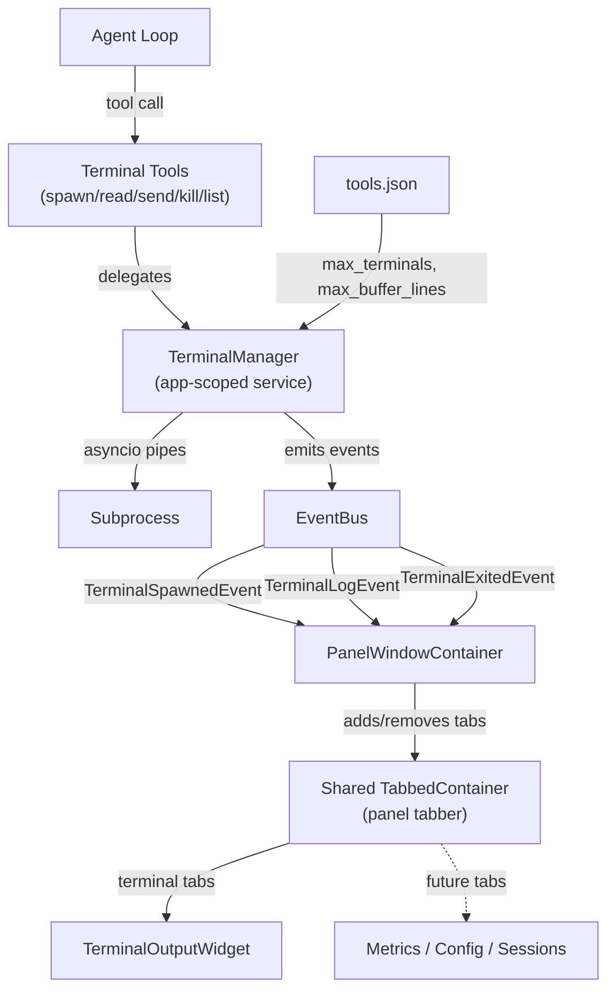

# Feature Implementation Plan: Terminal Manager — Persistent Terminal Service & TUI Integration

---

## 1. Overview

| Field              | Value                                            |
|:-------------------|:-------------------------------------------------|
| **Feature**        | Persistent terminal management for long-running processes (servers, watchers) with live TUI streaming |
| **Source**         | N/A — standalone |
| **Motivation**     | The current `run_command` tool only supports short-lived blocking commands (max 120s). Agents need the ability to spawn, monitor, interact with, and kill long-running processes like dev servers, file watchers, and test runners. Users need to see terminal output live in the TUI. |
| **User-Facing?**   | Yes — terminal output is streamed live into a tabbed panel in the TUI; users can cycle between multiple terminals |
| **Scope**          | **Includes:** `TerminalManager` service, 5 terminal tools (`spawn_terminal`, `read_terminal`, `send_terminal_input`, `kill_terminal`, `list_terminals`), TUI terminal panel with [TabbedContainer](file:///x:/agent_cli/agent_cli/core/ux/tui/views/common/tabbed_container.py#28-168), data-driven configuration. **Excludes:** PTY emulation, full ANSI rendering, session persistence of terminals |
| **Estimated Effort** | L — new service layer, 5 new tools, TUI widget, event wiring, data-driven config |

### 1.1 Requirements

| # | Requirement | Priority | Acceptance Criterion |
|:-:|:------------|:--------:|:---------------------|
| R1 | Agent can spawn a long-running process that persists beyond a single tool call | Must | `spawn_terminal("npm run dev")` returns a valid terminal ID and the process keeps running |
| R2 | Agent can read the latest output from a named terminal | Must | `read_terminal(terminal_id)` returns the most recent buffered output |
| R3 | Agent can send stdin input to a running terminal | Must | `send_terminal_input(terminal_id, "y\n")` delivers input to the process |
| R4 | Agent can kill a running terminal | Must | `kill_terminal(terminal_id)` terminates the process and returns exit code |
| R5 | Terminal output streams live into the TUI panel | Must | User sees real-time output updates in the panel |
| R6 | Terminal tabs live in the shared panel [TabbedContainer](file:///x:/agent_cli/agent_cli/core/ux/tui/views/common/tabbed_container.py#28-168) (shared with future features like metrics, config, sessions) | Must | Each terminal is a tab in the shared panel tabber. `‹` / `›` cycles through all panel tabs (terminals + other features). Since agents typically spawn only one terminal, cycling friction is negligible. |
| R7 | Maximum concurrent terminals is configurable via data-driven config | Must | [tools.json](file:///x:/agent_cli/agent_cli/data/tools.json) → `terminal.max_terminals` controls the limit (default: 3) |
| R8 | Terminal output buffer size is configurable via data-driven config | Must | [tools.json](file:///x:/agent_cli/agent_cli/data/tools.json) → `terminal.max_buffer_lines` controls memory usage (default: 2000) |
| R9 | Terminal service is app-scoped, not session-scoped | Must | Switching sessions does not kill or reset terminals |
| R10 | All terminals are cleaned up on app shutdown | Must | `AppContext.shutdown()` kills all running terminal processes |

### 1.2 Assumptions & Open Questions

- ✅ The existing `EventBus` supports async subscribers — confirmed by `AsyncEventBus` + existing patterns
- ✅ Terminal events already defined in [events.py](file:///x:/agent_cli/agent_cli/core/infra/events/events.py) — [TerminalSpawnedEvent](file:///x:/agent_cli/agent_cli/core/infra/events/events.py#185-191), [TerminalLogEvent](file:///x:/agent_cli/agent_cli/core/infra/events/events.py#193-199), [TerminalExitedEvent](file:///x:/agent_cli/agent_cli/core/infra/events/events.py#201-207) are ready
- ✅ `ToolCategory.TERMINAL` already exists in [base.py](file:///x:/agent_cli/agent_cli/core/runtime/tools/base.py) — predefined for this use case
- ✅ asyncio pipes for I/O (not PTY) — simpler, cross-platform, matches existing [shell_tool.py](file:///x:/agent_cli/agent_cli/core/runtime/tools/shell_tool.py) pattern
- ✅ Terminal service is app-scoped — survives session switches, wired into [AppContext](file:///x:/agent_cli/agent_cli/core/infra/registry/bootstrap.py#82-328)

### 1.3 Out of Scope

- PTY / pseudo-terminal emulation (ConPTY on Windows)
- Full ANSI color rendering in terminal widget (output is sanitized)
- Persisting terminal state across app restarts
- Terminal resize / SIGWINCH handling

---

## 2. Codebase Context

### 2.1 Related Existing Code

| Component | File Path | Relevance |
|:----------|:----------|:----------|
| [RunCommandTool](file:///x:/agent_cli/agent_cli/core/runtime/tools/shell_tool.py#71-155) | [shell_tool.py](file:///x:/agent_cli/agent_cli/core/runtime/tools/shell_tool.py) | Existing short-lived shell execution — model for tool structure, safety patterns, output sanitization |
| [BaseTool](file:///x:/agent_cli/agent_cli/core/runtime/tools/base.py#64-124) / [ToolCategory](file:///x:/agent_cli/agent_cli/core/runtime/tools/base.py#27-35) | [base.py](file:///x:/agent_cli/agent_cli/core/runtime/tools/base.py) | ABC for all tools — `ToolCategory.TERMINAL` already defined |
| [ToolRegistry](file:///x:/agent_cli/agent_cli/core/runtime/tools/registry.py#26-131) | [registry.py](file:///x:/agent_cli/agent_cli/core/runtime/tools/registry.py) | Registration point for new tools |
| [ToolExecutor](file:///x:/agent_cli/agent_cli/core/runtime/tools/executor.py#62-607) | [executor.py](file:///x:/agent_cli/agent_cli/core/runtime/tools/executor.py) | Safety/approval wrapper — terminal tools route through this |
| `EventBus` / Terminal Events | [events.py](file:///x:/agent_cli/agent_cli/core/infra/events/events.py#L180-L207) | [TerminalSpawnedEvent](file:///x:/agent_cli/agent_cli/core/infra/events/events.py#185-191), [TerminalLogEvent](file:///x:/agent_cli/agent_cli/core/infra/events/events.py#193-199), [TerminalExitedEvent](file:///x:/agent_cli/agent_cli/core/infra/events/events.py#201-207) already defined |
| [AppContext](file:///x:/agent_cli/agent_cli/core/infra/registry/bootstrap.py#82-328) | [bootstrap.py](file:///x:/agent_cli/agent_cli/core/infra/registry/bootstrap.py#L82-L132) | DI container — new service goes here |
| [TabbedContainer](file:///x:/agent_cli/agent_cli/core/ux/tui/views/common/tabbed_container.py#28-168) | [tabbed_container.py](file:///x:/agent_cli/agent_cli/core/ux/tui/views/common/tabbed_container.py) | Generic tab container — used for terminal display |
| [PanelWindowContainer](file:///x:/agent_cli/agent_cli/core/ux/tui/views/main/panel/panel_window.py#14-28) | [panel_window.py](file:///x:/agent_cli/agent_cli/core/ux/tui/views/main/panel/panel_window.py) | Right-side panel — terminal tabs mount here alongside `ChangedFilesPanel` |
| [DataRegistry](file:///x:/agent_cli/agent_cli/core/infra/registry/registry.py#31-856) / [tools.json](file:///x:/agent_cli/agent_cli/data/tools.json) | [registry.py](file:///x:/agent_cli/agent_cli/core/infra/registry/registry.py) / [tools.json](file:///x:/agent_cli/agent_cli/data/tools.json) | Data-driven configuration for terminal limits |
| [_sanitize_terminal_output](file:///x:/agent_cli/agent_cli/core/runtime/tools/shell_tool.py#157-168) | [shell_tool.py](file:///x:/agent_cli/agent_cli/core/runtime/tools/shell_tool.py#L157-L168) | Reusable ANSI sanitization (will be shared) |

### 2.2 Patterns & Conventions to Follow

- **Naming**: Services use `<Name>Manager` class names (e.g. `ProviderManager`, `TerminalManager`); tools use `<Action><Noun>Tool` (e.g. [RunCommandTool](file:///x:/agent_cli/agent_cli/core/runtime/tools/shell_tool.py#71-155)); files use `snake_case`
- **Structure**: Service layer holds stateful logic; tool classes are thin facades calling the service; DI via [AppContext](file:///x:/agent_cli/agent_cli/core/infra/registry/bootstrap.py#82-328); events for cross-component communication
- **Error handling**: `ToolExecutionError` for tool-level failures; logging via `logging.getLogger(__name__)`
- **Configuration**: Data-driven via [tools.json](file:///x:/agent_cli/agent_cli/data/tools.json) → `DataRegistry.get_tool_defaults()` → tool/service constructor
- **Imports**: Absolute imports throughout (`from agent_cli.core...`)
- **Tool safety**: `is_safe = False` by default; [ToolCategory](file:///x:/agent_cli/agent_cli/core/runtime/tools/base.py#27-35) enum for grouping

### 2.3 Integration Points

| Integration Point | File Path | How It Connects |
|:------------------|:----------|:----------------|
| Tool registration | [bootstrap.py](file:///x:/agent_cli/agent_cli/core/infra/registry/bootstrap.py#L866-L899) → [_build_tool_registry()](file:///x:/agent_cli/agent_cli/core/infra/registry/bootstrap.py#866-900) | Register 5 new terminal tools |
| DI container | [bootstrap.py](file:///x:/agent_cli/agent_cli/core/infra/registry/bootstrap.py#L82-L132) → [AppContext](file:///x:/agent_cli/agent_cli/core/infra/registry/bootstrap.py#82-328) | Add `terminal_manager` field |
| Service creation | [bootstrap.py](file:///x:/agent_cli/agent_cli/core/infra/registry/bootstrap.py#L335-L751) → [create_app()](file:///x:/agent_cli/agent_cli/core/infra/registry/bootstrap.py#335-752) | Instantiate `TerminalManager` before tool registry |
| Shutdown cleanup | [bootstrap.py](file:///x:/agent_cli/agent_cli/core/infra/registry/bootstrap.py#L220-L276) → `AppContext.shutdown()` | Call `terminal_manager.shutdown()` |
| Event emission | [events.py](file:///x:/agent_cli/agent_cli/core/infra/events/events.py#L180-L207) | Service emits existing terminal events |
| TUI subscription | [panel_window.py](file:///x:/agent_cli/agent_cli/core/ux/tui/views/main/panel/panel_window.py) | Subscribe to terminal events, manage terminal tabs |
| Data config | [tools.json](file:///x:/agent_cli/agent_cli/data/tools.json) | Add [terminal](file:///x:/agent_cli/agent_cli/core/runtime/tools/shell_tool.py#157-168) config section |

---

## 3. Design

### 3.1 Architecture Overview

The `TerminalManager` is an app-scoped service (not session-scoped) that manages the lifecycle of persistent subprocess instances via `asyncio.create_subprocess_shell`. Each subprocess is created with `stderr=asyncio.subprocess.STDOUT` so both streams merge into a single pipe. Each terminal gets a unique ID, a circular output buffer, and a single background reader task that drains `process.stdout` (which contains both stdout and stderr). The five tool classes (`SpawnTerminalTool`, `ReadTerminalTool`, `SendTerminalInputTool`, `KillTerminalTool`, `ListTerminalsTool`) are thin facades that delegate to the manager. The manager emits events ([TerminalSpawnedEvent](file:///x:/agent_cli/agent_cli/core/infra/events/events.py#185-191), [TerminalLogEvent](file:///x:/agent_cli/agent_cli/core/infra/events/events.py#193-199), [TerminalExitedEvent](file:///x:/agent_cli/agent_cli/core/infra/events/events.py#201-207)) on the `EventBus` so the TUI can react.

The [PanelWindowContainer](file:///x:/agent_cli/agent_cli/core/ux/tui/views/main/panel/panel_window.py#14-28) hosts a **shared [TabbedContainer](file:///x:/agent_cli/agent_cli/core/ux/tui/views/common/tabbed_container.py#28-168)** that serves as the general-purpose panel tabber. This tabber is designed to hold tabs from multiple features — terminal streams are the first consumer, but future features (metrics dashboard, user config, session info, etc.) will add their own tabs to the same container. Each spawned terminal gets its own tab with a `TerminalOutputWidget`. The standard `‹` / `›` cycling navigates across all panel tabs (terminals + other features). Since agents typically spawn only one terminal, this cycling model works well without adding nested navigation complexity.



### 3.2 New Components

| Component | Type | File Path | Responsibility |
|:----------|:-----|:----------|:---------------|
| `TerminalManager` | Class (Service) | `core/runtime/services/terminal_manager.py` | Manages subprocess lifecycle, output buffering, reader tasks, event emission. App-scoped singleton. |
| `ManagedTerminal` | Dataclass | `core/runtime/services/terminal_manager.py` | Internal state for a single terminal (process handle, merged stdout+stderr buffer, reader task, metadata) |
| `SpawnTerminalTool` | Class (Tool) | `core/runtime/tools/terminal_tools.py` | Starts a new terminal process via `TerminalManager` |
| `ReadTerminalTool` | Class (Tool) | `core/runtime/tools/terminal_tools.py` | Reads buffered output from a terminal |
| `SendTerminalInputTool` | Class (Tool) | `core/runtime/tools/terminal_tools.py` | Sends stdin input to a terminal |
| `KillTerminalTool` | Class (Tool) | `core/runtime/tools/terminal_tools.py` | Kills a terminal process |
| `ListTerminalsTool` | Class (Tool) | `core/runtime/tools/terminal_tools.py` | Lists all managed terminals with IDs, commands, and status (read-only, `is_safe=True`) |
| `TerminalOutputWidget` | Class (Widget) | `core/ux/tui/views/main/panel/terminal_widget.py` | Displays live-streamed terminal output using a `RichLog` or scrollable `Static` |

### 3.3 Modified Components

| Component | File Path | What Changes | Why |
|:----------|:----------|:-------------|:----|
| [tools.json](file:///x:/agent_cli/agent_cli/data/tools.json) | [data/tools.json](file:///x:/agent_cli/agent_cli/data/tools.json) | Add [terminal](file:///x:/agent_cli/agent_cli/core/runtime/tools/shell_tool.py#157-168) config section | Data-driven configuration for max terminals and buffer size |
| [AppContext](file:///x:/agent_cli/agent_cli/core/infra/registry/bootstrap.py#82-328) | [core/infra/registry/bootstrap.py](file:///x:/agent_cli/agent_cli/core/infra/registry/bootstrap.py) | Add `terminal_manager` field | DI container needs reference to the service |
| [create_app()](file:///x:/agent_cli/agent_cli/core/infra/registry/bootstrap.py#335-752) | [core/infra/registry/bootstrap.py](file:///x:/agent_cli/agent_cli/core/infra/registry/bootstrap.py) | Create `TerminalManager`, pass to tools and context | Wiring the service into the app |
| `AppContext.shutdown()` | [core/infra/registry/bootstrap.py](file:///x:/agent_cli/agent_cli/core/infra/registry/bootstrap.py) | Call `terminal_manager.shutdown()` | Clean up terminal processes on exit |
| [_build_tool_registry()](file:///x:/agent_cli/agent_cli/core/infra/registry/bootstrap.py#866-900) | [core/infra/registry/bootstrap.py](file:///x:/agent_cli/agent_cli/core/infra/registry/bootstrap.py) | Register 5 terminal tools | Make them available to agents |
| [PanelWindowContainer](file:///x:/agent_cli/agent_cli/core/ux/tui/views/main/panel/panel_window.py#14-28) | [core/ux/tui/views/main/panel/panel_window.py](file:///x:/agent_cli/agent_cli/core/ux/tui/views/main/panel/panel_window.py) | Replace raw `Vertical` with shared [TabbedContainer](file:///x:/agent_cli/agent_cli/core/ux/tui/views/common/tabbed_container.py#28-168) as the panel tabber; `ChangedFilesPanel` becomes the first static tab, terminal tabs are added/removed dynamically | TUI integration — panel tabber is the extensible host for all panel features |
| [shell_tool.py](file:///x:/agent_cli/agent_cli/core/runtime/tools/shell_tool.py) | [core/runtime/tools/shell_tool.py](file:///x:/agent_cli/agent_cli/core/runtime/tools/shell_tool.py) | Extract [_sanitize_terminal_output](file:///x:/agent_cli/agent_cli/core/runtime/tools/shell_tool.py#157-168) to shared location | Reuse in terminal manager |

### 3.4 Data Model / Schema Changes

**[tools.json](file:///x:/agent_cli/agent_cli/data/tools.json) — new [terminal](file:///x:/agent_cli/agent_cli/core/runtime/tools/shell_tool.py#157-168) section:**
```json
{
  "terminal": {
    "max_terminals": 3,
    "max_buffer_lines": 2000
  }
}
```

**`ManagedTerminal` dataclass:**
```python
@dataclass
class ManagedTerminal:
    terminal_id: str
    command: str
    process: asyncio.subprocess.Process
    buffer: deque[str]       # Circular buffer, maxlen from config
    reader_task: asyncio.Task[None]  # Single task — reads merged stdout+stderr
    created_at: float
    exited: bool = False
    exit_code: int | None = None
```

> [!NOTE]
> **Intentional design: stdout and stderr are merged at spawn time.** The subprocess is created
> with `stderr=asyncio.subprocess.STDOUT`, so both streams are interleaved into `process.stdout`.
> This means:
> - **One reader task** per terminal — reads from `process.stdout` only (which contains both streams)
> - **One buffer** (`deque`) — no dual-buffer synchronization needed
> - **One exit emission point** — when the reader task detects EOF on `process.stdout`, it calls
>   `await process.wait()` to get the exit code, sets `exited=True` and `exit_code`, then emits
>   [TerminalExitedEvent](file:///x:/agent_cli/agent_cli/core/infra/events/events.py#201-207) exactly once. The `kill()` method cancels the reader task and calls
>   `process.terminate()`, but defers exit event emission to the reader task's cancellation cleanup
>   (`try/finally`), ensuring the event is emitted exactly once regardless of how the process ends.

### 3.5 API / Interface Contract

```python
# ── TerminalManager Service ──────────────────────────────────────

class TerminalManager:
    def __init__(
        self,
        event_bus: AbstractEventBus,
        workspace_root: Path,
        *,
        max_terminals: int = 3,
        max_buffer_lines: int = 2000,
    ) -> None: ...

    async def spawn(self, command: str) -> str:
        """Start a process, return terminal_id. Raises if at capacity."""

    def read(self, terminal_id: str, *, last_n: int | None = None) -> str:
        """Return buffered output. Raises if terminal_id unknown."""

    async def send_input(self, terminal_id: str, text: str) -> None:
        """Write to stdin. Raises if process exited or id unknown."""

    async def kill(self, terminal_id: str) -> int:
        """Kill the process, return exit code. Raises if id unknown."""

    def list_terminals(self) -> list[dict[str, Any]]:
        """Return summary of all managed terminals (id, command, exited, exit_code)."""

    async def shutdown(self) -> None:
        """Kill all terminals. Called by AppContext.shutdown()."""


# ── Tool Signatures (Pydantic args models) ───────────────────────

class SpawnTerminalArgs(BaseModel):
    command: str = Field(description="The shell command to run as a persistent terminal.")

class ReadTerminalArgs(BaseModel):
    terminal_id: str = Field(description="ID of the terminal to read from.")
    last_n: int | None = Field(default=None, description="Number of recent lines to return. Omit for all buffered output.")

class SendTerminalInputArgs(BaseModel):
    terminal_id: str = Field(description="ID of the terminal to send input to.")
    text: str = Field(description="Text to write to the terminal's stdin (include \\n if needed). Note: The process may not respond instantly — use read_terminal after a brief pause to see the effect.")

class KillTerminalArgs(BaseModel):
    terminal_id: str = Field(description="ID of the terminal to kill.")

class ListTerminalsArgs(BaseModel):
    pass  # No arguments needed
```

### 3.6 Design Decisions

| Decision | Alternatives Considered | Why This Choice |
|:---------|:-----------------------|:----------------|
| App-scoped service (not session-scoped) | Session-scoped (terminals die on session switch) | User's explicit requirement — terminals survive session changes |
| asyncio pipes (not PTY) | PTY via `winpty`/`ConPTY` | Simpler, cross-platform, consistent with existing [shell_tool.py](file:///x:/agent_cli/agent_cli/core/runtime/tools/shell_tool.py). PTY adds Windows complexity with minimal benefit for agent use. |
| Service + thin tool facades | Tools holding process state directly | Clean separation — service owns lifecycle, tools are just the LLM-facing API |
| `deque` circular buffer | Unbounded list, file-backed log | Memory-safe, data-driven max size, simple to implement |
| EventBus for TUI streaming | Direct polling from widget | Consistent with all other TUI updates; decoupled architecture |
| New `services/` directory | Put manager in `tools/` | Manager is a service, not a tool — correct architectural layer |
| Extract [_sanitize_terminal_output](file:///x:/agent_cli/agent_cli/core/runtime/tools/shell_tool.py#157-168) to shared util | Duplicate in both files | DRY — both [shell_tool.py](file:///x:/agent_cli/agent_cli/core/runtime/tools/shell_tool.py) and `terminal_manager.py` need it |
| Shared panel [TabbedContainer](file:///x:/agent_cli/agent_cli/core/ux/tui/views/common/tabbed_container.py#28-168) (not terminal-specific) | Dedicated terminal-only tabber; nested sub-navigation within one tab | Shared tabber is simpler, extensible (future features add tabs to the same container), and since the common case is 1 terminal, cycling friction is negligible |
| Merge stdout+stderr into single buffer | Separate buffers per stream | Matches real terminal behavior; simpler. Subprocess created with `stderr=STDOUT` so both interleave. |
| Auto-remove terminal tab on exit | Keep dead tabs, let user manually dismiss | Dead tabs piling up degrades UX. Auto-remove after a brief delay (show exit status momentarily, then remove). |
| `ListTerminalsTool` as a 5th tool | No list tool (agent must remember IDs) | Low-effort safety net — if the agent loses a terminal ID across a long context, it can rediscover. `is_safe=True`, read-only. |
| `terminal_manager` as non-optional field | `Optional[TerminalManager]` requiring null checks | Always created in [create_app()](file:///x:/agent_cli/agent_cli/core/infra/registry/bootstrap.py#335-752), no reason for it to be None. Non-optional avoids defensive coding throughout the codebase. |

---

## 4. Testing Strategy

### 4.1 Test Plan

| Requirement | Test Name | Type | Description |
|:-----------:|:----------|:-----|:------------|
| R1 | `test_spawn_terminal_returns_id` | Unit | Spawn a simple command, verify terminal_id format |
| R1 | `test_spawn_terminal_at_capacity_raises` | Unit | Try to spawn beyond max_terminals, expect error |
| R2 | `test_read_terminal_returns_output` | Unit | Spawn `echo hello`, wait, read output, verify content |
| R2 | `test_read_terminal_last_n` | Unit | Buffer has 10 lines, read last 3, verify only 3 returned |
| R3 | `test_send_input_to_terminal` | Integration | Spawn interactive process, send input, verify effect in output |
| R4 | `test_kill_terminal` | Unit | Spawn, kill, verify exit code returned and process dead |
| R5 | `test_terminal_log_events_emitted` | Unit | Mock event bus, spawn terminal, verify [TerminalLogEvent](file:///x:/agent_cli/agent_cli/core/infra/events/events.py#193-199) published |
| R6 | `test_terminal_spawned_event_emitted` | Unit | Verify [TerminalSpawnedEvent](file:///x:/agent_cli/agent_cli/core/infra/events/events.py#185-191) on spawn |
| R7 | `test_max_terminals_from_config` | Unit | Construct manager with max_terminals=2, verify enforcement |
| R8 | `test_buffer_size_limit` | Unit | Set max_buffer_lines=5, produce 10 lines, verify only last 5 kept |
| R9 | `test_manager_is_app_scoped` | Unit | Verify `terminal_manager` is a non-optional field on [AppContext](file:///x:/agent_cli/agent_cli/core/infra/registry/bootstrap.py#82-328), not on session objects |
| R10 | `test_shutdown_kills_all` | Unit | Spawn 2 terminals, call shutdown, verify both killed |

### 4.2 Edge Cases & Error Scenarios

| Scenario | Expected Behavior | Test Name |
|:---------|:------------------|:----------|
| Read from unknown terminal ID | Raises `ToolExecutionError` with descriptive message | `test_read_unknown_terminal` |
| Send input to exited process | Raises `ToolExecutionError` explaining process has exited | `test_send_input_to_exited` |
| Kill already-exited terminal | Returns the exit code without error | `test_kill_already_exited` |
| Empty command string | Raises `ToolExecutionError` | `test_spawn_empty_command` |
| Process exits on its own | [TerminalExitedEvent](file:///x:/agent_cli/agent_cli/core/infra/events/events.py#201-207) emitted, terminal marked as exited | `test_natural_exit_event` |
| Rapid output flooding | Buffer caps at max_buffer_lines, oldest lines dropped | `test_buffer_overflow` |

### 4.3 Existing Tests to Modify

| Test | File | Modification Needed |
|:-----|:-----|:--------------------|
| `test_data_integrity` | [dev/tests/data/test_data_integrity.py](file:///x:/agent_cli/dev/tests/data/test_data_integrity.py) | **Must check**: if tests validate [tools.json](file:///x:/agent_cli/agent_cli/data/tools.json) keys, add [terminal](file:///x:/agent_cli/agent_cli/core/runtime/tools/shell_tool.py#157-168) to expected keys. Run this test explicitly in Phase 1 checkpoint. |
| Tool registry tests | `dev/tests/` (if exist) | New tools (now 5) must appear in registry count assertions |

---

## 5. Implementation Phases

---

### Phase 1: Foundation — TerminalManager Service & Data Config

**Goal**: A working `TerminalManager` that can spawn, read, send input, kill terminals using asyncio pipes, with data-driven configuration and proper event emission.

**Prerequisites**: All design decisions confirmed ✅

#### Steps

1. **Add `terminal` section to `tools.json`**
   - File: `agent_cli/data/tools.json`
   - Details: Add terminal configuration block
   ```json
   "terminal": {
     "max_terminals": 3,
     "max_buffer_lines": 2000
   }
   ```

2. **Extract `_sanitize_terminal_output` to a shared utility**
   - File: `agent_cli/core/runtime/tools/shell_tool.py`
   - Details: Move the 4 ANSI regex patterns and `_sanitize_terminal_output()` function to a new shared module `agent_cli/core/runtime/tools/_sanitize.py`. Update `shell_tool.py` to import from there. This avoids circular imports and keeps both `shell_tool.py` and the terminal manager DRY.
   - New file: `agent_cli/core/runtime/tools/_sanitize.py`

3. **Create `TerminalManager` service**
   - File: `agent_cli/core/runtime/services/__init__.py` (empty)
   - File: `agent_cli/core/runtime/services/terminal_manager.py`
   - Details: Implement the full service:
     - `ManagedTerminal` dataclass (id, process, buffer, reader_task, metadata)
     - `TerminalManager.__init__()` — takes event_bus, workspace root, config values
     - `spawn()` — creates subprocess with `stderr=asyncio.subprocess.STDOUT` (merge stderr into stdout at spawn time), starts a single background `_reader_loop` task, emits `TerminalSpawnedEvent`
     - `read()` — returns joined buffer content (optionally last_n lines)
     - `send_input()` — writes to `process.stdin`
     - `kill()` — calls `process.terminate()` and cancels reader task. Does **not** emit `TerminalExitedEvent` directly — the reader task's `try/finally` cleanup handles that
     - `list_terminals()` — returns summary list of terminal id, command, exited status, exit code
     - `shutdown()` — kills all terminals
     - `_reader_loop()` — single background task per terminal: reads `process.stdout` line-by-line (which contains both stdout+stderr), sanitizes output, appends to deque buffer, emits `TerminalLogEvent` per chunk. On EOF: calls `await process.wait()`, sets `exited=True`/`exit_code`, emits `TerminalExitedEvent`. Wrapped in `try/finally` so the exit event is emitted exactly once whether the process exits naturally or is killed
   ```python
   class TerminalManager:
       def __init__(self, event_bus, workspace_root, *, max_terminals=3, max_buffer_lines=2000):
           self._event_bus = event_bus
           self._workspace_root = workspace_root
           self._max_terminals = max_terminals
           self._max_buffer_lines = max_buffer_lines
           self._terminals: dict[str, ManagedTerminal] = {}
   ```

4. **Write unit tests for TerminalManager**
   - File: `dev/tests/runtime/test_terminal_manager.py`
   - Covers: spawn, read, send_input, kill, shutdown, buffer limits, capacity limits, event emission

#### Checkpoint

- [ ] `tools.json` has `terminal` section with `max_terminals` and `max_buffer_lines`
- [ ] `_sanitize.py` exists and `shell_tool.py` imports from it (no behavior change)
- [ ] `TerminalManager` is importable: `python -c "from agent_cli.core.runtime.services.terminal_manager import TerminalManager"`
- [ ] Unit tests pass: `pytest dev/tests/runtime/test_terminal_manager.py -v`
- [ ] `test_data_integrity` passes: `pytest dev/tests/data/test_data_integrity.py -v`
- [ ] Existing tests still pass: `pytest dev/tests/ -v`

---

### Phase 2: Terminal Tools — Agent-Facing API

**Goal**: Five tool classes registered in the tool registry, allowing agents to spawn, read, send input to, kill, and list terminals.

**Prerequisites**: Phase 1 checkpoint passed

#### Steps

1. **Create terminal tool classes**
   - File: `agent_cli/core/runtime/tools/terminal_tools.py`
   - Details: Five tool classes, each with Pydantic args model and `execute()` that delegates to `TerminalManager`:
     - `SpawnTerminalTool` — `name="spawn_terminal"`, `category=TERMINAL`, `is_safe=False`
     - `ReadTerminalTool` — `name="read_terminal"`, `category=TERMINAL`, `is_safe=True`
     - `SendTerminalInputTool` — `name="send_terminal_input"`, `category=TERMINAL`, `is_safe=False`
     - `KillTerminalTool` — `name="kill_terminal"`, `category=TERMINAL`, `is_safe=False`
     - `ListTerminalsTool` — `name="list_terminals"`, `category=TERMINAL`, `is_safe=True`
   - Each tool takes `TerminalManager` in its constructor (injected by bootstrap)

2. **Wire into bootstrap — `AppContext` + `create_app()` + `_build_tool_registry()`**
   - File: `agent_cli/core/infra/registry/bootstrap.py`
   - Details:
     - Add `terminal_manager: TerminalManager` field to `AppContext` (non-optional — always created in `create_app()`)
     - In `create_app()`: instantiate `TerminalManager` with event_bus, workspace root, and config from `tool_defaults.get("terminal", {})`
     - Pass `terminal_manager` to `_build_tool_registry()` and register all 5 tools
     - Set `context.terminal_manager = terminal_manager`
     - In `AppContext.shutdown()`: call `await self.terminal_manager.shutdown()`

3. **Update `_build_tool_registry()` signature and registrations**
   - File: `agent_cli/core/infra/registry/bootstrap.py`
   - Details: Add `terminal_manager` parameter, import and register the 5 terminal tool classes

4. **Write unit tests for terminal tools**
   - File: `dev/tests/runtime/test_terminal_tools.py`
   - Covers: Tool args validation, delegation to manager mock, safety flags, category assignments

#### Checkpoint

- [ ] All 5 tools registered: `python -c "from agent_cli.core.infra.registry.bootstrap import create_app; ctx=create_app(); print(ctx.tool_registry.get_all_names())"` shows spawn_terminal, read_terminal, send_terminal_input, kill_terminal, list_terminals
- [ ] Tool tests pass: `pytest dev/tests/runtime/test_terminal_tools.py -v`
- [ ] Full test suite passes: `pytest dev/tests/ -v`
- [ ] App starts without errors

---

### Phase 3: TUI Integration — Shared Panel Tabber & Live Terminal Streaming

**Goal**: `PanelWindowContainer` uses a shared `TabbedContainer` as its panel tabber. `ChangedFilesPanel` is the first static tab. Terminal output streams live into dynamically added/removed tabs. Users cycle through all panel tabs (terminals + Changed Files) via `‹` / `›`.

**Prerequisites**: Phase 2 checkpoint passed

#### Steps

1. **Create `TerminalOutputWidget`**
   - File: `agent_cli/core/ux/tui/views/main/panel/terminal_widget.py`
   - Details: A widget that displays terminal output. Uses a Textual `RichLog` (or scrollable `Static`) that auto-scrolls. Receives lines via a `append_line(text)` method. Shows a header with terminal ID and command. Shows status (running / exited with code).

2. **Refactor `PanelWindowContainer` to use shared `TabbedContainer`**
   - File: `agent_cli/core/ux/tui/views/main/panel/panel_window.py`
   - Details:
     - Replace the current `Vertical` → `ChangedFilesPanel` with a `TabbedContainer`
     - Add `ChangedFilesPanel` as the first static tab (`TabDefinition(title="Changes", content=ChangedFilesPanel(...))`)
     - Subscribe to `TerminalSpawnedEvent` → `add_tab()` with a new `TerminalOutputWidget`, title like `"Terminal: <short_cmd>"`
     - Subscribe to `TerminalLogEvent` → route content to the matching `TerminalOutputWidget` via `terminal_id → widget_ref` mapping (no index involved)
     - Subscribe to `TerminalExitedEvent` → update tab title to show exit code (e.g., `"Terminal: npm [exit: 0]"`), then auto-remove the tab after a brief delay (~3 seconds) so the user sees the exit status before it disappears
     - Store a mapping of `terminal_id → (tab_id, widget_ref)` for routing events. Use a stable string `tab_id` returned by `TabbedContainer.add_tab()` rather than a numeric index, since indices go stale when tabs are removed or other features add tabs. This requires extending `TabbedContainer` to use stable tab IDs (see note below)
     - **Note**: The `TabbedContainer` currently uses index-based APIs. Phase 3 must extend it with stable string IDs: `add_tab()` returns a `tab_id: str`, `remove_tab(tab_id)` accepts a string, and the internal `_tabs` becomes an ordered dict keyed by ID. This is a prerequisite for robust multi-feature tab management.
     - **Note**: The `TabbedContainer` is the shared panel tabber — future features (metrics, config, sessions) will also add tabs here

3. **Add CSS for terminal panel**
   - File: `agent_cli/assets/app.tcss`
   - Details: Style the terminal output area (monospace font, dark background, auto-scroll, sensible height constraints)

4. **Manual end-to-end verification**
   - Start the app
   - Verify `ChangedFilesPanel` is the default (and only) tab
   - Ask agent to spawn a terminal (e.g., `ping localhost`)
   - Verify output streams in a new tab
   - Verify `‹` / `›` cycles between "Changes" and "Terminal: ping" tabs
   - Ask agent to spawn another terminal
   - Verify 3 tabs: Changes, Terminal 1, Terminal 2
   - Kill a terminal, verify tab updates / removal

#### Checkpoint

- [ ] `PanelWindowContainer` renders a `TabbedContainer` with "Changes" as the default tab
- [ ] Spawning a terminal adds a new tab to the shared tabber
- [ ] Output streams live (not on-demand) into the terminal tab
- [ ] Tab cycling (`‹`/`›`) works across Changes + terminal tabs
- [ ] Exited terminals show exit code in tab title
- [ ] Full test suite passes: `pytest dev/tests/ -v`
- [ ] App starts and runs without errors

---

## 6. File Change Summary

| # | Action | File Path | Phase | Description |
|:-:|:------:|:----------|:-----:|:------------|
| 1 | MODIFY | `agent_cli/data/tools.json` | 1 | Add `terminal` config section |
| 2 | CREATE | `agent_cli/core/runtime/tools/_sanitize.py` | 1 | Shared ANSI sanitization utility |
| 3 | MODIFY | `agent_cli/core/runtime/tools/shell_tool.py` | 1 | Import sanitizer from shared module |
| 4 | CREATE | `agent_cli/core/runtime/services/__init__.py` | 1 | Empty package init |
| 5 | CREATE | `agent_cli/core/runtime/services/terminal_manager.py` | 1 | Core terminal management service |
| 6 | CREATE | `dev/tests/runtime/test_terminal_manager.py` | 1 | Unit tests for TerminalManager |
| 7 | CREATE | `agent_cli/core/runtime/tools/terminal_tools.py` | 2 | 5 terminal tool classes |
| 8 | MODIFY | `agent_cli/core/infra/registry/bootstrap.py` | 2 | Wire TerminalManager, register tools, shutdown cleanup |
| 9 | CREATE | `dev/tests/runtime/test_terminal_tools.py` | 2 | Unit tests for terminal tools |
| 10 | CREATE | `agent_cli/core/ux/tui/views/main/panel/terminal_widget.py` | 3 | Terminal output display widget |
| 11 | MODIFY | `agent_cli/core/ux/tui/views/main/panel/panel_window.py` | 3 | Refactor to shared TabbedContainer; subscribe to terminal events |
| 12 | MODIFY | `agent_cli/core/ux/tui/views/common/tabbed_container.py` | 3 | Extend with stable string tab IDs (`add_tab` → `tab_id`, `remove_tab(tab_id)`, ordered dict internally) |
| 13 | MODIFY | `agent_cli/assets/app.tcss` | 3 | Terminal panel styling |

---

## 7. Post-Implementation Verification

- [ ] All requirements from §1.1 have passing tests
- [ ] Full test suite passes: `pytest dev/tests/ -v`
- [ ] No lint/type errors: `ruff check agent_cli/`
- [ ] No orphan code (every new component is reachable from bootstrap)
- [ ] Feature works end-to-end: spawn terminal → see output in TUI → send input → kill terminal
- [ ] Max terminal limit enforced (spawn 4th terminal with limit=3 → error)
- [ ] Buffer size limit enforced (chatty process doesn't cause OOM)
- [ ] App shutdown kills all terminals cleanly
- [ ] Session switching does not affect running terminals

---

## Appendix: References

- Existing pattern: [shell_tool.py](file:///x:/agent_cli/agent_cli/core/runtime/tools/shell_tool.py) — asyncio subprocess execution
- Existing events: [events.py](file:///x:/agent_cli/agent_cli/core/infra/events/events.py#L180-L207) — terminal events already defined
- Existing TUI component: [tabbed_container.py](file:///x:/agent_cli/agent_cli/core/ux/tui/views/common/tabbed_container.py) — tab cycling widget
- `ToolCategory.TERMINAL`: [base.py](file:///x:/agent_cli/agent_cli/core/runtime/tools/base.py#L33) — already declared
