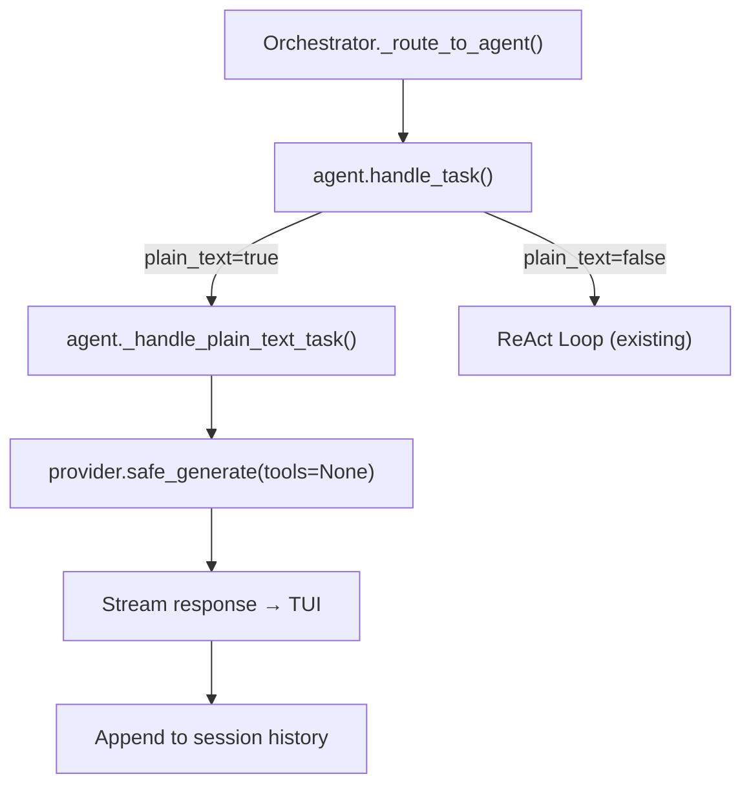

# Feature Implementation Plan: Plain Text Mode

---

## 1. Overview

| Field              | Value                                            |
|:-------------------|:-------------------------------------------------|
| **Feature**        | Static, model-level "plain text" mode that bypasses the ReAct loop and streams raw chat completions |
| **Source**         | N/A — standalone |
| **Motivation**     | Some models (e.g., Gemma-3 1B) cannot follow the structured JSON schema protocol. When a developer tests a model and confirms it fails schema validation, they should be able to set `"plain_text": true` in the model JSON to allow raw text-in/text-out communication — no tools, no protocols, no ReAct loop. |
| **User-Facing?**   | Yes — the TUI displays plain streaming text instead of structured responses |
| **Scope**          | Model-config-driven plain text mode. NOT a runtime toggle. NOT a slash-command. |
| **Estimated Effort** | M — touches data model, registry, agent base, and orchestrator routing |

### 1.1 Requirements

| # | Requirement | Priority | Acceptance Criterion |
|:-:|:------------|:--------:|:---------------------|
| R1 | Model JSON supports `"plain_text": true` top-level field | Must | Field parsed and exposed via `ModelSpec.plain_text` |
| R2 | When `plain_text: true`, the agent bypasses the ReAct loop entirely | Must | No tool definitions sent, no schema validation, no `SchemaValidator.parse_and_validate()` |
| R3 | Plain text streaming works: user text → model → streamed response → TUI | Must | Response streams to the TUI as `AgentMessageEvent` |
| R4 | Context is shared chat history (user/assistant turns) within the session | Must | Session messages are passed to the model on each turn |
| R5 | Memory compaction still works for long conversations | Should | `SummarizingMemoryManager` compacts when budget is exceeded |
| R6 | Models without `plain_text` field default to `false` (existing behavior) | Must | No breaking changes to existing model JSON files |

### 1.2 Assumptions & Open Questions

- ✅ `plain_text` is a **static model-level config**, not runtime-togglable
- ✅ When `plain_text: true`, capabilities block is irrelevant (auto-defaulted to all-false by registry)
- ✅ Context strategy is **shared** — plain text turns live in the same session message history
- ✅ The system prompt for plain text agents is a simple persona (no tool contract, no JSON schema instructions)

### 1.3 Out of Scope

- Runtime mode switching via slash commands (`/mode plain`)
- Per-message plain text prefix (e.g., `!your message`)
- Hybrid mode (plain text with occasional tool use)

---

## 2. Codebase Context

### 2.1 Related Existing Code

| Component | File Path | Relevance |
|:----------|:----------|:----------|
| `ModelSpec` | `agent_cli/core/infra/config/config_models.py` | Add `plain_text: bool` field |
| `DataRegistry._get_model_specs_cached()` | `agent_cli/core/infra/registry/registry.py` | Parse `plain_text` from model JSON |
| `BaseAgent.handle_task()` | `agent_cli/core/runtime/agents/base.py` | The ReAct loop — needs a bypass path |
| `DefaultAgent` | `agent_cli/core/runtime/agents/default.py` | `build_system_prompt()` needs a plain text variant |
| `Orchestrator._route_to_agent()` | `agent_cli/core/runtime/orchestrator/orchestrator.py` | Routes to `agent.handle_task()` — routing stays the same |
| `BaseLLMProvider.safe_generate()` | `agent_cli/core/providers/base/base.py` | Used for LLM calls — reused as-is with `tools=None` |

### 2.2 Patterns & Conventions to Follow

- **Naming**: Dataclass fields use `snake_case`, JSON fields use `snake_case`
- **Structure**: Capabilities/flags parsed in `DataRegistry`, exposed via typed `ModelSpec`
- **Error handling**: `AgentCLIError` hierarchy, caught at Orchestrator level
- **Configuration**: Data-driven via `agent_cli/data/models/*.json`

### 2.3 Integration Points

| Integration Point | File Path | How It Connects |
|:------------------|:----------|:----------------|
| Model JSON parsing | `registry.py:_get_model_specs_cached()` | Reads `plain_text` field, sets `ModelSpec.plain_text` |
| Agent mode check | `base.py:handle_task()` | Checks `ModelSpec.plain_text` to branch into plain text path |
| System prompt | `default.py:build_system_prompt()` | Skips tool/schema injection when plain text |
| Bootstrap | `bootstrap.py:_create_agent_instance()` | Passes `plain_text` flag through to agent |

---

## 3. Design

### 3.1 Architecture Overview

When a model has `plain_text: true`, the `BaseAgent.handle_task()` method detects this at the start and delegates to a new `_handle_plain_text_task()` method instead of running the ReAct loop. This method performs a single LLM call per user message (no iteration), streams the response to the TUI, and appends both the user message and assistant response to the shared session history. No tool definitions are sent. No schema validation occurs.



### 3.2 New Components

| Component | Type | File Path | Responsibility |
|:----------|:-----|:----------|:---------------|
| `_handle_plain_text_task()` | Method | `agent_cli/core/runtime/agents/base.py` | Single-turn LLM call without tools/schema — the plain text execution path |
| `_build_plain_text_system_prompt()` | Method | `agent_cli/core/runtime/agents/base.py` | Builds a minimal persona-only system prompt (no tool contract) |

### 3.3 Modified Components

| Component | File Path | What Changes | Why |
|:----------|:----------|:-------------|:----|
| `ModelSpec` | `config_models.py` | Add `plain_text: bool = False` field | Store the parsed flag |
| `DataRegistry._get_model_specs_cached()` | `registry.py` | Parse `plain_text` from model JSON | Feed the flag into ModelSpec |
| `AgentConfig` | `base.py` | Add `plain_text: bool = False` field | Agent-level awareness of mode |
| `BaseAgent.handle_task()` | `base.py` | Branch at top: if `plain_text`, delegate to `_handle_plain_text_task()` | Bypass ReAct loop |
| `DefaultAgent.build_system_prompt()` | `default.py` | Skip tool/schema injection when `plain_text` | Clean persona-only prompt |
| `bootstrap._resolve_agent_config()` | `bootstrap.py` | Resolve `plain_text` from model's `ModelSpec` | Wire flag into `AgentConfig` |
| `gemma3-1b.json` | `data/models/gemma3-1b.json` | Add `"plain_text": true` | Enable plain text for Gemma-3 1B |

### 3.4 Data Model / Schema Changes

**Model JSON** (`gemma3-1b.json`):
```json
{
  "offerings": {
    "ollama-gemma3-1b": {
      "provider": "ollama",
      "api_model": "gemma3:1b",
      "plain_text": true,
      "context_window": 32000,
      "tokenizer": "sentencepiece",
      "pricing_input": 0.0,
      "pricing_output": 0.0
    }
  }
}
```

**ModelSpec** (config_models.py):
```python
@dataclass
class ModelSpec:
    model_id: str
    provider: str
    api_model: str
    plain_text: bool = False  # NEW
    # ... rest unchanged
```

**AgentConfig** (base.py):
```python
@dataclass
class AgentConfig:
    name: str = ""
    # ... existing fields ...
    plain_text: bool = False  # NEW — resolved from model's ModelSpec
```

### 3.5 API / Interface Contract

```python
# The plain text path in BaseAgent — no new public API, just internal method
async def _handle_plain_text_task(
    self,
    task_id: str,
    task_description: str,
    session_messages: Optional[List[Dict[str, Any]]] = None,
) -> str:
    """Single-turn LLM call without tools or schema validation."""
    ...
```

### 3.6 Design Decisions

| Decision | Alternatives Considered | Why This Choice |
|:---------|:-----------------------|:----------------|
| Plain text as a method in `BaseAgent` | Separate `PlainTextAgent` class | Avoids class proliferation; the logic is simple enough for a single method. All agents can be plain text if their model requires it. |
| Flag on `AgentConfig` resolved from `ModelSpec` | Check `ModelSpec` at runtime in `handle_task()` | Cleaner — the agent knows its mode at construction time. Avoids repeated registry lookups. |
| Shared context (session messages) | Isolated context | More natural UX — user can have a conversation that spans plain text and agent turns if they switch models mid-session. |

---

## 4. Testing Strategy

### 4.1 Test Plan

| Requirement | Test Name | Type | Description |
|:-----------:|:----------|:-----|:------------|
| R1 | `test_model_spec_plain_text_flag` | Unit | ModelSpec correctly parses `plain_text: true/false/missing` |
| R2 | `test_plain_text_bypasses_react` | Unit | `handle_task()` calls `_handle_plain_text_task()` when `plain_text=True` |
| R6 | `test_plain_text_defaults_false` | Unit | Models without `plain_text` field resolve to `False` |

### 4.2 Edge Cases & Error Scenarios

| Scenario | Expected Behavior | Test Name |
|:---------|:------------------|:----------|
| Model JSON missing `plain_text` field | Defaults to `False`, full ReAct mode | `test_plain_text_defaults_false` |
| Plain text model with empty response | Returns empty string, no crash | `test_plain_text_empty_response` |
| Plain text model hits context limit | Memory compaction triggers, then retries | `test_plain_text_context_compaction` |

### 4.3 Existing Tests to Modify

| Test | File | Modification Needed |
|:-----|:-----|:--------------------|
| `test_data_integrity` | `dev/tests/data/test_data_integrity.py` | May need update if schema validation checks for `plain_text` field |

---

## 5. Implementation Phases

---

### Phase 1: Data Model & Registry — Parse `plain_text` Flag

**Goal**: `ModelSpec` carries the `plain_text` flag, parsed from model JSON files.

**Prerequisites**: Registry already handles missing capabilities gracefully.

#### Steps

1. **Add `plain_text` field to `ModelSpec`**
   - File: `agent_cli/core/infra/config/config_models.py`
   - Details: Add `plain_text: bool = False` to the `ModelSpec` dataclass
   ```python
   @dataclass
   class ModelSpec:
       model_id: str
       provider: str
       api_model: str
       plain_text: bool = False  # NEW
       aliases: List[str] = field(default_factory=list)
       # ... rest unchanged
   ```

2. **Parse `plain_text` in `DataRegistry._get_model_specs_cached()`**
   - File: `agent_cli/core/infra/registry/registry.py`
   - Details: Read `plain_text` from the model JSON data and pass it to `ModelSpec()`
   ```python
   plain_text = self._to_bool(data.get("plain_text"), default=False)
   spec = ModelSpec(
       model_id=model_id,
       plain_text=plain_text,
       ...
   )
   ```

3. **Add `plain_text` field to `AgentConfig`**
   - File: `agent_cli/core/runtime/agents/base.py`
   - Details: Add `plain_text: bool = False` to the `AgentConfig` dataclass

4. **Update `gemma3-1b.json`**
   - File: `agent_cli/data/models/gemma3-1b.json`
   - Details: Add `"plain_text": true`

#### Checkpoint

- [ ] `DataRegistry.resolve_model_spec("ollama-gemma3-1b").plain_text == True`
- [ ] `DataRegistry.resolve_model_spec("gemini-2.5-flash").plain_text == False`
- [ ] Existing models without `plain_text` field still load without errors

---

### Phase 2: Agent Plain Text Path

**Goal**: `BaseAgent.handle_task()` branches into a plain text execution path when `config.plain_text is True`.

**Prerequisites**: Phase 1 checkpoint passed.

#### Steps

1. **Add `_handle_plain_text_task()` to `BaseAgent`**
   - File: `agent_cli/core/runtime/agents/base.py`
   - Details: A simple method that:
     - Resets working memory
     - Hydrates session messages (if any)
     - Adds a plain persona system prompt (no tool contract)
     - Adds the user message
     - Calls `provider.safe_generate(tools=None)` (single call, no loop)
     - Emits the response as `AgentMessageEvent`
     - Returns the response text
   ```python
   async def _handle_plain_text_task(
       self,
       task_id: str,
       task_description: str,
       session_messages: Optional[List[Dict[str, Any]]] = None,
   ) -> str:
       task_delta: List[Dict[str, Any]] = []
       self._last_task_title = ""
       
       self.memory.reset_working()
       
       # Simple persona prompt — no tools, no schema
       persona = self.config.persona.strip() if self.config.persona else ""
       if not persona:
           persona = "You are a helpful assistant."
       system_prompt = persona
       
       if session_messages is not None:
           for msg in self._hydrate_session_messages(session_messages, system_prompt):
               self.memory.add_working_event(msg)
       else:
           self.memory.add_working_event({"role": "system", "content": system_prompt})
       
       self.memory.add_working_event({"role": "user", "content": task_description})
       task_delta.append({"role": "user", "content": task_description})
       
       # Compaction if needed
       if self.memory.should_compact():
           await self.memory.summarize_and_compact()
       
       # Single LLM call — no tools, no schema
       llm_response = await self.provider.safe_generate(
           context=self.memory.get_working_context(),
           tools=None,
           max_retries=int(self._retry_defaults.get("llm_max_retries", 3)),
           base_delay=float(self._retry_defaults.get("llm_retry_base_delay", 1.0)),
           max_delay=float(self._retry_defaults.get("llm_retry_max_delay", 30.0)),
           task_id=task_id,
           event_bus=self.event_bus,
       )
       
       response_text = getattr(llm_response, "text_content", "") or ""
       self._on_llm_response(llm_response)
       
       self.memory.add_working_event({"role": "assistant", "content": response_text})
       task_delta.append({"role": "assistant", "content": response_text})
       
       await self.event_bus.emit(
           AgentMessageEvent(
               source=self.name,
               agent_name=self.name,
               content=response_text,
               is_monologue=False,
           )
       )
       
       self._last_task_messages = list(task_delta)
       return response_text
   ```

2. **Add branch at the top of `handle_task()`**
   - File: `agent_cli/core/runtime/agents/base.py`
   - Details: Before the ReAct loop setup, check `self.config.plain_text`:
   ```python
   async def handle_task(self, task_id, task_description, ...):
       # Plain text mode — bypass ReAct loop entirely
       if self.config.plain_text:
           return await self._handle_plain_text_task(
               task_id=task_id,
               task_description=task_description,
               session_messages=session_messages,
           )
       # ... existing ReAct loop continues below
   ```

#### Checkpoint

- [ ] With `gemma3-1b` (plain_text=true), a user message returns a raw LLM response without any JSON schema
- [ ] With other models (plain_text=false), the ReAct loop runs as before
- [ ] No tool definitions are sent to the LLM in plain text mode

---

### Phase 3: Bootstrap Wiring & Polish

**Goal**: The `plain_text` flag is correctly resolved from `ModelSpec` and wired into `AgentConfig` at bootstrap time.

**Prerequisites**: Phase 2 checkpoint passed.

#### Steps

1. **Resolve `plain_text` in bootstrap `_resolve_agent_config()`**
   - File: `agent_cli/core/infra/registry/bootstrap.py`
   - Details: After resolving the model name, look up the `ModelSpec` and extract `plain_text`:
   ```python
   def _resolve_agent_config(...) -> AgentConfig:
       # ... existing resolution ...
       model_spec = data_registry.resolve_model_spec(model_name)
       plain_text = model_spec.plain_text if model_spec is not None else False
       
       return AgentConfig(
           # ... existing fields ...
           plain_text=plain_text,
       )
   ```

2. **Also resolve for user-defined agents**
   - File: `agent_cli/core/infra/registry/bootstrap.py`
   - Details: Same logic for the user-defined agent loop (lines 650+)

3. **Add logging for plain text mode activation**
   - File: `agent_cli/core/runtime/agents/base.py`
   - Details: Log when an agent enters plain text mode:
   ```python
   if self.config.plain_text:
       logger.info(
           "Agent '%s' entering plain text mode (model=%s)",
           self.name, self.config.model,
       )
   ```

#### Checkpoint

- [ ] `gemma3-1b` agent starts in plain text mode automatically
- [ ] Log output confirms: `Agent 'default' entering plain text mode`
- [ ] Full test suite passes: `pytest dev/tests/ -v`
- [ ] Other models (Gemini, GPT, Claude) are unaffected

---

## 6. File Change Summary

| # | Action | File Path | Phase | Description |
|:-:|:------:|:----------|:-----:|:------------|
| 1 | MODIFY | `agent_cli/core/infra/config/config_models.py` | 1 | Add `plain_text: bool = False` to `ModelSpec` |
| 2 | MODIFY | `agent_cli/core/infra/registry/registry.py` | 1 | Parse `plain_text` from model JSON |
| 3 | MODIFY | `agent_cli/core/runtime/agents/base.py` | 1,2 | Add `plain_text` to `AgentConfig`, add `_handle_plain_text_task()`, add branch in `handle_task()` |
| 4 | MODIFY | `agent_cli/data/models/gemma3-1b.json` | 1 | Add `"plain_text": true` |
| 5 | MODIFY | `agent_cli/core/infra/registry/bootstrap.py` | 3 | Resolve `plain_text` from `ModelSpec` into `AgentConfig` |

---

## 7. Post-Implementation Verification

- [ ] All requirements from §1.1 have passing tests
- [ ] Full test suite passes: `pytest dev/tests/ -v`
- [ ] No orphan code (every new component is reachable)
- [ ] Feature works end-to-end: Switch to `gemma3-1b`, send a message, get raw text response
- [ ] Models without `plain_text` are fully unaffected

---

## Appendix: References

- Similar pattern: `_supports_native_tools_effective()` in `base.py` — capability-driven behavior branching
- Data-driven model config: `agent_cli/data/models/*.json`
- Registry graceful defaults: `registry.py:_get_model_specs_cached()` (user's recent edit)
