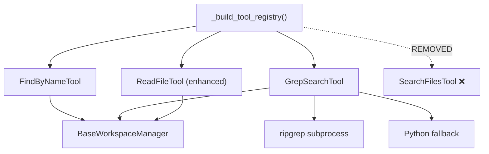

# Feature Implementation Plan: Advanced File Search Tools

---

## 1. Overview

| Field              | Value                                            |
|:-------------------|:-------------------------------------------------|
| **Feature**        | Add `find_by_name` and `grep_search` tools, remove `search_files`, and add line-number display to `read_file` |
| **Source**         | N/A — standalone                                 |
| **Motivation**     | The current `search_files` tool uses slow Python-level `os.walk` + case-insensitive string matching for everything. It conflates two distinct use cases: finding files by name and searching file contents. Splitting into purpose-built tools (`find_by_name` for file discovery, `grep_search` for content search) gives the agent clearer, faster, and more capable search primitives. |
| **User-Facing?**   | Yes — agent uses these tools to respond to user queries |
| **Scope**          | 2 new tools, 1 tool removal (`search_files`), 1 tool improvement (`read_file` line numbers). Does NOT include `view_file_outline` (deferred). |
| **Estimated Effort** | M — 2 new tool classes, 1 removal, data-driven config, bootstrap wiring, tests |

### 1.1 Requirements

| # | Requirement | Priority | Acceptance Criterion |
|:-:|:------------|:--------:|:---------------------|
| R1 | `find_by_name` — search for files/dirs by glob pattern within a directory | Must | Given a glob pattern and directory, returns matching paths with type, size, and mtime |
| R2 | `find_by_name` supports filtering by type (file/directory/any), extensions, excludes, and max_depth | Must | Each filter correctly narrows results |
| R3 | `grep_search` — search file contents using regex or literal patterns via `ripgrep` subprocess | Must | Returns matches with filename, line number, and line content |
| R4 | `grep_search` supports case-insensitive search, glob includes, and file-only mode | Must | Flags correctly alter search behavior |
| R5 | `grep_search` falls back to Python-based search when [rg](file:///x:/agent_cli/agent_cli/core/runtime/tools/file_tools.py#183-186) is not available | Must | Produces equivalent results without [rg](file:///x:/agent_cli/agent_cli/core/runtime/tools/file_tools.py#183-186) |
| R6 | `search_files` tool is fully removed from codebase | Must | Tool no longer in registry, class deleted, references updated |
| R7 | `read_file` shows line numbers in output by default, controllable via [tools.json](file:///x:/agent_cli/agent_cli/data/tools.json) config | Should | Line numbers appear as `  1: content`; disabling via config removes them |
| R8 | All new tools respect workspace path jailing via [BaseWorkspaceManager](file:///x:/agent_cli/agent_cli/core/ux/interaction/base.py#9-29) | Must | Paths outside workspace root are rejected |
| R9 | All new tools are registered in [_build_tool_registry](file:///x:/agent_cli/agent_cli/core/infra/registry/bootstrap.py#899-955) and available to agents | Must | Tools appear in `tool_registry.get_all_names()` |
| R10 | Results are capped to prevent token explosion (max results configurable via [tools.json](file:///x:/agent_cli/agent_cli/data/tools.json)) | Must | Truncation message shown when cap is hit |

### 1.2 Assumptions & Open Questions

- ✅ `ripgrep` ([rg](file:///x:/agent_cli/agent_cli/core/runtime/tools/file_tools.py#183-186)) is expected to be available on the system PATH — the tool falls back to Python if not found
- ✅ `search_files` is fully removed — no backward compatibility per project rules
- ✅ All existing references to `search_files` in error catalog ([errors.json](file:///x:/agent_cli/agent_cli/data/errors.json)), prompts, and valid examples will be updated to use the new tool names

### 1.3 Out of Scope

- `view_file_outline` (structural file inspection) — deferred to a future plan
- Integration with external indexing services (e.g., ctags, tree-sitter)
- AST-powered code intelligence

---

## 2. Codebase Context

### 2.1 Related Existing Code

| Component | File Path | Relevance |
|:----------|:----------|:----------|
| [BaseTool](file:///x:/agent_cli/agent_cli/core/runtime/tools/base.py#64-124) | [base.py](file:///x:/agent_cli/agent_cli/core/runtime/tools/base.py) | ABC all tools inherit from — [name](file:///x:/agent_cli/agent_cli/core/runtime/tools/registry.py#94-97), `description`, [args_schema](file:///x:/agent_cli/agent_cli/core/runtime/tools/file_tools.py#183-186), [execute()](file:///x:/agent_cli/agent_cli/core/runtime/tools/file_tools.py#401-451), `is_safe`, [category](file:///x:/agent_cli/agent_cli/core/runtime/tools/registry.py#72-75) |
| [ToolCategory](file:///x:/agent_cli/agent_cli/core/runtime/tools/base.py#27-35) | [base.py](file:///x:/agent_cli/agent_cli/core/runtime/tools/base.py#L27-L34) | `SEARCH` category for new search tools |
| [SearchFilesTool](file:///x:/agent_cli/agent_cli/core/runtime/tools/file_tools.py#575-679) | [file_tools.py](file:///x:/agent_cli/agent_cli/core/runtime/tools/file_tools.py#L575-L678) | **To be removed.** Current grep-like tool — replaced by `find_by_name` + `grep_search` |
| [SearchFilesArgs](file:///x:/agent_cli/agent_cli/core/runtime/tools/file_tools.py#557-573) | [file_tools.py](file:///x:/agent_cli/agent_cli/core/runtime/tools/file_tools.py#L557-L572) | **To be removed** alongside [SearchFilesTool](file:///x:/agent_cli/agent_cli/core/runtime/tools/file_tools.py#575-679) |
| [ReadFileTool](file:///x:/agent_cli/agent_cli/core/runtime/tools/file_tools.py#76-147) | [file_tools.py](file:///x:/agent_cli/agent_cli/core/runtime/tools/file_tools.py#L76-L146) | Tool to enhance with line number display |
| [ToolRegistry](file:///x:/agent_cli/agent_cli/core/runtime/tools/registry.py#26-131) | [registry.py](file:///x:/agent_cli/agent_cli/core/runtime/tools/registry.py) | Central catalog — new tools registered, `search_files` deregistered |
| [_build_tool_registry](file:///x:/agent_cli/agent_cli/core/infra/registry/bootstrap.py#899-955) | [bootstrap.py](file:///x:/agent_cli/agent_cli/core/infra/registry/bootstrap.py#L899-L954) | Factory that wires tools — update imports and registrations |
| [BaseWorkspaceManager](file:///x:/agent_cli/agent_cli/core/ux/interaction/base.py#9-29) | [base.py](file:///x:/agent_cli/agent_cli/core/ux/interaction/base.py) | Path jailing contract — [resolve_path()](file:///x:/agent_cli/agent_cli/core/ux/interaction/base.py#12-21), [is_allowed()](file:///x:/agent_cli/agent_cli/core/ux/interaction/base.py#22-25), [get_root()](file:///x:/agent_cli/agent_cli/core/ux/interaction/base.py#26-29) |
| `ToolExecutionError` | [agent_cli/core/infra/events/errors.py](file:///x:/agent_cli/agent_cli/core/infra/events/errors.py) | Standard error type for tool failures |
| [tools.json](file:///x:/agent_cli/agent_cli/data/tools.json) | [tools.json](file:///x:/agent_cli/agent_cli/data/tools.json) | Data-driven tool configuration (defaults) |
| `DataRegistry` | [registry.py](file:///x:/agent_cli/agent_cli/core/infra/registry/registry.py#L146-L147) | [get_tool_defaults()](file:///x:/agent_cli/agent_cli/core/infra/registry/registry.py#146-148) returns [tools.json](file:///x:/agent_cli/agent_cli/data/tools.json) content |
| `RunCommandTool` | [shell_tool.py](file:///x:/agent_cli/agent_cli/core/runtime/tools/shell_tool.py) | Reference for subprocess invocation pattern ([rg](file:///x:/agent_cli/agent_cli/core/runtime/tools/file_tools.py#183-186)) |
| [errors.json](file:///x:/agent_cli/agent_cli/data/errors.json) | [errors.json](file:///x:/agent_cli/agent_cli/data/errors.json) | Contains `search_files` references in valid_example fields that must be updated |

### 2.2 Patterns & Conventions to Follow

- **Naming**: Tools use `<ToolName>Tool` class names with `<ToolName>Args` (Pydantic BaseModel) for arguments
- **Structure**: Each tool = [Args](file:///x:/agent_cli/agent_cli/core/runtime/tools/file_tools.py#58-74) model + [Tool](file:///x:/agent_cli/agent_cli/core/runtime/tools/base.py#64-124) class, grouped by section with ASCII box headers
- **Error handling**: All tools raise `ToolExecutionError` for recoverable failures
- **Configuration**: Hardcoded defaults at module level (`_UPPERCASE_CONSTANTS`), overridable via [tools.json](file:///x:/agent_cli/agent_cli/data/tools.json) → `DataRegistry.get_tool_defaults()`
- **Imports**: Absolute imports from `agent_cli.*`
- **Categories**: `ToolCategory.SEARCH` for search tools
- **Workspace**: All path args resolved via `self.workspace.resolve_path()` before use
- **Constructor**: [__init__(self, workspace: BaseWorkspaceManager)](file:///x:/agent_cli/agent_cli/core/runtime/tools/file_tools.py#289-299) — workspace injected at registration time

### 2.3 Integration Points

| Integration Point | File Path | How It Connects |
|:------------------|:----------|:----------------|
| Tool registration | [bootstrap.py:L899-L954](file:///x:/agent_cli/agent_cli/core/infra/registry/bootstrap.py#L899-L954) | Remove [SearchFilesTool](file:///x:/agent_cli/agent_cli/core/runtime/tools/file_tools.py#575-679) import/register, add new tools |
| Tool defaults config | [tools.json](file:///x:/agent_cli/agent_cli/data/tools.json) | Add new config sections, remove `search_files_*` fields |
| Error catalog | [errors.json](file:///x:/agent_cli/agent_cli/data/errors.json) | Update `valid_example` fields referencing `search_files` |
| Agent tool list | [bootstrap.py:L655](file:///x:/agent_cli/agent_cli/core/infra/registry/bootstrap.py#L655) | `all_tools = tool_registry.get_all_names()` — auto-updated |

---

## 3. Design

### 3.1 Architecture Overview

Two new tool classes are added in a new file `search_tools.py`, separating search-specific tools from the file operation tools in [file_tools.py](file:///x:/agent_cli/dev/tests/tools/test_file_tools.py) (which is already 679 lines). The existing [SearchFilesTool](file:///x:/agent_cli/agent_cli/core/runtime/tools/file_tools.py#575-679) and its [SearchFilesArgs](file:///x:/agent_cli/agent_cli/core/runtime/tools/file_tools.py#557-573) are removed from [file_tools.py](file:///x:/agent_cli/dev/tests/tools/test_file_tools.py). The `read_file` enhancement is an in-place modification of [ReadFileTool](file:///x:/agent_cli/agent_cli/core/runtime/tools/file_tools.py#76-147).



### 3.2 New Components

| Component | Type | File Path | Responsibility |
|:----------|:-----|:----------|:---------------|
| `FindByNameArgs` | Pydantic Model | `agent_cli/core/runtime/tools/search_tools.py` | Arguments: `pattern`, [path](file:///x:/agent_cli/agent_cli/core/ux/interaction/base.py#12-21), `type`, `extensions`, `excludes`, `max_depth`, `max_results` |
| `FindByNameTool` | Class (BaseTool) | `agent_cli/core/runtime/tools/search_tools.py` | Search files/dirs by glob pattern using Python `pathlib` + `fnmatch` with filtering |
| `GrepSearchArgs` | Pydantic Model | `agent_cli/core/runtime/tools/search_tools.py` | Arguments: `query`, `search_path`, `is_regex`, [case_insensitive](file:///x:/agent_cli/agent_cli/core/runtime/tools/file_tools.py#223-236), `includes`, `match_per_line`, `max_results` |
| `GrepSearchTool` | Class (BaseTool) | `agent_cli/core/runtime/tools/search_tools.py` | Content search via `ripgrep` subprocess with Python fallback |

### 3.3 Modified Components

| Component | File Path | What Changes | Why |
|:----------|:----------|:-------------|:----|
| [file_tools.py](file:///x:/agent_cli/dev/tests/tools/test_file_tools.py) | [agent_cli/core/runtime/tools/file_tools.py](file:///x:/agent_cli/agent_cli/core/runtime/tools/file_tools.py) | Remove [SearchFilesArgs](file:///x:/agent_cli/agent_cli/core/runtime/tools/file_tools.py#557-573), [SearchFilesTool](file:///x:/agent_cli/agent_cli/core/runtime/tools/file_tools.py#575-679), and related constants (`_SEARCH_FILES_*`) | Replaced by `find_by_name` + `grep_search` |
| `ReadFileTool.__init__` | [agent_cli/core/runtime/tools/file_tools.py](file:///x:/agent_cli/agent_cli/core/runtime/tools/file_tools.py) | Accept optional `show_line_numbers` param | R7 — configurability |
| `ReadFileTool.execute` | [agent_cli/core/runtime/tools/file_tools.py](file:///x:/agent_cli/agent_cli/core/runtime/tools/file_tools.py) | Add line-number prefixing to output | R7 — line numbers help agent navigate |
| [_build_tool_registry](file:///x:/agent_cli/agent_cli/core/infra/registry/bootstrap.py#899-955) | [agent_cli/core/infra/registry/bootstrap.py](file:///x:/agent_cli/agent_cli/core/infra/registry/bootstrap.py) | Remove [SearchFilesTool](file:///x:/agent_cli/agent_cli/core/runtime/tools/file_tools.py#575-679) import/register, add new tools, pass config to [ReadFileTool](file:///x:/agent_cli/agent_cli/core/runtime/tools/file_tools.py#76-147) | Wiring |
| [tools.json](file:///x:/agent_cli/agent_cli/data/tools.json) | [agent_cli/data/tools.json](file:///x:/agent_cli/agent_cli/data/tools.json) | Add `find_by_name` and `grep_search` sections, add `show_line_numbers`, clean up removed tool fields | Data-driven defaults |
| [errors.json](file:///x:/agent_cli/agent_cli/data/errors.json) | [agent_cli/data/errors.json](file:///x:/agent_cli/agent_cli/data/errors.json) | Update `valid_example` values that reference `search_files` → use `grep_search` or `find_by_name` | Keep examples valid |

### 3.4 Data Model / Schema Changes

```json
// tools.json — final state after changes
{
  "file_tools": {
    "show_line_numbers": true,
    "list_directory_default_depth": 2,
    "diff_context_lines": 2,
    "diff_max_lines": 60,
    "read_file_max_bytes": 1048576
  },
  "find_by_name": {
    "max_results": 50,
    "default_max_depth": 10
  },
  "grep_search": {
    "max_results": 50,
    "max_file_size_bytes": 524288
  }
}
```

> [!NOTE]
> The old `search_files_default_max_results` and `search_files_max_file_bytes` fields are removed from `file_tools` and relocated to their respective new tool sections.

### 3.5 API / Interface Contract

```python
# ── find_by_name ─────────────────────────────────────────────────
class FindByNameArgs(BaseModel):
    pattern: str = Field(
        description="Glob pattern to search for (e.g. '*.py', 'test_*')."
    )
    path: str = Field(
        default=".",
        description="Directory to search in (relative to workspace root).",
    )
    type: Optional[str] = Field(
        default=None,
        description="Filter by type: 'file', 'directory', or 'any' (default).",
    )
    extensions: Optional[list[str]] = Field(
        default=None,
        description="File extensions to include, without leading dot (e.g. ['py','txt']).",
    )
    excludes: Optional[list[str]] = Field(
        default=None,
        description="Glob patterns to exclude (e.g. ['__pycache__', '*.pyc']).",
    )
    max_depth: Optional[int] = Field(
        default=None,
        description="Maximum directory depth to search.",
    )
    max_results: int = Field(
        default=50,
        description="Maximum number of results to return.",
    )

# Output format:
# Found 12 matches in 'src/':
# [file]  src/utils/helper.py  (2.3KB, 2026-03-07 10:30)
# [dir]   src/models/           (2026-03-07 09:15)
# ...
# [Stopped at 50 results. Narrow your pattern.]


# ── grep_search ──────────────────────────────────────────────────
class GrepSearchArgs(BaseModel):
    query: str = Field(
        description="Text pattern to search for (literal string or regex)."
    )
    search_path: str = Field(
        default=".",
        description="Directory or file to search in (relative to workspace root).",
    )
    is_regex: bool = Field(
        default=False,
        description="If True, treat query as a regex pattern. If False, literal match.",
    )
    case_insensitive: bool = Field(
        default=True,
        description="If True, perform case-insensitive search.",
    )
    includes: Optional[list[str]] = Field(
        default=None,
        description="Glob patterns to filter files (e.g. ['*.py', '*.js']).",
    )
    match_per_line: bool = Field(
        default=True,
        description="If True, return each matching line. If False, return only filenames.",
    )
    max_results: int = Field(
        default=50,
        description="Maximum number of matches to return.",
    )

# Output format (match_per_line=True):
# Found 5 matches:
# src/models/user.py:12: class User(BaseModel):
# src/models/user.py:45:     def validate_email(self):
#
# Output format (match_per_line=False):
# Found 3 files containing 'BaseModel':
# src/models/user.py
# src/models/product.py
# src/services/base.py
```

### 3.6 Design Decisions

| Decision | Alternatives Considered | Why This Choice |
|:---------|:-----------------------|:----------------|
| New file `search_tools.py` for the 2 new tools | Add to [file_tools.py](file:///x:/agent_cli/dev/tests/tools/test_file_tools.py) | [file_tools.py](file:///x:/agent_cli/dev/tests/tools/test_file_tools.py) is already 679 lines; separation by concern keeps files manageable |
| Remove `search_files` entirely | Keep both, deprecate gradually | Project rule: avoid backward compat. The two new tools fully cover `search_files` use cases with clearer separation |
| Use `ripgrep` subprocess for `grep_search` with Python fallback | Pure Python only | [rg](file:///x:/agent_cli/agent_cli/core/runtime/tools/file_tools.py#183-186) is dramatically faster, respects `.gitignore`, handles binary detection natively; fallback ensures it works everywhere |
| `find_by_name` uses Python `pathlib` + `fnmatch` | Shell out to `fd` | Pure Python avoids external dependency; performance is adequate for workspace-scoped searches |
| Line numbers in `read_file` default ON, configurable via [tools.json](file:///x:/agent_cli/agent_cli/data/tools.json) | Always on, always off, per-call arg | Data-driven config follows existing patterns and allows user customization without code changes |

---

## 4. Testing Strategy

### 4.1 Test Plan

| Requirement | Test Name | Type | Description |
|:-----------:|:----------|:-----|:------------|
| R1 | `test_find_by_name_basic_glob` | Unit | Finds files matching `*.py` in a temp directory |
| R2 | `test_find_by_name_type_filter_file` | Unit | `type='file'` excludes directories |
| R2 | `test_find_by_name_type_filter_directory` | Unit | `type='directory'` excludes files |
| R2 | `test_find_by_name_extensions_filter` | Unit | `extensions=['py','txt']` limits results |
| R2 | `test_find_by_name_excludes` | Unit | `excludes=['__pycache__']` removes matching paths |
| R2 | `test_find_by_name_max_depth` | Unit | `max_depth=1` limits to immediate children |
| R3 | `test_grep_search_literal` | Unit | Finds literal string matches with line numbers |
| R3 | `test_grep_search_regex` | Unit | Finds regex pattern matches |
| R4 | `test_grep_search_case_insensitive` | Unit | Case-insensitive flag works correctly |
| R4 | `test_grep_search_includes` | Unit | `includes=['*.py']` limits search scope |
| R4 | `test_grep_search_files_only` | Unit | `match_per_line=False` returns only filenames |
| R5 | `test_grep_search_python_fallback` | Unit | Works correctly when [rg](file:///x:/agent_cli/agent_cli/core/runtime/tools/file_tools.py#183-186) is unavailable |
| R6 | `test_search_files_removed` | Unit | `search_files` is not in registry |
| R7 | `test_read_file_line_numbers_on` | Unit | Output includes `  1: ` prefix when enabled |
| R7 | `test_read_file_line_numbers_off` | Unit | Output has no prefix when disabled |
| R7 | `test_read_file_line_numbers_with_slicing` | Unit | Line numbers correct for `start_line`/`end_line` |
| R8 | `test_tools_reject_outside_workspace` | Unit | New tools raise error for paths outside root |
| R10 | `test_find_by_name_max_results` | Unit | Truncation message when cap hit |
| R10 | `test_grep_search_max_results` | Unit | Truncation message when cap hit |

### 4.2 Edge Cases & Error Scenarios

| Scenario | Expected Behavior | Test Name |
|:---------|:------------------|:----------|
| `find_by_name` on non-existent directory | Raises `ToolExecutionError` | `test_find_by_name_nonexistent_dir` |
| `find_by_name` on a file (not directory) | Raises `ToolExecutionError` | `test_find_by_name_not_a_directory` |
| `grep_search` with empty query | Raises `ToolExecutionError` | `test_grep_search_empty_query` |
| `grep_search` with invalid regex | Raises `ToolExecutionError` with clear message | `test_grep_search_invalid_regex` |
| `grep_search` no matches | Returns "No matches found" message | `test_grep_search_no_matches` |
| `find_by_name` no matches | Returns "No matches found" message | `test_find_by_name_no_matches` |

### 4.3 Existing Tests to Modify

| Test | File | Modification Needed |
|:-----|:-----|:--------------------|
| `test_read_file_*` | [dev/tests/tools/test_file_tools.py](file:///x:/agent_cli/dev/tests/tools/test_file_tools.py) | Update expected output to include line number formatting; add tests for on/off toggle |
| Any `search_files` tests | [dev/tests/tools/test_file_tools.py](file:///x:/agent_cli/dev/tests/tools/test_file_tools.py) | Remove tests for deleted [SearchFilesTool](file:///x:/agent_cli/agent_cli/core/runtime/tools/file_tools.py#575-679) |

---

## 5. Implementation Phases

---

### Phase 1: Foundation — `FindByNameTool` + Config + Remove [SearchFilesTool](file:///x:/agent_cli/agent_cli/core/runtime/tools/file_tools.py#575-679)

**Goal**: New `search_tools.py` with working `FindByNameTool`, [SearchFilesTool](file:///x:/agent_cli/agent_cli/core/runtime/tools/file_tools.py#575-679) removed, config updated.

**Prerequisites**: Plan review complete

#### Steps

1. **Update [tools.json](file:///x:/agent_cli/agent_cli/data/tools.json) config**
   - File: [agent_cli/data/tools.json](file:///x:/agent_cli/agent_cli/data/tools.json)
   - Details: Add `find_by_name` and `grep_search` config sections. Add `show_line_numbers: true` to `file_tools`. Remove `search_files_default_max_results` and `search_files_max_file_bytes` from `file_tools`.
   ```json
   "file_tools": {
     "show_line_numbers": true,
     "list_directory_default_depth": 2,
     "diff_context_lines": 2,
     "diff_max_lines": 60,
     "read_file_max_bytes": 1048576
   },
   "find_by_name": {
     "max_results": 50,
     "default_max_depth": 10
   },
   "grep_search": {
     "max_results": 50,
     "max_file_size_bytes": 524288
   }
   ```

2. **Create `search_tools.py` with `FindByNameTool`**
   - File: `agent_cli/core/runtime/tools/search_tools.py`
   - Details: Implement `FindByNameArgs` and `FindByNameTool` following [BaseTool](file:///x:/agent_cli/agent_cli/core/runtime/tools/base.py#64-124) pattern. Uses `os.walk` + `fnmatch` for glob matching. Supports `type` filter (file/directory/any), `extensions` filter, `excludes` patterns, `max_depth` limit, and `max_results` cap. Respects workspace jailing via [resolve_path()](file:///x:/agent_cli/agent_cli/core/ux/interaction/base.py#12-21) and [is_allowed()](file:///x:/agent_cli/agent_cli/core/ux/interaction/base.py#22-25). Output format: `[file]`/`[dir]` prefix with relative path, size, and modification time.

3. **Remove [SearchFilesTool](file:///x:/agent_cli/agent_cli/core/runtime/tools/file_tools.py#575-679) from [file_tools.py](file:///x:/agent_cli/dev/tests/tools/test_file_tools.py)**
   - File: [agent_cli/core/runtime/tools/file_tools.py](file:///x:/agent_cli/agent_cli/core/runtime/tools/file_tools.py)
   - Details: Delete [SearchFilesArgs](file:///x:/agent_cli/agent_cli/core/runtime/tools/file_tools.py#557-573) class (L557-572), [SearchFilesTool](file:///x:/agent_cli/agent_cli/core/runtime/tools/file_tools.py#575-679) class (L575-678), and the `_SEARCH_FILES_DEFAULT_MAX_RESULTS` / `_SEARCH_FILES_MAX_FILE_BYTES` constants (L24, L28). Keep the [_is_probably_binary](file:///x:/agent_cli/agent_cli/core/runtime/tools/file_tools.py#31-43) and [_decode_text_bytes](file:///x:/agent_cli/agent_cli/core/runtime/tools/file_tools.py#45-51) helpers (still used by [ReadFileTool](file:///x:/agent_cli/agent_cli/core/runtime/tools/file_tools.py#76-147)).

4. **Update bootstrap to swap tools**
   - File: [agent_cli/core/infra/registry/bootstrap.py](file:///x:/agent_cli/agent_cli/core/infra/registry/bootstrap.py)
   - Details: Remove [SearchFilesTool](file:///x:/agent_cli/agent_cli/core/runtime/tools/file_tools.py#575-679) from import and registration. Import `FindByNameTool` from `search_tools` and register it.

5. **Update [errors.json](file:///x:/agent_cli/agent_cli/data/errors.json) valid examples**
   - File: [agent_cli/data/errors.json](file:///x:/agent_cli/agent_cli/data/errors.json)
   - Details: Replace all `"search_files"` references in `valid_example` fields with `"grep_search"` (for content search examples) or `"find_by_name"` (for file discovery examples).

6. **Write unit tests for `FindByNameTool`**
   - File: `dev/tests/tools/test_search_tools.py`
   - Covers: Basic glob, type filter (file/directory), extensions, excludes, max_depth, max_results, nonexistent dir, not-a-directory, no matches, workspace jailing

#### Checkpoint

- [ ] `FindByNameTool` importable: `python -c "from agent_cli.core.runtime.tools.search_tools import FindByNameTool"`
- [ ] [SearchFilesTool](file:///x:/agent_cli/agent_cli/core/runtime/tools/file_tools.py#575-679) no longer importable from `file_tools`
- [ ] Tool registry contains `find_by_name` but NOT `search_files`
- [ ] No references to `search_files` remain in [errors.json](file:///x:/agent_cli/agent_cli/data/errors.json)
- [ ] Unit tests pass: `pytest dev/tests/tools/test_search_tools.py -v -k find_by_name`
- [ ] Linter clean: `ruff check agent_cli/core/runtime/tools/search_tools.py`

---

### Phase 2: `GrepSearchTool` — Ripgrep-Powered Content Search

**Goal**: Working `GrepSearchTool` with [rg](file:///x:/agent_cli/agent_cli/core/runtime/tools/file_tools.py#183-186) subprocess as primary engine and Python fallback.

**Prerequisites**: Phase 1 checkpoint passed

#### Steps

1. **Add `GrepSearchTool` to `search_tools.py`**
   - File: `agent_cli/core/runtime/tools/search_tools.py`
   - Details: Implement `GrepSearchArgs` and `GrepSearchTool`.
     - **Primary path (ripgrep)**: Build [rg](file:///x:/agent_cli/agent_cli/core/runtime/tools/file_tools.py#183-186) command with appropriate flags (`--json` for structured output, `-i` for case-insensitive, `--glob` for includes, `-l` for files-only, `-F` for literal / no flag for regex, `-m` for max count per file). Parse JSON output lines. Cap total results at `max_results`.
     - **Fallback path (Python)**: If [rg](file:///x:/agent_cli/agent_cli/core/runtime/tools/file_tools.py#183-186) is not found (`FileNotFoundError` on subprocess), use `os.walk` + `re.compile` (regex) or `str.find` (literal) to search files. Reuse [_is_probably_binary](file:///x:/agent_cli/agent_cli/core/runtime/tools/file_tools.py#31-43) and [_decode_text_bytes](file:///x:/agent_cli/agent_cli/core/runtime/tools/file_tools.py#45-51) helpers from `file_tools`. Respect `includes` via `fnmatch`. Cap at `max_results`.
     - **Error handling**: Empty query → `ToolExecutionError`. Invalid regex → `ToolExecutionError` with clear message. Non-existent path → `ToolExecutionError`.

2. **Register `GrepSearchTool` in bootstrap**
   - File: [agent_cli/core/infra/registry/bootstrap.py](file:///x:/agent_cli/agent_cli/core/infra/registry/bootstrap.py)
   - Details: Import `GrepSearchTool` from `search_tools` and register alongside `FindByNameTool`

3. **Write unit tests for `GrepSearchTool`**
   - File: `dev/tests/tools/test_search_tools.py`
   - Covers: Literal search, regex search, case-insensitive, includes filter, files-only mode, max_results cap, empty query, invalid regex, no matches, Python fallback (mock [rg](file:///x:/agent_cli/agent_cli/core/runtime/tools/file_tools.py#183-186) not found)

#### Checkpoint

- [ ] `GrepSearchTool` registered and functional
- [ ] Unit tests pass: `pytest dev/tests/tools/test_search_tools.py -v -k grep_search`
- [ ] Ripgrep path works when [rg](file:///x:/agent_cli/agent_cli/core/runtime/tools/file_tools.py#183-186) is available
- [ ] Python fallback works when [rg](file:///x:/agent_cli/agent_cli/core/runtime/tools/file_tools.py#183-186) is not available (tested via mock)

---

### Phase 3: `read_file` Enhancement — Line Number Display

**Goal**: [ReadFileTool](file:///x:/agent_cli/agent_cli/core/runtime/tools/file_tools.py#76-147) output includes line numbers by default, configurable via [tools.json](file:///x:/agent_cli/agent_cli/data/tools.json).

**Prerequisites**: Phase 2 checkpoint passed

#### Steps

1. **Modify [ReadFileTool](file:///x:/agent_cli/agent_cli/core/runtime/tools/file_tools.py#76-147) to support line numbers**
   - File: [agent_cli/core/runtime/tools/file_tools.py](file:///x:/agent_cli/agent_cli/core/runtime/tools/file_tools.py)
   - Details:
     - Update [__init__](file:///x:/agent_cli/agent_cli/core/runtime/tools/file_tools.py#289-299) to accept `show_line_numbers: bool = True`
     - In [execute()](file:///x:/agent_cli/agent_cli/core/runtime/tools/file_tools.py#401-451), after computing `display_content` and the line slice, prefix each line with padded 1-indexed line numbers
     - For sliced output, line numbers reflect original file positions (not 1-based from slice start)
   ```python
   def __init__(self, workspace, *, show_line_numbers: bool = True):
       self.workspace = workspace
       self._show_line_numbers = show_line_numbers

   async def execute(self, **kwargs):
       # ... existing logic up to display_content ...
       if self._show_line_numbers:
           start_offset = max((start_line or 1), 1)
           display_lines = display_content.splitlines()
           width = len(str(start_offset + len(display_lines) - 1))
           numbered = [
               f"{i:>{width}}: {line}"
               for i, line in enumerate(display_lines, start=start_offset)
           ]
           display_content = "\n".join(numbered)
   ```

2. **Update bootstrap to pass config to [ReadFileTool](file:///x:/agent_cli/agent_cli/core/runtime/tools/file_tools.py#76-147)**
   - File: [agent_cli/core/infra/registry/bootstrap.py](file:///x:/agent_cli/agent_cli/core/infra/registry/bootstrap.py)
   - Details: Read `show_line_numbers` from `data_registry.get_tool_defaults()["file_tools"]` and pass to constructor.
   ```python
   file_defaults = data_registry.get_tool_defaults().get("file_tools", {})
   show_line_numbers = bool(file_defaults.get("show_line_numbers", True))
   registry.register(ReadFileTool(workspace, show_line_numbers=show_line_numbers))
   ```

3. **Update existing `read_file` tests**
   - File: [dev/tests/tools/test_file_tools.py](file:///x:/agent_cli/dev/tests/tools/test_file_tools.py)
   - Details: Adjust expected output to account for line-number prefixing. Add tests for `show_line_numbers=True` and `show_line_numbers=False`. Remove any [SearchFilesTool](file:///x:/agent_cli/agent_cli/core/runtime/tools/file_tools.py#575-679) tests.

#### Checkpoint

- [ ] `read_file` output includes line numbers by default
- [ ] Setting `"show_line_numbers": false` in [tools.json](file:///x:/agent_cli/agent_cli/data/tools.json) disables line numbers
- [ ] Line numbers are correct for sliced reads (`start_line` / `end_line`)
- [ ] Existing tests updated and passing: `pytest dev/tests/tools/test_file_tools.py -v`
- [ ] Full test suite passes: `pytest dev/tests/ -v`
- [ ] No lint/type errors: `ruff check agent_cli/core/runtime/tools/`

---

## 6. File Change Summary

| # | Action | File Path | Phase | Description |
|:-:|:------:|:----------|:-----:|:------------|
| 1 | MODIFY | [agent_cli/data/tools.json](file:///x:/agent_cli/agent_cli/data/tools.json) | 1 | Add `find_by_name`, `grep_search` config; add `show_line_numbers`; remove `search_files_*` fields |
| 2 | CREATE | `agent_cli/core/runtime/tools/search_tools.py` | 1–2 | New file with `FindByNameTool` (Phase 1) and `GrepSearchTool` (Phase 2) |
| 3 | MODIFY | [agent_cli/core/runtime/tools/file_tools.py](file:///x:/agent_cli/agent_cli/core/runtime/tools/file_tools.py) | 1, 3 | Remove [SearchFilesArgs](file:///x:/agent_cli/agent_cli/core/runtime/tools/file_tools.py#557-573)/[SearchFilesTool](file:///x:/agent_cli/agent_cli/core/runtime/tools/file_tools.py#575-679) (Phase 1); add line numbers to [ReadFileTool](file:///x:/agent_cli/agent_cli/core/runtime/tools/file_tools.py#76-147) (Phase 3) |
| 4 | MODIFY | [agent_cli/core/infra/registry/bootstrap.py](file:///x:/agent_cli/agent_cli/core/infra/registry/bootstrap.py) | 1–3 | Remove [SearchFilesTool](file:///x:/agent_cli/agent_cli/core/runtime/tools/file_tools.py#575-679), register new tools, pass config to [ReadFileTool](file:///x:/agent_cli/agent_cli/core/runtime/tools/file_tools.py#76-147) |
| 5 | MODIFY | [agent_cli/data/errors.json](file:///x:/agent_cli/agent_cli/data/errors.json) | 1 | Update `valid_example` fields referencing `search_files` |
| 6 | CREATE | `dev/tests/tools/test_search_tools.py` | 1–2 | Unit tests for `FindByNameTool` and `GrepSearchTool` |
| 7 | MODIFY | [dev/tests/tools/test_file_tools.py](file:///x:/agent_cli/dev/tests/tools/test_file_tools.py) | 3 | Update `read_file` tests for line numbers; remove `search_files` tests |

---

## 7. Post-Implementation Verification

- [ ] All requirements from §1.1 have passing tests
- [ ] Full test suite passes: `pytest dev/tests/ -v`
- [ ] No lint/type errors: `ruff check agent_cli/core/runtime/tools/`
- [ ] No orphan code (every new component is reachable via [_build_tool_registry](file:///x:/agent_cli/agent_cli/core/infra/registry/bootstrap.py#899-955))
- [ ] No stale references to `search_files` anywhere in codebase
- [ ] Feature works end-to-end: start agent CLI, verify `find_by_name` and `grep_search` appear in tool list, `search_files` does not
- [ ] [tools.json](file:///x:/agent_cli/agent_cli/data/tools.json) changes validated: `python -c "from agent_cli.core.infra.registry.registry import DataRegistry; d = DataRegistry(); print(d.get_tool_defaults()['find_by_name'])"`

---

## Appendix: References

- Existing tool pattern: [file_tools.py](file:///x:/agent_cli/agent_cli/core/runtime/tools/file_tools.py)
- Tool base class: [base.py](file:///x:/agent_cli/agent_cli/core/runtime/tools/base.py)
- Bootstrap wiring: [bootstrap.py](file:///x:/agent_cli/agent_cli/core/infra/registry/bootstrap.py#L899-L954)
- Data-driven defaults: [tools.json](file:///x:/agent_cli/agent_cli/data/tools.json)
- Ripgrep documentation: https://github.com/BurntSushi/ripgrep
