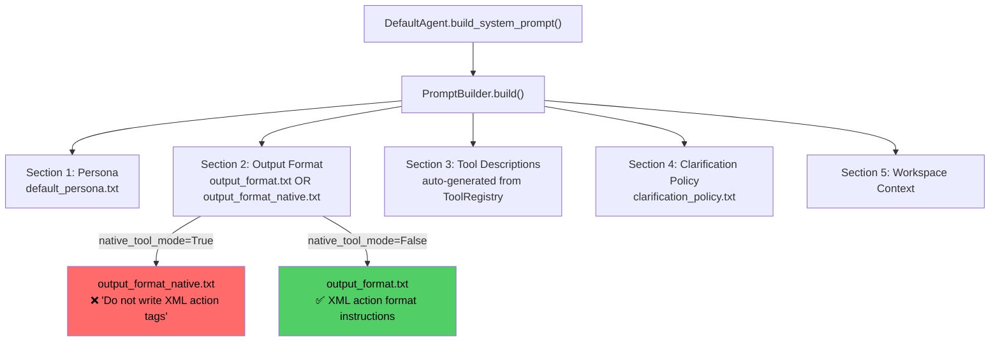

# Prompt Analysis: Session c0416063

## Session Summary

The agent (Gemini 3 Flash Preview) was asked "what is this project about?" and spiraled into **7 consecutive errors** without completing the task. The session contains 4 distinct schema validation errors that reveal fundamental issues in the prompt generation.

---

## Error-by-Error Trace

### Error 1: Multiple `<action>` Blocks (Turn 4)

**What the agent did:**
```xml
<action><tool>read_file</tool><args>{"path": "pack.mcmeta"}</args></action>
<action><tool>read_file</tool><args>{"path": ".agent/INDEX.md"}</args></action>
```

**Validator error:** `Multiple <action> blocks found. You must call exactly ONE tool per response.`

**Root cause:** The prompt says "One decision per turn" but does **not** provide a **concrete negative example** of multiple actions. The agent pattern-matched parallel tool calls (a common behavior in many LLM systems) because the constraint is stated abstractly. Furthermore, the output format template ([output_format.txt:28](file:///x:/agent_cli/agent_cli/data/prompts/output_format.txt#L28)) doesn't explicitly show "do NOT include more than one `<action>` block."

---

### Error 2: Self-correction Text Outside Tags (Turn 5)

**What the agent did:**
```
(Self-correction: I should call one tool at a time...)
```

**Validator error:** `Response contains no reasoning, no tool call, and no final answer.`

**Root cause:** After receiving the schema error, the agent tried to "self-correct" but outputted **parenthetical free-form text** — not wrapped in any tag. The schema validator's [_check_text_leakage()](file:///x:/agent_cli/agent_cli/agent/schema.py#297-316) strips all known tags and checks for leftover text > 10 chars. But note: the validator first checks for **emptiness** (line 148 of [schema.py](file:///x:/agent_cli/agent_cli/agent/schema.py#L148)) before checking text leakage (line 156). So the error message here is about "no content at all" rather than "text outside tags."

> [!IMPORTANT]
> The prompt tells the agent what tags are **allowed** but doesn't tell it what to do when it makes a mistake. There's no "error recovery" guidance in the prompt. The agent doesn't know how to properly format a self-correction — it should wrap it in `<thinking>` tags.

---

### Error 3: XML Args Instead of JSON (Turn 7)

**What the agent did:**
```xml
<action>
  <tool>read_file</tool>
  <args>
    <path>.agent/INDEX.md</path>
  </args>
</action>
```

**Validator error:** `Invalid JSON in <args> for tool 'read_file'. Raw content: <path>.agent/INDEX.md</path>`

**Root cause:** The agent used **XML-style arguments** (`<path>...</path>`) instead of JSON (`{"path": "..."}`). This is a common confusion when models are told to use XML-like tags for structure — they generalize and try XML for everything.

The prompt template shows the correct format on **one line** ([output_format.txt:15](file:///x:/agent_cli/agent_cli/data/prompts/output_format.txt#L15)):
```
<action><tool>tool_name</tool><args>{"key": "value"}</args></action>
```

But this **compact example** doesn't sufficiently emphasize that args **must be JSON**. The agent, already confused from error corrections, reverted to a more "natural" XML format.

---

### Error 4: Empty Response (Turn 8)

**What the agent did:** Produced an empty string `""`.

**Root cause:** After 3 consecutive errors, the agent became so confused about what format is acceptable that it produced nothing. This is a classic "prompt paralysis" pattern — too many corrections without a clear recovery path.

---

### Error 5: Thinking-Only with Text Leakage (Turn 10-11)

**What the agent did:**
```
---

(Self-correction: I should follow the format exactly.)
<title>Reading .agent/INDEX.md</title>
<thinking>...</thinking>
<action><tool>read_file</tool><args>{"path": ".agent/INDEX.md"}</args></action>
```

**Validator error:** `Found raw text outside of allowed tags.`

**Root cause:** The agent *almost* got it right — the `<title>`, `<thinking>`, and `<action>` blocks are correct. But the text `---` and [(Self-correction: ...)](file:///x:/agent_cli/agent_cli/agent/base.py#137-141) before the tags triggered [_check_text_leakage()](file:///x:/agent_cli/agent_cli/agent/schema.py#297-316). The agent added "self-correction" narration because **the prompt doesn't instruct where to put metacognitive commentary**.

---

## Root Cause Analysis

### 🔴 Critical Issue: Native vs XML Mode Mismatch

The simulated prompt output reveals the system used **[output_format_native.txt](file:///x:/agent_cli/agent_cli/data/prompts/output_format_native.txt)** (the output says "Invoke a tool via the **native API function calling mechanism**" and "Do not write XML action tags").

But looking at the session, the agent **is using XML `<action>` tags** — meaning the system is actually running in **XML prompting mode** at runtime, yet the simulated prompt shows native mode instructions.

This means one of two things:
1. The `provider.supports_native_tools` flag is misconfigured, or
2. The provider switches behavior depending on runtime context, and the simulation doesn't reflect the real session.

Either way, the agent received **contradictory instructions**: the native prompt says "Do not write XML action tags" while the agent is expected to produce XML.

**Check:** In [default.py:27](file:///x:/agent_cli/agent_cli/agent/default.py#L27):
```python
native_tools = getattr(self.provider, "supports_native_tools", False)
```
This attribute determines which template is used. If this returns `True` for Gemini Flash but native FC isn't actually wired, the agent gets the wrong instructions.

### 🟡 Major Issue: No Concrete Examples of Correct Output

The prompt shows only **abstract patterns** like:
```
<action><tool>tool_name</tool><args>{"key": "value"}</args></action>
```

It doesn't show a **realistic complete response** that demonstrates the full expected structure. A concrete few-shot example would dramatically reduce format confusion.

### 🟡 Major Issue: No Error Recovery Instructions

When the agent receives a schema error, the prompt gives **no guidance** on how to recover. The error messages from the system say "Fix your formatting and try again" but the prompt itself never explains:
- How to handle corrections (wrap in `<thinking>` tags)
- That self-narration must go inside `<thinking>` tags
- That empty responses are invalid

### 🟠 Moderate Issue: Title is Optional in Practice but Suggested as Required

The output format says "Provide a short title" (step 1), making it seem required. But the schema validator silently defaults to "Untitled Action" if omitted. The agent sometimes includes it, sometimes doesn't — inconsistency that adds to confusion.

### 🟠 Moderate Issue: No "JSON, not XML" Emphasis for Args

The prompt shows JSON in the example but never explicitly says "the `<args>` block must contain valid JSON, not XML." When a model is already in an XML-producing mindset (because the response format is XML-based), it can easily slip into XML args.

---

## Recommendations

| # | Fix | Priority | File(s) |
|---|-----|----------|---------|
| 1 | **Verify native_tools flag** for Gemini Flash — ensure it matches the actual tool call mode being used at runtime | 🔴 Critical | [default.py](file:///x:/agent_cli/agent_cli/agent/default.py), provider config |
| 2 | **Add a complete few-shot example** to [output_format.txt](file:///x:/agent_cli/agent_cli/data/prompts/output_format.txt) showing a full valid response (title + thinking + action with real JSON args) | 🟡 High | [output_format.txt](file:///x:/agent_cli/agent_cli/data/prompts/output_format.txt) |
| 3 | **Add error recovery guidance** to the output format: "If you receive a schema error, your next response must be a corrected version inside proper tags. Put any self-reflection inside `<thinking>` tags." | 🟡 High | [output_format.txt](file:///x:/agent_cli/agent_cli/data/prompts/output_format.txt) |
| 4 | **Explicitly state `<args>` must be JSON** — add: "The `<args>` block must contain a valid JSON object. Do not use XML inside `<args>`." | 🟠 Medium | [output_format.txt](file:///x:/agent_cli/agent_cli/data/prompts/output_format.txt) |
| 5 | **Add negative examples** for common mistakes (multiple actions, text outside tags, XML args) | 🟠 Medium | [output_format.txt](file:///x:/agent_cli/agent_cli/data/prompts/output_format.txt) |
| 6 | **Improve schema error messages** to include the correct format example inline, not just "fix your formatting" | 🟢 Low | [schema.py](file:///x:/agent_cli/agent_cli/agent/schema.py) |

---

## Prompt Pipeline Summary



The **mode selection** at `native_tool_mode` is the critical decision point. If this flag is wrong, the entire format instruction section is wrong, and the agent has no chance of producing valid output consistently.
