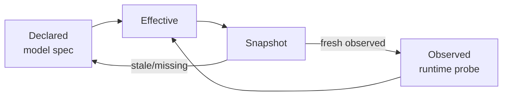
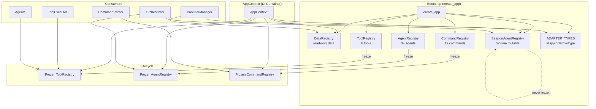

# Registry System — Full Audit Report

**Date:** 2026-03-05
**Scope:** All registry and registry-like subsystems in `agent_cli`
**Auditor:** Antigravity AI

---

## Executive Summary

The `agent_cli` project implements a **multi-layered registry architecture** that manages data-driven defaults, runtime tools, agents, commands, and LLM provider adapters. A prior refactor (conversation `99b6a24b`) successfully introduced a lifecycle mixin (`validate → freeze`), eliminated global singletons (`_DEFAULT_REGISTRY`, `_OBSERVABILITY`), and made the adapter type map immutable. The system is now architecturally sound, but this audit identifies **4 critical issues**, **6 warnings**, and **8 informational notes** regarding test health, consistency gaps, and improvement opportunities.

### Verdict

| Category | Count |
|:---------|------:|
| 🔴 Critical | 4 |
| 🟡 Warning | 6 |
| ℹ️ Info | 8 |

---

## 1. Registry Inventory

The project has **6 distinct registry subsystems**:

| # | Registry | Location | Type | Freezable | Lifecycle Mixin |
|---|----------|----------|------|-----------|-----------------|
| 1 | [DataRegistry](file:///x:/agent_cli/agent_cli/core/infra/registry/registry.py#29-785) | [registry.py](file:///x:/agent_cli/agent_cli/core/infra/registry/registry.py) | Read-only data store | N/A (immutable by design) | ❌ |
| 2 | [ToolRegistry](file:///x:/agent_cli/agent_cli/core/runtime/tools/registry.py#26-127) | [registry.py](file:///x:/agent_cli/agent_cli/core/runtime/tools/registry.py) | Mutable → Frozen | ✅ | ✅ |
| 3 | [AgentRegistry](file:///x:/agent_cli/agent_cli/core/runtime/agents/registry.py#11-51) | [registry.py](file:///x:/agent_cli/agent_cli/core/runtime/agents/registry.py) | Mutable → Frozen | ✅ | ✅ |
| 4 | [CommandRegistry](file:///x:/agent_cli/agent_cli/core/ux/commands/base.py#83-137) | [base.py](file:///x:/agent_cli/agent_cli/core/ux/commands/base.py) | Mutable → Frozen | ✅ | ✅ |
| 5 | [SessionAgentRegistry](file:///x:/agent_cli/agent_cli/core/runtime/agents/session_registry.py#29-107) | [session_registry.py](file:///x:/agent_cli/agent_cli/core/runtime/agents/session_registry.py) | Always mutable | ❌ (by design) | ❌ |
| 6 | `ADAPTER_TYPES` | [manager.py](file:///x:/agent_cli/agent_cli/core/providers/manager.py) | Immutable map | N/A (`MappingProxyType`) | ❌ |

**DI Container:** [AppContext](file:///x:/agent_cli/agent_cli/core/infra/registry/bootstrap.py#L69-L113) holds references to all registries. No global singletons remain.

---

## 2. Critical Issues 🔴

### C1: Test Suite Broken — Stale Import After Reorganization

> [!CAUTION]
> The DataRegistry test file cannot even be collected by pytest.

[test_registry.py:12](file:///x:/agent_cli/dev/tests/data/test_registry.py#L12) imports:
```python
from agent_cli.core import registry as registry_module
```
But the module was relocated to `agent_cli.core.infra.registry.registry` during the codebase reorganization. This causes an `ImportError` that prevents **all 22 DataRegistry tests** from running.

**Fix:**
```diff
-from agent_cli.core import registry as registry_module
+from agent_cli.core.infra.registry import registry as registry_module
```

**Impact:** High — the entire DataRegistry test suite is silently non-functional.

---

### C2: [DataRegistry](file:///x:/agent_cli/agent_cli/core/infra/registry/registry.py#29-785) Lacks `__slots__` for [_capability_observations](file:///x:/agent_cli/agent_cli/core/infra/registry/registry.py#299-325) Thread Safety

The [DataRegistry](file:///x:/agent_cli/agent_cli/core/infra/registry/registry.py#29-785) stores mutable capability observations in [_capability_observations](file:///x:/agent_cli/agent_cli/core/infra/registry/registry.py#299-325) (a [dict](file:///x:/agent_cli/agent_cli/core/infra/logging/logging.py#154-164)). While [ObservabilityManager](file:///x:/agent_cli/agent_cli/core/infra/logging/logging.py#166-402) uses `Lock()` for thread safety, [DataRegistry](file:///x:/agent_cli/agent_cli/core/infra/registry/registry.py#29-785) does **not** protect its mutable observation cache:

- [save_capability_observation](file:///x:/agent_cli/agent_cli/core/infra/registry/registry.py#L280-L297) reads and mutates [_capability_observations](file:///x:/agent_cli/agent_cli/core/infra/registry/registry.py#299-325) without a lock.
- [invalidate_capability_observations](file:///x:/agent_cli/agent_cli/core/infra/registry/registry.py#L299-L324) iterates and deletes keys without a lock.
- [bump_capability_cache_version](file:///x:/agent_cli/agent_cli/core/infra/registry/registry.py#L326-L330) clears the entire dict without synchronization.

These are called from the capability probe service, which could run concurrently with snapshot reads during provider resolution.

**Severity:** Critical in production if any concurrent access pattern exists (e.g., background probe while user is chatting).

**Recommendation:** Add a `threading.Lock` to guard all [_capability_observations](file:///x:/agent_cli/agent_cli/core/infra/registry/registry.py#299-325) mutations and reads in snapshot building.

---

### C3: `RegistryLifecycleMixin._frozen` is a Class Variable, Not Instance Variable

In [registry_base.py:17](file:///x:/agent_cli/agent_cli/core/infra/registry/registry_base.py#L17):

```python
class RegistryLifecycleMixin:
    _frozen: bool = False
    _registry_name: str = "unnamed"
```

[_frozen](file:///x:/agent_cli/agent_cli/core/infra/registry/registry_base.py#39-43) and `_registry_name` are **class-level attributes**. While Python's attribute lookup mechanism means instance-level writes shadow the class attribute (making the current code functionally correct), this is a subtle footgun:

- If a subclass forgets to set `self._registry_name` or `self._frozen` in [__init__](file:///x:/agent_cli/agent_cli/core/runtime/agents/registry.py#19-22), all instances share the class-level state until first mutation.
- If someone creates two instances and freezes one, the other remains unfrozen only because [freeze()](file:///x:/agent_cli/agent_cli/core/infra/registry/registry_base.py#20-32) sets `self._frozen = True` at the instance level. This is correct but non-obvious.

**Recommendation:** Initialize state in a proper [__init__](file:///x:/agent_cli/agent_cli/core/runtime/agents/registry.py#19-22) method or document the shadowing behavior explicitly.

---

### C4: [AgentRegistry](file:///x:/agent_cli/agent_cli/core/runtime/agents/registry.py#11-51) Missing [__len__](file:///x:/agent_cli/agent_cli/core/runtime/tools/registry.py#122-124) and [__contains__](file:///x:/agent_cli/agent_cli/core/runtime/tools/registry.py#125-127) Dunder Methods

[ToolRegistry](file:///x:/agent_cli/agent_cli/core/runtime/tools/registry.py#26-127) provides [__len__](file:///x:/agent_cli/agent_cli/core/runtime/tools/registry.py#122-124) and [__contains__](file:///x:/agent_cli/agent_cli/core/runtime/tools/registry.py#125-127) ([registry.py:122-126](file:///x:/agent_cli/agent_cli/core/runtime/tools/registry.py#L122-L126)), enabling [len(registry)](file:///x:/agent_cli/agent_cli/core/runtime/tools/registry.py#122-124) and `"name" in registry` idioms. [AgentRegistry](file:///x:/agent_cli/agent_cli/core/runtime/agents/registry.py#11-51) does **not**, despite having the same internal pattern. The [CommandRegistry](file:///x:/agent_cli/agent_cli/core/ux/commands/base.py#83-137) also lacks these.

This is a consistency gap — both registries support `.has(name)` but not the Pythonic [in](file:///x:/agent_cli/agent_cli/core/infra/registry/registry.py#669-675) operator.

**Recommendation:** Add [__len__](file:///x:/agent_cli/agent_cli/core/runtime/tools/registry.py#122-124) and [__contains__](file:///x:/agent_cli/agent_cli/core/runtime/tools/registry.py#125-127) to [AgentRegistry](file:///x:/agent_cli/agent_cli/core/runtime/agents/registry.py#11-51) and [CommandRegistry](file:///x:/agent_cli/agent_cli/core/ux/commands/base.py#83-137) for interface parity.

---

## 3. Warnings 🟡

### W1: Stale Module Comment in [commands/__init__.py](file:///x:/agent_cli/agent_cli/core/ux/commands/__init__.py)

[commands/__init__.py:1](file:///x:/agent_cli/agent_cli/core/ux/commands/__init__.py#L1) still references the removed `@command` decorator:

```python
# Command system — @command decorator, CommandRegistry, CommandParser.
```

The `@command` decorator was removed during the lifecycle refactor. This comment is misleading.

**Fix:** Update the comment to:
```python
# Command system — CommandRegistry, CommandDef, CommandParser.
```

---

### W2: [DataRegistry](file:///x:/agent_cli/agent_cli/core/infra/registry/registry.py#29-785) Does Not Use [RegistryLifecycleMixin](file:///x:/agent_cli/agent_cli/core/infra/registry/registry_base.py#10-54)

Unlike [ToolRegistry](file:///x:/agent_cli/agent_cli/core/runtime/tools/registry.py#26-127), [AgentRegistry](file:///x:/agent_cli/agent_cli/core/runtime/agents/registry.py#11-51), and [CommandRegistry](file:///x:/agent_cli/agent_cli/core/ux/commands/base.py#83-137), the [DataRegistry](file:///x:/agent_cli/agent_cli/core/infra/registry/registry.py#29-785) does **not** inherit from [RegistryLifecycleMixin](file:///x:/agent_cli/agent_cli/core/infra/registry/registry_base.py#10-54). This is by design (it's read-only at construction time), but it creates an inconsistency: [DataRegistry](file:///x:/agent_cli/agent_cli/core/infra/registry/registry.py#29-785) has mutable state ([_capability_observations](file:///x:/agent_cli/agent_cli/core/infra/registry/registry.py#299-325), `_prompt_cache`, [_provider_specs_cache](file:///x:/agent_cli/agent_cli/core/infra/registry/registry.py#484-524)) that is not protected by the lifecycle pattern.

The spec document ([05_registry_lifecycle.md](file:///x:/agent_cli/dev/specs/00_core_engine/05_registry_lifecycle.md)) acknowledges this design choice. However, the mutable observation cache added in the capability probe integration means [DataRegistry](file:///x:/agent_cli/agent_cli/core/infra/registry/registry.py#29-785) is no longer purely read-only.

**Recommendation:** Consider splitting the capability observation cache into a separate service or wrapping it in its own lifecycle-managed class.

---

### W3: `CommandRegistry.register()` Doesn't Validate Handler Callable

`ToolRegistry.register()` validates three duck-type attributes ([name](file:///x:/agent_cli/agent_cli/core/runtime/agents/registry.py#49-51), [execute](file:///x:/agent_cli/dev/tests/tools/test_registry.py#27-29), [get_json_schema](file:///x:/agent_cli/dev/tests/tools/test_registry.py#136-141)). `AgentRegistry.register()` validates two ([name](file:///x:/agent_cli/agent_cli/core/runtime/agents/registry.py#49-51), [handle_task](file:///x:/agent_cli/dev/tests/agent/test_session_registry.py#115-119)). `CommandRegistry.register()` validates **none** — it trusts the [CommandDef](file:///x:/agent_cli/agent_cli/core/ux/commands/base.py#49-59) dataclass to be well-formed:

```python
def register(self, cmd: CommandDef, *, override: bool = False) -> None:
    self._assert_mutable()
    key = cmd.name.lower()
    if key in self._registry and not override:
        raise ValueError(f"Command '/{cmd.name}' is already registered.")
    self._registry[key] = cmd
```

A [CommandDef](file:///x:/agent_cli/agent_cli/core/ux/commands/base.py#49-59) with `handler=None` (the default) would be silently registered and only crash at dispatch time.

**Recommendation:** Add validation: `if cmd.handler is None: raise ValueError(...)`.

---

### W4: Bootstrap [register_default_agent()](file:///x:/agent_cli/agent_cli/core/infra/registry/bootstrap.py#681-698) Doesn't Accept All Required Parameters

The standalone [register_default_agent()](file:///x:/agent_cli/agent_cli/core/infra/registry/bootstrap.py#L681-L697) function creates an `Orchestrator` without passing [agent_registry](file:///x:/agent_cli/dev/tests/agent/test_session_registry.py#87-98) and `session_agents`, which are now required by the main bootstrap path. This function appears to be legacy/dead code.

```python
def register_default_agent(context: AppContext, agent: BaseAgent) -> None:
    context.orchestrator = Orchestrator(
        event_bus=context.event_bus,
        state_manager=context.state_manager,
        default_agent=agent,
        command_parser=context.command_parser,
        session_manager=context.session_manager,
        capability_probe=context.capability_probe,
        observability=context.observability,
    )
```

**Recommendation:** Remove this function or update it to match the complete constructor call in [create_app()](file:///x:/agent_cli/agent_cli/core/infra/registry/bootstrap.py#319-656).

---

### W5: No [validate()](file:///x:/agent_cli/agent_cli/core/infra/registry/registry_base.py#33-38) Override in Any Registry

The [RegistryLifecycleMixin](file:///x:/agent_cli/agent_cli/core/infra/registry/registry_base.py#10-54) provides a [validate()](file:///x:/agent_cli/agent_cli/core/infra/registry/registry_base.py#33-38) hook that "runs before freeze." None of the three freezable registries ([ToolRegistry](file:///x:/agent_cli/agent_cli/core/runtime/tools/registry.py#26-127), [AgentRegistry](file:///x:/agent_cli/agent_cli/core/runtime/agents/registry.py#11-51), [CommandRegistry](file:///x:/agent_cli/agent_cli/core/ux/commands/base.py#83-137)) override it. The hook exists but is unused.

Tests exist for the hook at the mixin level ([test_registry_base.py:49-55](file:///x:/agent_cli/dev/tests/core/test_registry_base.py#L49-L55)), but no registry takes advantage of it for consistency checks (e.g., "at least one tool must be registered", or "a `help` command must exist").

**Recommendation:** Implement meaningful [validate()](file:///x:/agent_cli/agent_cli/core/infra/registry/registry_base.py#33-38) overrides or document why they are intentionally empty.

---

### W6: `DataRegistry.__init__` Uses `__slots__` but Subclasses Don't

[DataRegistry](file:///x:/agent_cli/agent_cli/core/infra/registry/registry.py#29-785) declares `__slots__` ([registry.py:38-52](file:///x:/agent_cli/agent_cli/core/infra/registry/registry.py#L38-L52)), which is good for memory efficiency and attribute access speed. However, none of the mixin-based registries use `__slots__`. This is a minor inconsistency but is worth noting for a system that might be extended.

---

## 4. Informational Notes ℹ️

### I1: Freeze Sequence Order is Correct

The [bootstrap freeze sequence](file:///x:/agent_cli/agent_cli/core/infra/registry/bootstrap.py#L632-L634) is:

```python
tool_registry.freeze()    # 1st - tools are referenced by agents
agent_registry.freeze()   # 2nd - agents are referenced by orchestrator
cmd_registry.freeze()     # 3rd - commands reference everything
```

This matches the dependency order documented in the spec. ✅

---

### I2: [SessionAgentRegistry](file:///x:/agent_cli/agent_cli/core/runtime/agents/session_registry.py#29-107) is Correctly Not Frozen

The [SessionAgentRegistry](file:///x:/agent_cli/agent_cli/core/runtime/agents/session_registry.py#29-107) does **not** inherit [RegistryLifecycleMixin](file:///x:/agent_cli/agent_cli/core/infra/registry/registry_base.py#10-54) and has no [freeze()](file:///x:/agent_cli/agent_cli/core/infra/registry/registry_base.py#20-32) method. This is correct — it must support runtime mutations (`/agent add`, `/agent switch`, etc.). [Session registry test](file:///x:/agent_cli/dev/tests/agent/test_session_registry.py#L121-L155) validates this behavior. ✅

---

### I3: `ADAPTER_TYPES` Immutability is Correctly Implemented

The adapter type map uses `MappingProxyType` ([manager.py:49-51](file:///x:/agent_cli/agent_cli/core/providers/manager.py#L49-L51)), and `ProviderManager.__init__()` validates adapter shape at startup ([manager.py:88-111](file:///x:/agent_cli/agent_cli/core/providers/manager.py#L88-L111)). ✅

---

### I4: No Global Singletons Remain

A search for `_DEFAULT_REGISTRY`, `_OBSERVABILITY`, `get_observability()`, and `global ` statements confirms all globals from the original audit have been eliminated. All state flows through [AppContext](file:///x:/agent_cli/agent_cli/core/infra/registry/bootstrap.py#69-312) via dependency injection. ✅

---

### I5: `@command` Decorator Has Been Fully Removed

No `@command` decorator usage remains in any handler file. Only a stale comment in [commands/__init__.py](file:///x:/agent_cli/agent_cli/core/ux/commands/__init__.py) references it (see W1). ✅

---

### I6: Duck-Type Validation is Consistently Applied

All three mutable registries validate registration inputs:

| Registry | Validates |
|----------|-----------|
| [ToolRegistry](file:///x:/agent_cli/agent_cli/core/runtime/tools/registry.py#26-127) | [name](file:///x:/agent_cli/agent_cli/core/runtime/agents/registry.py#49-51), [execute](file:///x:/agent_cli/dev/tests/tools/test_registry.py#27-29), [get_json_schema](file:///x:/agent_cli/dev/tests/tools/test_registry.py#136-141) |
| [AgentRegistry](file:///x:/agent_cli/agent_cli/core/runtime/agents/registry.py#11-51) | [name](file:///x:/agent_cli/agent_cli/core/runtime/agents/registry.py#49-51), [handle_task](file:///x:/agent_cli/dev/tests/agent/test_session_registry.py#115-119) |
| [SessionAgentRegistry](file:///x:/agent_cli/agent_cli/core/runtime/agents/session_registry.py#29-107) | [name](file:///x:/agent_cli/agent_cli/core/runtime/agents/registry.py#49-51) |

All use `hasattr()` checks, keeping mock/fake compatibility for testing. ✅

---

### I7: Data Files are Well-Structured

The `agent_cli/data/` directory contains:

| File | Purpose |
|------|---------|
| `models.json` | Internal model routing config |
| `models/*.json` | Per-model offering specs (11 files) |
| `providers.json` | Provider adapter configs |
| `tools.json` | Tool defaults (timeouts, patterns) |
| `memory.json` | Context budget, retry, session params |
| `schema.json` | Title/validation constraints |
| `prompts/*.txt` | Prompt templates (7 files) |

The `DataRegistry` loads and validates all of these at construction time, with strict error handling for missing files, malformed JSON, and invalid typed payloads. ✅

---

### I8: Capability Observation System is Feature-Complete

The `DataRegistry` implements a full capability observation lifecycle:



Features include:
- TTL-based freshness (`max_age_seconds`)
- Per-identity cache (`provider + model + deployment_id`)
- Cache version bumping for bulk invalidation
- Observation normalization from both `CapabilityObservation` and raw `dict`

---

## 5. Test Coverage Assessment

### Current Test Files

| Test File | Tests | Status |
|-----------|------:|--------|
| [test_registry_base.py](file:///x:/agent_cli/dev/tests/core/test_registry_base.py) | 4 | ✅ Passing |
| [test_registry.py (tools)](file:///x:/agent_cli/dev/tests/tools/test_registry.py) | 14 | ✅ Passing |
| [test_session_registry.py](file:///x:/agent_cli/dev/tests/agent/test_session_registry.py) | 6 | ✅ Passing |
| [test_registry.py (data)](file:///x:/agent_cli/dev/tests/data/test_registry.py) | 22 | 🔴 **BROKEN** (import error, see C1) |

### Missing Test Coverage

| Area | Gap |
|------|-----|
| `CommandRegistry` freeze behavior | No dedicated test file exists |
| `CommandRegistry` duplicate guard | No test |
| `CommandRegistry` override mode | No test |
| `CommandRegistry` handler validation | No validation exists (see W3) |
| `ADAPTER_TYPES` immutability | No test confirms `MappingProxyType` rejects writes |
| `ProviderManager._validate_adapter_types()` | No test confirms bad adapter classes are rejected |
| Bootstrap `create_app()` freeze integration | No test confirms all registries are frozen after bootstrap |
| `DataRegistry` thread safety | No test for concurrent capability observation access |

---

## 6. Architecture Diagram



---

## 7. Recommendations Summary

| Priority | ID | Action |
|:---------|:---|:-------|
| 🔴 Immediate | C1 | Fix stale import in `dev/tests/data/test_registry.py` |
| 🔴 Immediate | C2 | Add `Lock` to `DataRegistry` capability observation operations |
| 🟡 Soon | C3 | Convert `RegistryLifecycleMixin` class vars to instance vars in `__init__` |
| 🟡 Soon | C4 | Add `__len__`/`__contains__` to `AgentRegistry` and `CommandRegistry` |
| 🟡 Soon | W3 | Add handler validation in `CommandRegistry.register()` |
| 🟡 Soon | W4 | Remove or update the legacy `register_default_agent()` function |
| 🟢 Nice-to-have | W1 | Fix stale `@command` comment in `commands/__init__.py` |
| 🟢 Nice-to-have | W5 | Consider meaningful `validate()` overrides |
| 🟢 Nice-to-have | — | Add `CommandRegistry` test suite |
| 🟢 Nice-to-have | — | Add `ADAPTER_TYPES` immutability test |
| 🟢 Nice-to-have | — | Add bootstrap freeze integration test |

---

## 8. Previous Audit Cross-Reference

This audit confirms the following items from the [previous lifecycle refactor spec](file:///x:/agent_cli/dev/specs/00_core_engine/05_registry_lifecycle.md) have been completed:

| Migration Item | Status |
|:---------------|:-------|
| Create `RegistryLifecycleMixin` | ✅ Done |
| `ToolRegistry` mixin + validation + freeze | ✅ Done |
| `AgentRegistry` mixin + validation + freeze | ✅ Done |
| `SessionAgentRegistry` duck-type validation (no freeze) | ✅ Done |
| `CommandRegistry` mixin + duplicate guard | ✅ Done |
| Remove `@command` decorator and `_DEFAULT_REGISTRY` | ✅ Done |
| Explicit command registration in bootstrap | ✅ Done |
| Fix `/help` to use injected registry | ✅ Done (via `ctx.app_context`) |
| `ADAPTER_TYPES` → `MappingProxyType` | ✅ Done |
| Adapter validation in `ProviderManager.__init__()` | ✅ Done |
| Remove `_OBSERVABILITY` global + `get_observability()` | ✅ Done |
| Add logging to `DataRegistry` | ✅ Done |
| Replace `_declared_support()` with accessor map | ✅ Done |
| Freeze sequence in `create_app()` | ✅ Done |
| Write tests for freeze/validation/immutability | ⚠️ Partial (see §5) |

---

*End of audit report.*
