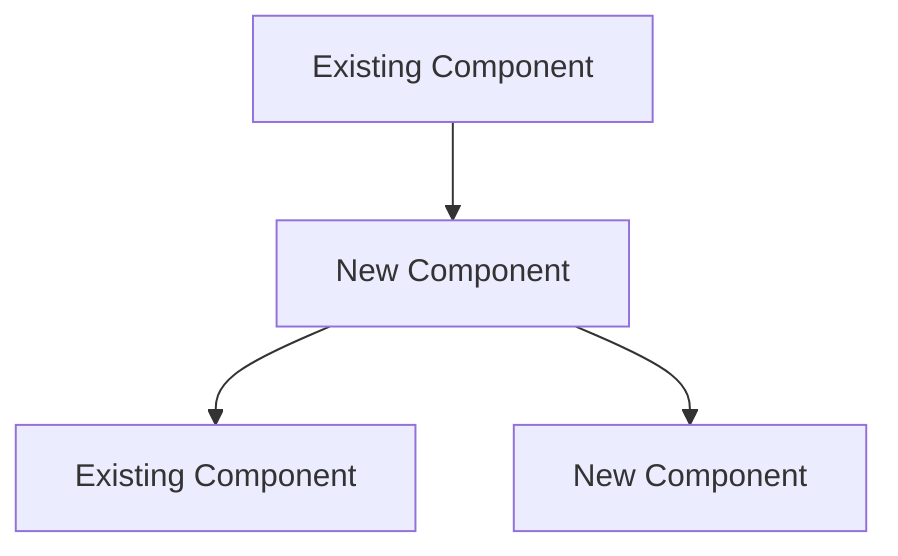

# Feature Implementation Plan: {TITLE}

<!--
=============================================================================
AGENT INSTRUCTIONS (remove this block after completing the plan)
=============================================================================
This template guides you through planning and implementing a new feature.
Follow these rules:

1. UNDERSTAND THE REQUIREMENT — Before writing anything, make sure you fully
   understand what the user wants. If ambiguous, list your assumptions in §1.2
   and confirm with the user before proceeding.

2. STUDY THE CODEBASE — Read existing code that is related to or adjacent to
   the feature. Understand the patterns, conventions, and architecture already
   in use. Your implementation MUST be consistent with them.

3. REPLACE ALL {PLACEHOLDERS} — Every {PLACEHOLDER} must be replaced with real,
   specific values. If a section is genuinely not applicable, write "N/A" with
   a one-line justification.

4. DESIGN BEFORE CODE — Complete sections 1–4 (Overview, Codebase Context,
   Design, and Testing Strategy) BEFORE writing the implementation phases.
   Do not jump straight to coding.

5. PHASES ARE INCREMENTAL — Each phase must produce a working system. The
   feature can be partially functional between phases, but nothing should be
   broken. Prefer: scaffold → core logic → integration → polish.

6. EVERY PHASE NEEDS A CHECKPOINT — Define what "done" looks like for each
   phase. If you can't verify it, the phase is too vague.

7. NO ORPHAN CODE — Every new file, class, or function must be reachable from
   the existing codebase by the end of the plan. If you create something,
   another step must wire it in.

8. TEST ALONGSIDE — Do not leave all testing to the end. Each phase should
   include or reference the tests that validate the work done in that phase.
=============================================================================
-->

---

## 1. Overview

| Field              | Value                                            |
|:-------------------|:-------------------------------------------------|
| **Feature**        | {One sentence describing the feature}            |
| **Source**         | {Code review or report that triggered this plan — e.g., `code_review_api_layer_2026-03-06.md`, finding F3. Write "N/A — standalone" if not triggered by a review} |
| **Motivation**     | {Why this feature is needed — the problem it solves} |
| **User-Facing?**   | {Yes / No — does this change something a user sees or interacts with?} |
| **Scope**          | {Bounded description of what IS and IS NOT included} |
| **Estimated Effort** | {S / M / L / XL with brief justification}      |

### 1.1 Requirements

<!-- Concrete, testable requirements. Each one should map to at least one test. -->

| # | Requirement | Priority | Acceptance Criterion |
|:-:|:------------|:--------:|:---------------------|
| R1 | {e.g., "User can filter results by date range"} | {Must / Should / Nice} | {e.g., "Given date range input, only matching results are returned"} |
| R2 | {Requirement} | {Priority} | {Criterion} |
| R3 | {Requirement} | {Priority} | {Criterion} |

### 1.2 Assumptions & Open Questions

<!-- List anything you assumed or anything that needs clarification.
     Mark open questions with ❓ and resolved ones with ✅ -->

- ✅/❓ {e.g., "Assuming the existing `EventBus` supports async subscribers"} — {resolution or "needs confirmation"}
- ✅/❓ {assumption or question}

### 1.3 Out of Scope

- {Item 1 — e.g., "Bulk operations — will be a separate feature"}
- {Item 2}

---

## 2. Codebase Context

<!-- AGENT: You MUST read relevant source files before writing this section.
     Understand the patterns already in use. Your design must be consistent. -->

### 2.1 Related Existing Code

<!-- Code that is functionally adjacent to the new feature — things you'll
     import from, extend, or model your code after. -->

| Component | File Path | Relevance |
|:----------|:----------|:----------|
| {e.g., `UserService`} | {`src/services/user_service.py`} | {e.g., "New feature follows same service pattern"} |
| {e.g., `BaseModel`} | {`src/models/base.py`} | {e.g., "New model will extend this"} |

### 2.2 Patterns & Conventions to Follow

<!-- Document the specific patterns you observed so your implementation is consistent. -->

- **Naming**: {e.g., "Services use `<Name>Service` class names, files use `snake_case`"}
- **Structure**: {e.g., "Each feature has: model → service → handler/controller"}
- **Error handling**: {e.g., "Custom exceptions in `src/exceptions.py`, caught at handler level"}
- **Configuration**: {e.g., "All config via `Settings` class in `src/config.py`"}
- **Imports**: {e.g., "Relative imports within packages, absolute from root"}

### 2.3 Integration Points

<!-- Where the new feature connects to existing code. Every integration point
     is a potential breakage site — be precise. -->

| Integration Point | File Path | How It Connects |
|:------------------|:----------|:----------------|
| {e.g., "Router registration"} | {`src/app.py:L45`} | {e.g., "New route handler added to `register_routes()`"} |
| {e.g., "Event emission"} | {`src/events.py:L12`} | {e.g., "Feature emits `feature.created` event"} |

---

## 3. Design

### 3.1 Architecture Overview

<!-- High-level description of how the feature fits into the existing system.
     Include a diagram if the feature touches 3+ components. -->

{Prose description of the approach — 2-4 sentences}

<!-- Optional: architecture diagram -->
<!--

-->

### 3.2 New Components

<!-- Every new file, class, or significant function introduced by this feature. -->

| Component | Type | File Path | Responsibility |
|:----------|:-----|:----------|:---------------|
| {e.g., `NotificationService`} | {Class} | {`src/services/notification_service.py`} | {e.g., "Manages notification creation, delivery, and read-state"} |
| {e.g., `Notification`} | {Model/Dataclass} | {`src/models/notification.py`} | {e.g., "Data model for notifications"} |
| {e.g., `notify_user()`} | {Function} | {`src/utils/notify.py`} | {e.g., "Convenience wrapper for common notification patterns"} |

### 3.3 Modified Components

<!-- Existing code that needs changes to support the new feature. -->

| Component | File Path | What Changes | Why |
|:----------|:----------|:-------------|:----|
| {e.g., `AppRouter`} | {`src/app.py`} | {e.g., "Add route for `/notifications`"} | {e.g., "Expose notification endpoints"} |

### 3.4 Data Model / Schema Changes

<!-- If the feature introduces or modifies data structures, schemas, configs,
     or file formats. Skip if purely logic changes. -->

```{language}
{Schema definition, dataclass, TypedDict, config format, etc.}
```

### 3.5 API / Interface Contract

<!-- If the feature exposes a callable interface (functions, CLI commands,
     API endpoints, events), define the contract. -->

```{language}
{Function signatures, CLI usage, endpoint definitions, etc.}
```

### 3.6 Design Decisions

<!-- Non-obvious choices made during design and their rationale. -->

| Decision | Alternatives Considered | Why This Choice |
|:---------|:-----------------------|:----------------|
| {e.g., "Use observer pattern for notifications"} | {e.g., "Direct calls, message queue"} | {e.g., "Observer decouples sender from receivers, consistent with existing EventBus"} |

---

## 4. Testing Strategy

### 4.1 Test Plan

<!-- Map requirements to tests. Every R# from §1.1 should appear here. -->

| Requirement | Test Name | Type | Description |
|:-----------:|:----------|:-----|:------------|
| R1 | {e.g., `test_filter_by_date_range`} | {Unit/Integration/E2E} | {What it validates} |
| R2 | {test name} | {type} | {description} |

### 4.2 Edge Cases & Error Scenarios

<!-- Cases that are easy to miss. Each one should become a test. -->

| Scenario | Expected Behavior | Test Name |
|:---------|:------------------|:----------|
| {e.g., "Empty input"} | {e.g., "Returns empty list, no error"} | {`test_filter_empty_input`} |
| {e.g., "Invalid date format"} | {e.g., "Raises `ValidationError` with descriptive message"} | {`test_filter_invalid_date`} |

### 4.3 Existing Tests to Modify

| Test | File | Modification Needed |
|:-----|:-----|:--------------------|
| {test name} | {`tests/test_something.py:L20`} | {What changes and why} |

---

## 5. Implementation Phases

<!-- AGENT: Complete sections 1–4 above BEFORE writing these phases.
     Each phase must leave the system in a working (non-broken) state. -->

---

### Phase 1: {Phase Title — e.g., "Foundation — Models & Core Logic"}

**Goal**: {One sentence — what exists after this phase?}

**Prerequisites**: {e.g., "Design review complete, all open questions resolved"}

#### Steps

1. **{Action verb + target}** — {e.g., "Create the `Notification` data model"}
   - File: `{path/to/target}`
   - Details: {Exactly what to create/modify, with key code if helpful}
   ```{language}
   {code snippet — the essential structure, not the full implementation}
   ```

2. **{Action verb + target}**
   - File: `{path/to/target}`
   - Details: {Specifics}

3. **Write unit tests for Phase 1 code**
   - File: `{tests/path}`
   - Covers: {Which components/functions from this phase}

#### Checkpoint

- [ ] {e.g., "New module importable: `python -c 'from src.models.notification import Notification'`"}
- [ ] {e.g., "Unit tests pass: `pytest tests/test_notification.py -v`"}
- [ ] {e.g., "Linter clean: `ruff check src/models/notification.py`"}

---

### Phase 2: {Phase Title — e.g., "Integration — Wiring Into Existing System"}

**Goal**: {One sentence}

**Prerequisites**: {Phase 1 checkpoint passed}

#### Steps

1. **{Action}**
   - File: `{path}`
   - Details: {Specifics}

2. **{Action}**
   - File: `{path}`
   - Details: {Specifics}

3. **Write integration tests for Phase 2**
   - File: `{tests/path}`
   - Covers: {Which integration points}

#### Checkpoint

- [ ] {Verification step}
- [ ] {Verification step}

---

### Phase 3: {Phase Title — e.g., "Polish — Error Handling, Edge Cases, Docs"}

**Goal**: {One sentence}

**Prerequisites**: {Phase 2 checkpoint passed}

#### Steps

1. **{Action}**
   - File: `{path}`
   - Details: {Specifics}

2. **{Action}**
   - File: `{path}`
   - Details: {Specifics}

#### Checkpoint

- [ ] {e.g., "Full test suite passes: `pytest tests/ -v`"}
- [ ] {e.g., "No lint errors: `ruff check .`"}
- [ ] {e.g., "Feature works end-to-end: {manual verification step}"}

---

## 6. File Change Summary

<!-- AGENT: Generate this AFTER completing the phases above.
     This is the complete manifest of every file touched. -->

| # | Action | File Path | Phase | Description |
|:-:|:------:|:----------|:-----:|:------------|
| 1 | CREATE | `{path/to/new/file.ext}` | {1} | {Brief purpose} |
| 2 | CREATE | `{path/to/test/file.ext}` | {1} | {Tests for #1} |
| 3 | MODIFY | `{path/to/existing/file.ext}` | {2} | {What changed} |

---

## 7. Post-Implementation Verification

<!-- Final validation after ALL phases are complete -->

- [ ] All requirements from §1.1 have passing tests
- [ ] Full test suite passes: `{command}`
- [ ] No lint/type errors: `{command}`
- [ ] No orphan code (every new component is reachable)
- [ ] Feature works end-to-end: `{verification command or steps}`
- [ ] {Any domain-specific validation}

---

## Appendix: References

- {Reference 1 — e.g., "Feature request: `issue #123`"}
- {Reference 2 — e.g., "Similar pattern in: `src/services/existing_service.py`"}
