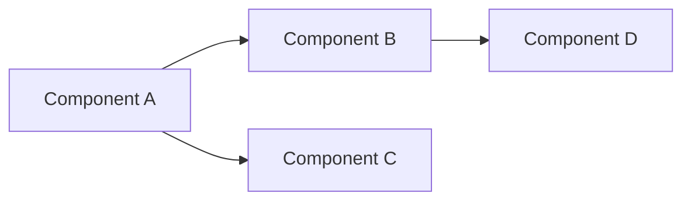

# Migration Plan: {TITLE}

<!--
=============================================================================
AGENT INSTRUCTIONS (remove this block after completing the plan)
=============================================================================
This template guides you through creating a concrete, actionable migration plan.
Follow these rules:

1. RESEARCH FIRST — Before filling ANY section, read all relevant source files,
   tests, configs, and documentation. Do not guess at dependencies or impacts.

2. REPLACE ALL {PLACEHOLDERS} — Every {PLACEHOLDER} must be replaced with real,
   specific values. If a section is genuinely not applicable, write "N/A" with
   a one-line justification.

3. BE CONCRETE — Write exact file paths, function names, class names, and line
   numbers. Vague statements like "update the config" are not acceptable.
   Write "update `src/config/database.py:L45` to change `DB_HOST` from
   `localhost` to `cluster.internal`" instead.

4. PHASES ARE SEQUENTIAL — Each phase must be completable and verifiable on its
   own. Never put dependent work in the same phase as its prerequisite.

5. EVERY PHASE NEEDS A CHECKPOINT — Define what "done" looks like for each
   phase. If you can't verify it, the phase is too vague.

6. ESTIMATE HONESTLY — If you don't know the complexity, say so. Do not
   fabricate effort estimates.

7. THINK ABOUT FAILURE — For every change, ask: "What if this breaks? How do
   we detect it? How do we undo it?" If you can't answer, add a risk item.
=============================================================================
-->

---

## 1. Overview

| Field             | Value                                          |
|:------------------|:-----------------------------------------------|
| **Objective**     | {One sentence: what are we migrating and why}  |
| **Source**        | {Code review or report that triggered this plan — e.g., `code_review_auth_module_2026-03-06.md`, finding F2, F5. Write "N/A — standalone" if not triggered by a review} |
| **Source State**   | {Current state — version, architecture, location} |
| **Target State**   | {Desired end state — version, architecture, location} |
| **Scope**         | {Bounded description of what IS and IS NOT included} |
| **Estimated Effort** | {T-shirt size: S/M/L/XL with justification}  |
| **Risk Level**    | {Low / Medium / High / Critical — with one-line reason} |

### 1.1 Success Criteria

<!-- Define measurable outcomes. The migration is "done" when ALL of these are true. -->

- [ ] {Criterion 1 — e.g., "All 47 unit tests pass against the new schema"}
- [ ] {Criterion 2 — e.g., "Zero runtime errors in 24h canary deployment"}
- [ ] {Criterion 3 — e.g., "Old module fully removed, no import references remain"}

### 1.2 Out of Scope

<!-- Explicitly list what this migration does NOT cover to prevent scope creep. -->

- {Item 1 — e.g., "UI redesign — handled separately in PROJ-456"}
- {Item 2}

---

## 2. Current State Analysis

<!-- AGENT: Read all relevant source files before writing this section. List every
     file, class, function, and config that will be touched or affected. -->

### 2.1 Components Involved

| Component | File Path | Role | Will Be Modified | Will Be Deleted |
|:----------|:----------|:-----|:----------------:|:---------------:|
| {Name}    | {`path/to/file.ext`} | {Brief role description} | {Yes/No} | {Yes/No} |

### 2.2 Dependency Map

<!-- Map what depends on what. This is the most critical section for avoiding
     breakage. Use the format below or a mermaid diagram. -->

```
{Component A}
  ├── imported by: {Component B} (path/to/b.ext:L12)
  ├── imported by: {Component C} (path/to/c.ext:L5)
  └── calls into: {Component D} (path/to/d.ext:L88, function_name())
```

<!-- Alternative: include a mermaid dependency graph -->
<!--

-->

### 2.3 External Touchpoints

<!-- Anything outside the codebase that is affected: APIs, databases, CI/CD,
     config files, environment variables, third-party services, etc. -->

| Touchpoint | Type | Impact |
|:-----------|:-----|:-------|
| {e.g., `.env` file} | {Config} | {`DATABASE_URL` format changes} |
| {e.g., GitHub Actions workflow} | {CI/CD} | {Test matrix needs new entry} |

---

## 3. Risk Assessment

<!-- AGENT: For each risk, you MUST define detection and mitigation. If you can't
     define mitigation, escalate the risk level. -->

| # | Risk | Likelihood | Impact | Detection | Mitigation |
|:-:|:-----|:----------:|:------:|:----------|:-----------|
| 1 | {e.g., "Import cycles after module restructure"} | {Low/Med/High} | {Low/Med/High} | {How we'd notice — e.g., "circular import error on startup"} | {What we do — e.g., "introduce interface module to break cycle"} |
| 2 | {Risk description} | {L/M/H} | {L/M/H} | {Detection method} | {Mitigation action} |

### 3.1 Breaking Changes

<!-- Explicitly list every breaking change introduced by this migration. -->

- **{Change 1}**: {e.g., "`UserService.get()` signature changes from `get(id)` to `get(id, tenant_id)`"}
  - Affected callers: {list all call sites with file:line}
- **{Change 2}**: {description}
  - Affected callers: {list}

### 3.2 Rollback Strategy

<!-- What is the escape plan if the migration fails mid-way through each phase? -->

| Phase | Rollback Method | Data Loss Risk | Estimated Rollback Time |
|:------|:----------------|:--------------:|:------------------------|
| Phase 1 | {e.g., "git revert — no data changes"} | {None/Low/High} | {e.g., "< 5 min"} |
| Phase 2 | {method} | {risk} | {time} |

---

## 4. Migration Phases

<!-- AGENT: Each phase is a self-contained unit of work. After completing a phase,
     the system MUST be in a working state. Never leave the codebase broken
     between phases. -->

---

### Phase 1: {Phase Title — e.g., "Preparation & Scaffolding"}

**Goal**: {One sentence — what does completing this phase achieve?}

**Prerequisites**: {What must be true before starting — e.g., "All tests green on main branch"}

#### Steps

<!-- Number every step. Each step must be a single, atomic action. -->

1. **{Action verb + target}** — {e.g., "Create new directory structure"}
   - File: `{path/to/target}`
   - Details: {Exactly what to do, with code snippets if applicable}
   ```{language}
   {code snippet showing the change, if helpful}
   ```

2. **{Action verb + target}** — {e.g., "Add compatibility shim"}
   - File: `{path/to/target}`
   - Details: {Specifics}

#### Checkpoint

<!-- How to verify this phase is complete and nothing is broken -->

- [ ] {Verification step — e.g., "Run `pytest tests/ -v` — all tests pass"}
- [ ] {Verification step — e.g., "Run `python -c 'from new_module import X'` — no import errors"}
- [ ] {Verification step — e.g., "Linter passes: `ruff check .`"}

---

### Phase 2: {Phase Title — e.g., "Core Migration"}

**Goal**: {One sentence}

**Prerequisites**: {Phase 1 checkpoint passed}

#### Steps

1. **{Action}**
   - File: `{path}`
   - Details: {Specifics}

2. **{Action}**
   - File: `{path}`
   - Details: {Specifics}

#### Checkpoint

- [ ] {Verification step}
- [ ] {Verification step}

---

### Phase 3: {Phase Title — e.g., "Cleanup & Finalization"}

**Goal**: {One sentence}

**Prerequisites**: {Phase 2 checkpoint passed}

#### Steps

1. **{Action}**
   - File: `{path}`
   - Details: {Specifics}

#### Checkpoint

- [ ] {Verification step}
- [ ] {Final verification — e.g., "Full test suite passes"}
- [ ] {Final verification — e.g., "No references to old module: `grep -r 'old_module' src/` returns empty"}

---

## 5. Testing Strategy

### 5.1 Tests to Run at Each Phase

| Phase | Test Command | Expected Result |
|:------|:-------------|:----------------|
| Phase 1 | `{e.g., pytest tests/unit/ -v}` | {All pass, no new failures} |
| Phase 2 | `{command}` | {expectation} |
| Phase 3 | `{full suite command}` | {All pass} |

### 5.2 New Tests Required

<!-- List any NEW tests that must be written as part of this migration -->

| Test | Purpose | File |
|:-----|:--------|:-----|
| {e.g., `test_new_schema_migration`} | {Validates data transforms correctly} | {`tests/test_migration.py`} |

### 5.3 Tests to Modify

<!-- List existing tests that need updates due to the migration -->

| Test | Modification Needed | File |
|:-----|:--------------------|:-----|
| {e.g., `test_user_service.test_get_user`} | {Update to pass `tenant_id` arg} | {`tests/test_user.py:L34`} |

### 5.4 Tests to Remove

<!-- List tests that become obsolete after the migration -->

| Test | Reason for Removal | File |
|:-----|:-------------------|:-----|
| {e.g., `test_legacy_adapter`} | {Legacy adapter deleted in Phase 3} | {`tests/test_legacy.py`} |

---

## 6. File Change Summary

<!-- AGENT: This is the complete manifest of every file touched. Generate this
     AFTER completing the phases above. It serves as a quick-reference checklist. -->

| # | Action | File Path | Phase |
|:-:|:------:|:----------|:-----:|
| 1 | CREATE | `{path/to/new/file.ext}` | {1} |
| 2 | MODIFY | `{path/to/existing/file.ext}` | {2} |
| 3 | MOVE   | `{old/path}` → `{new/path}` | {2} |
| 4 | DELETE | `{path/to/old/file.ext}` | {3} |

---

## 7. Post-Migration Verification

<!-- Final validation after ALL phases are complete -->

- [ ] Full test suite passes: `{command}`
- [ ] No dead imports: `{lint/grep command}`
- [ ] No references to old/removed code: `{grep command}`
- [ ] Application starts without errors: `{start command}`
- [ ] {Any domain-specific validation}

---

## Appendix A: Decisions & Rationale

<!-- Document any non-obvious decisions made during planning and WHY.
     This helps future readers (and future agent sessions) understand the reasoning. -->

| Decision | Alternatives Considered | Why This Choice |
|:---------|:-----------------------|:----------------|
| {e.g., "Use adapter pattern for backward compat"} | {e.g., "Big-bang rewrite, feature flags"} | {e.g., "Adapter allows incremental rollout with zero downtime"} |

## Appendix B: References

<!-- Links to relevant docs, issues, PRs, or files that informed this plan -->

- {Reference 1 — e.g., "[Migration RFC](link)" or "`docs/architecture.md`"}
- {Reference 2}
