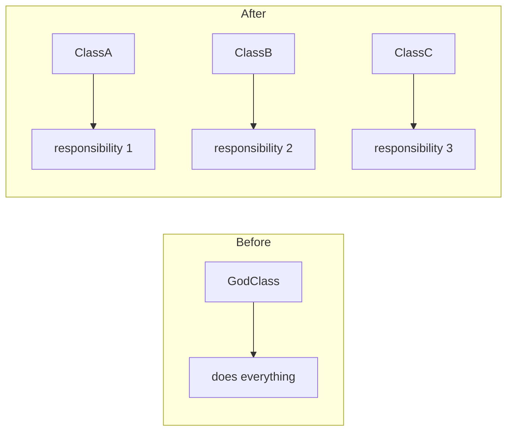

# Refactor Plan: {TITLE}

<!--
=============================================================================
AGENT INSTRUCTIONS (remove this block after completing the plan)
=============================================================================
This template guides you through refactoring, improving, or overhauling
existing code. Refactoring is NOT the same as building new features or
migrating between systems. The key constraint is:

    EXISTING BEHAVIOR MUST BE PRESERVED unless explicitly marked as
    an intentional behavioral change in §3.2.

Follow these rules:

1. DIAGNOSE BEFORE PRESCRIBING — Read and fully understand the current code
   before proposing any changes. Document WHAT is wrong and WHY in §2.
   If you can't articulate the problem clearly, you are not ready to refactor.

2. DEFINE "BETTER" — Refactoring without measurable improvement goals is just
   churn. Every change must map to a concrete improvement stated in §1.1.

3. REPLACE ALL {PLACEHOLDERS} — Every {PLACEHOLDER} must be replaced with real,
   specific values. If a section is genuinely not applicable, write "N/A" with
   a one-line justification.

4. PRESERVE BEHAVIOR BY DEFAULT — Unless a change is explicitly listed in §3.2
   as an intentional behavioral change, the refactored code MUST produce
   identical outputs for identical inputs. Existing tests must pass WITHOUT
   modification (except for import path changes).

5. TESTS ARE YOUR SAFETY NET — Run the full test suite BEFORE starting and
   confirm all tests pass. If tests don't exist, write them FIRST (Phase 0)
   before touching any production code.

6. INCREMENTAL OVER BIG-BANG — Prefer many small, safe changes over one large
   rewrite. Each phase must leave the system in a fully working state. If a
   refactor is too large for incremental phases, reconsider the scope.

7. EVERY PHASE NEEDS A CHECKPOINT — Define what "done" looks like for each
   phase. The primary checkpoint is always: "all existing tests still pass."

8. CLEAN UP AFTER YOURSELF — Dead code, deprecated shims, and temporary
   compatibility layers introduced during refactoring must be removed in the
   final cleanup phase.
=============================================================================
-->

---

## 1. Overview

| Field              | Value                                              |
|:-------------------|:---------------------------------------------------|
| **Target**         | {What is being refactored — module, class, subsystem} |
| **Source**         | {Code review or report that triggered this plan — e.g., `code_review_session_mgr_2026-03-06.md`, findings F1, F4, F6. Write "N/A — standalone" if not triggered by a review} |
| **Type**           | {Refactor / Improvement / Overhaul — see definitions below} |
| **Motivation**     | {Why — the pain point, tech debt, or limitation that triggered this} |
| **Scope**          | {Bounded description of what IS and IS NOT included} |
| **Estimated Effort** | {S / M / L / XL with justification}              |
| **Risk Level**     | {Low / Medium / High — with one-line reason}       |

<!--
Type definitions:
- REFACTOR: Same behavior, better structure (rename, extract, reorganize)
- IMPROVEMENT: Better behavior, backward compatible (performance, error handling, edge cases)
- OVERHAUL: Significant redesign that may change interfaces (requires §3.2 behavioral changes)
-->

### 1.1 Improvement Goals

<!-- Every change must map to at least one of these goals. If a change doesn't
     serve any goal, it doesn't belong in this plan. -->

| # | Goal | Metric | Current State | Target State |
|:-:|:-----|:-------|:--------------|:-------------|
| G1 | {e.g., "Reduce code duplication"} | {e.g., "Duplicated line count"} | {e.g., "142 lines duplicated across 3 files"} | {e.g., "Zero duplication — single source of truth"} |
| G2 | {e.g., "Improve testability"} | {e.g., "Test coverage %"} | {e.g., "34% coverage, 2 untestable functions"} | {e.g., "85%+ coverage, all functions testable"} |
| G3 | {e.g., "Simplify error handling"} | {e.g., "Number of bare except clauses"} | {e.g., "7 bare excepts, errors silently swallowed"} | {e.g., "Zero bare excepts, all errors typed and logged"} |

### 1.2 Success Criteria

- [ ] All existing tests pass without modification (except import paths)
- [ ] All improvement goals (§1.1) are met
- [ ] {Additional criterion — e.g., "No increase in cyclomatic complexity"}
- [ ] {Additional criterion}

### 1.3 Out of Scope

- {Item 1 — e.g., "Adding new features to the refactored module — separate plan"}
- {Item 2 — e.g., "Refactoring `ModuleY` — depends on this but handled separately"}

---

## 2. Current State Diagnosis

<!-- AGENT: This is the most important section. You MUST read all relevant source
     files thoroughly before writing this. Do not skim. Understand the code
     deeply enough to explain it to someone else. -->

### 2.1 Code Under Review

| File Path | Lines | Role | Primary Issues |
|:----------|:-----:|:-----|:---------------|
| {`path/to/file.ext`} | {count} | {What this file does} | {Brief issue list — e.g., "god class, 400+ lines, mixed concerns"} |

### 2.2 Problem Analysis

<!-- For each problem, explain WHAT is wrong, WHERE it manifests, and WHY it matters.
     Be specific — reference exact functions, line numbers, and patterns. -->

#### Problem 1: {Problem Title — e.g., "God Class with Mixed Responsibilities"}

- **What**: {e.g., "`SessionManager` handles session lifecycle, logging, persistence, AND config — 4 distinct responsibilities in 1 class"}
- **Where**: {`path/to/file.py` — functions: `init()`, `save()`, `log()`, `get_config()`}
- **Impact**: {e.g., "Cannot test persistence without starting a full session. Changes to logging risk breaking session logic."}
- **Goal**: {Maps to G# from §1.1}

#### Problem 2: {Problem Title}

- **What**: {description}
- **Where**: {locations}
- **Impact**: {consequences}
- **Goal**: {G#}

#### Problem 3: {Problem Title}

- **What**: {description}
- **Where**: {locations}
- **Impact**: {consequences}
- **Goal**: {G#}

### 2.3 Dependency Map

<!-- What depends on the code being refactored? These are the blast radius boundaries. -->

```
{Target Module/Class}
  ├── imported by: {Component A} (path/to/a.ext:L12)
  ├── imported by: {Component B} (path/to/b.ext:L5)
  ├── called by: {Component C} (path/to/c.ext:L88, function_name())
  └── tested by: {Test File} (tests/test_target.py)
```

### 2.4 Existing Test Coverage

<!-- What tests exist today? This determines whether you need a Phase 0. -->

| Test File | Tests | Status | Covers |
|:----------|:-----:|:------:|:-------|
| {`tests/test_target.py`} | {count} | {All pass / N failures} | {What aspects are tested} |
| {`tests/test_integration.py`} | {count} | {status} | {coverage} |

**Coverage gap assessment**: {e.g., "Core logic is well-tested but error paths have zero coverage. Phase 0 needed to add safety net tests before refactoring."}

---

## 3. Refactoring Design

### 3.1 Structural Changes

<!-- High-level description of how the code will be restructured. -->

{Prose description — 2-4 sentences explaining the new structure}

#### Before → After Comparison

<!-- Show the structural transformation at a glance -->

**Before:**
```
{Current structure — files, classes, key functions}
```

**After:**
```
{Target structure — files, classes, key functions}
```

<!-- Optional: visual diagram -->
<!--

-->

### 3.2 Behavioral Changes

<!-- CRITICAL: List EVERY intentional change in behavior. If this section is
     empty, then all existing tests must pass without any modifications.
     Behavioral changes are ONLY acceptable for "Improvement" or "Overhaul" types. -->

| # | Change | Before | After | Justification | Affected Tests |
|:-:|:-------|:-------|:------|:--------------|:---------------|
| B1 | {e.g., "Error on invalid input"} | {e.g., "Silently returns `None`"} | {e.g., "Raises `ValueError` with message"} | {e.g., "Callers were already checking for None; exception is clearer"} | {`test_x.py:test_name`} |

<!-- If no behavioral changes: -->
<!-- **None** — This is a pure structural refactor. All existing behavior is preserved. -->

### 3.3 Interface Compatibility

<!-- How do consumers of the refactored code get affected? -->

| Consumer | File Path | Impact | Migration Needed |
|:---------|:----------|:-------|:----------------:|
| {e.g., "`main.py`"} | {`src/main.py:L23`} | {e.g., "Import path changes"} | {Yes — update import} |
| {e.g., "`test_target.py`"} | {`tests/test_target.py`} | {e.g., "Class renamed"} | {Yes — update references} |

### 3.4 Design Decisions

| Decision | Alternatives Considered | Why This Choice |
|:---------|:-----------------------|:----------------|
| {e.g., "Extract to 3 classes, not 2"} | {e.g., "2 classes, utility functions, mixin"} | {e.g., "3 classes maps 1:1 to responsibilities; 2 would still mix concerns"} |

---

## 4. Risk Assessment

| # | Risk | Likelihood | Impact | Detection | Mitigation |
|:-:|:-----|:----------:|:------:|:----------|:-----------|
| 1 | {e.g., "Subtle behavior change not caught by tests"} | {L/M/H} | {L/M/H} | {e.g., "Revealed by integration tests or manual testing"} | {e.g., "Write characterization tests in Phase 0 before refactoring"} |
| 2 | {Risk} | {L/M/H} | {L/M/H} | {Detection} | {Mitigation} |

### 4.1 Rollback Strategy

| Phase | Rollback Method | Estimated Rollback Time |
|:------|:----------------|:------------------------|
| Phase 0 | {e.g., "Delete new test file — no production changes"} | {< 1 min} |
| Phase 1 | {e.g., "git revert — old code untouched during this phase"} | {< 5 min} |

---

## 5. Implementation Phases

<!-- AGENT: Each phase must leave the system in a FULLY WORKING state.
     Run ALL existing tests after each phase. No exceptions. -->

---

### Phase 0: Safety Net (if needed)

<!-- Include this phase if §2.4 revealed insufficient test coverage.
     Write tests for CURRENT behavior BEFORE changing anything.
     Skip this phase only if existing tests are comprehensive. -->

**Goal**: {e.g., "Establish baseline test coverage to catch regressions during refactoring"}

**Prerequisites**: {e.g., "All existing tests pass"}

#### Steps

1. **Write characterization tests for untested behavior**
   - File: `{tests/path}`
   - Covers: {List specific functions/paths that lack coverage}
   - Approach: {e.g., "Test current outputs for known inputs — these tests define 'correct' behavior"}

2. **Verify baseline**
   - Run: `{full test command}`
   - Expected: All tests pass (existing + new)

#### Checkpoint

- [ ] All existing tests still pass
- [ ] New characterization tests pass
- [ ] Coverage increased to: {target %} for target module

---

### Phase 1: {Phase Title — e.g., "Extract & Scaffold New Structure"}

**Goal**: {One sentence — e.g., "New classes exist alongside old code; old code is untouched"}

**Prerequisites**: {Phase 0 checkpoint passed (or "existing tests all pass" if Phase 0 skipped)}

#### Steps

1. **{Action verb + target}** — {e.g., "Create `SessionPersistence` class extracted from `SessionManager.save()`"}
   - File: `{path/to/new/file.ext}`
   - Details: {What to create and how it relates to the old code}
   ```{language}
   {Key structure — signatures, not full implementation}
   ```

2. **{Action verb + target}**
   - File: `{path/to/target}`
   - Details: {Specifics}

3. **Write tests for new components**
   - File: `{tests/path}`
   - Note: {e.g., "Old code is still live and untouched — these test the new components in isolation"}

#### Checkpoint

- [ ] All existing tests STILL PASS (old code untouched)
- [ ] New component tests pass
- [ ] New code is importable but not yet wired in

---

### Phase 2: {Phase Title — e.g., "Swap — Wire New Code, Redirect Old"}

**Goal**: {One sentence — e.g., "Consumers now use new code; old code is deprecated or shimmed"}

**Prerequisites**: {Phase 1 checkpoint passed}

#### Steps

1. **{Action — e.g., "Update `SessionManager` to delegate to `SessionPersistence`"}**
   - File: `{path}`
   - Details: {e.g., "Replace inline logic with calls to new class. Old public interface unchanged."}

2. **{Action — e.g., "Update import paths in consumers"}**
   - Files: {list all files that need import updates}
   - Details: {Specifics}

3. **Run full test suite**
   - Expected: All tests pass — behavior unchanged

#### Checkpoint

- [ ] ALL existing tests pass (critical — this proves behavior is preserved)
- [ ] New code is actively used (old inline logic removed or delegating)
- [ ] No dead code yet (cleanup is next phase)

---

### Phase 3: {Phase Title — e.g., "Cleanup — Remove Dead Code & Polish"}

**Goal**: {One sentence — e.g., "No deprecated code remains; codebase is clean"}

**Prerequisites**: {Phase 2 checkpoint passed}

#### Steps

1. **Remove deprecated / dead code**
   - Files: {list files with code to remove}
   - Details: {What exactly to remove}

2. **Remove compatibility shims / temporary wrappers**
   - Files: {if any were introduced in Phase 2}

3. **Update documentation / docstrings**
   - Files: {list}

4. **Final lint and formatting pass**
   - Run: `{lint command}`

#### Checkpoint

- [ ] ALL tests pass
- [ ] No dead code: `{grep/search command to verify}`
- [ ] No deprecated imports: `{verification command}`
- [ ] Lint clean: `{lint command}`
- [ ] All improvement goals from §1.1 are met

---

## 6. File Change Summary

<!-- AGENT: Generate this AFTER completing the phases above. -->

| # | Action | File Path | Phase | Description |
|:-:|:------:|:----------|:-----:|:------------|
| 1 | CREATE | `{path/to/new/file.ext}` | {1} | {e.g., "Extracted persistence logic"} |
| 2 | MODIFY | `{path/to/existing/file.ext}` | {2} | {e.g., "Delegate to new class"} |
| 3 | DELETE | `{path/to/dead/code.ext}` | {3} | {e.g., "Removed after extraction"} |

---

## 7. Post-Refactor Verification

- [ ] All existing tests pass (no modifications except import paths)
- [ ] All new tests pass
- [ ] Full test suite: `{command}`
- [ ] Lint/type check clean: `{command}`
- [ ] No dead code remains: `{grep command}`
- [ ] No references to old/removed names: `{grep command}`
- [ ] Improvement goals verified:
  - [ ] G1: {Verification — e.g., "Zero duplicated blocks: `{tool/command}`"}
  - [ ] G2: {Verification — e.g., "Coverage at 87%: `{coverage command}`"}
  - [ ] G3: {Verification}

---

## Appendix: References

- {Reference 1 — e.g., "Original issue/discussion that motivated this refactor"}
- {Reference 2 — e.g., "Pattern reference: `src/services/well_structured_service.py`"}
