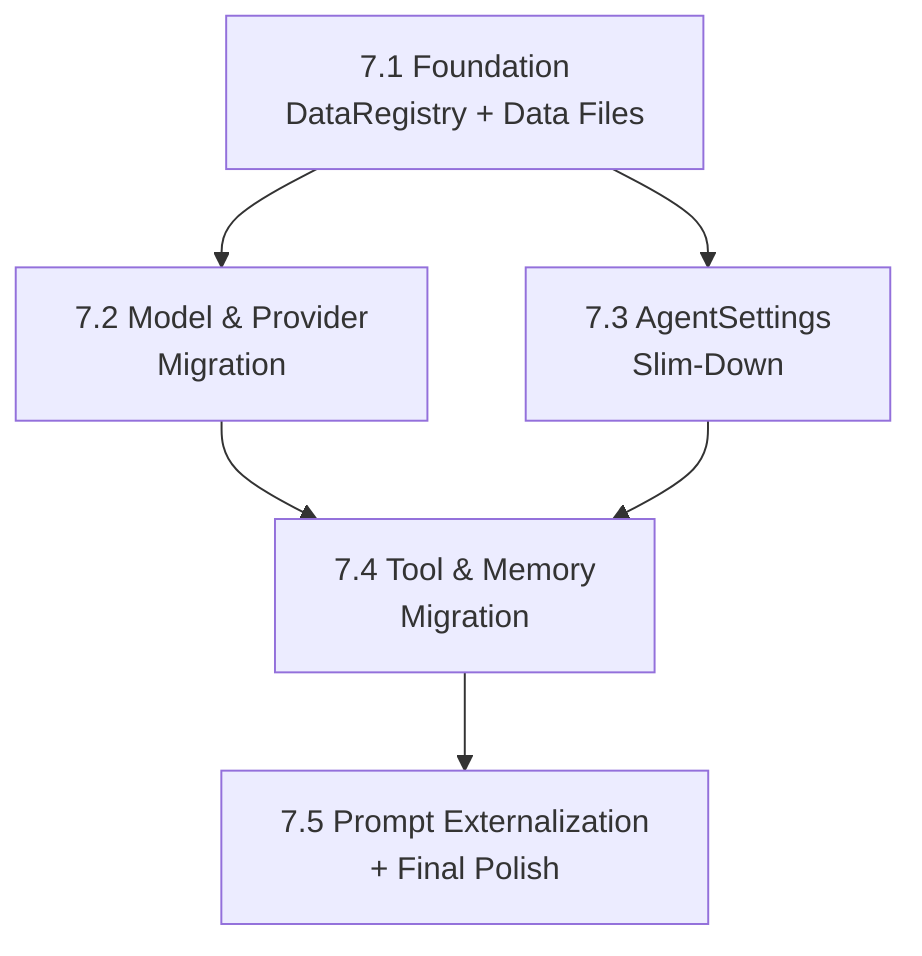

# Phase 7 — Data-Driven System

> **Source**: [`data-driven-concept.md`](file:///x:/agent_cli/architect-workspace/data-driven-concept.md)
> **Status**: Planning
> **Goal**: Extract all hard-coded values into TOML data files, managed by a read-only `DataRegistry`.

---

## 1. Design Review & Critique

### 1.1 Strengths

| Aspect | Verdict |
|---|---|
| Problem statement | ✅ Accurately identifies every hard-coded constant across 15 modules |
| Separation of concerns | ✅ Clean distinction: data-driven (developer) vs config (user) |
| Single source of truth | ✅ Each value lives in exactly one TOML file |
| DI integration | ✅ `DataRegistry` flows through `AppContext` — no global singleton |
| Backward compatibility | ✅ User-facing `AgentSettings` format unchanged; no breaking changes |
| Prompt externalization | ✅ Moving prompts to `.txt` files makes iteration easy |

### 1.2 Issues Found & Decisions

#### Issue 1: `output_formatter.py` hard-codes `2000` for error truncation

The concept doc says `tools.toml` will have `error_truncation_chars = 2000`, but current code has this inline at [output_formatter.py:42](file:///x:/agent_cli/agent_cli/tools/output_formatter.py#L42): `raw_output[:2000]`. The concept doc mentions it under `[output_formatter]` section but doesn't show the code migration step clearly.

> **Decision**: Include in the migration. `ToolOutputFormatter.__init__` will accept both `max_output_length` and `error_truncation_chars` from the registry.

#### Issue 2: `StuckDetector` history cap is hard-coded inline, not in `__init__`

[react_loop.py:75](file:///x:/agent_cli/agent_cli/agent/react_loop.py#L75) has `if len(self._recent) > 10` — the history cap of `10` is buried inside `is_stuck()`, not a constructor parameter. The concept doc's `memory.toml [stuck_detector]` specifies `history_cap = 10`.

> **Decision**: Refactor `StuckDetector.__init__` to accept `history_cap` as a parameter, then wire it from the registry.

#### Issue 3: `PromptBuilder` prompt text is all inline Python strings

The concept doc proposes `.txt` template files with `{variable}` placeholders. The current `_output_format_section()` has the title max set to `15` in two places ([react_loop.py:185](file:///x:/agent_cli/agent_cli/agent/react_loop.py#L185), [react_loop.py:203](file:///x:/agent_cli/agent_cli/agent/react_loop.py#L203)). This maps to `{title_max_words}` in the template.

> **Decision**: The `title_max_words` value comes from `schema.toml [title] max_words`. `PromptBuilder` will load the template, call `.format(title_max_words=...)` using the registry value.

#### Issue 4: `DefaultAgent` hard-codes `"Operating System: Windows"`

[default.py:33](file:///x:/agent_cli/agent_cli/agent/default.py#L33) has `workspace_context="Operating System: Windows"`. The concept doc correctly proposes `platform.system()`.

> **Decision**: Agreed — use `platform.system()` at runtime. This is a one-line fix, not a data-file concern.

#### Issue 5: `_DEFAULT_DENY_PATTERNS` duplication

`strict.py:15` defines `_DEFAULT_DENY_PATTERNS = (".env", ".git/", "*.pem", "*.key")` and `config.py:213` has the same list as a field default. The concept doc says to remove the duplicate in `strict.py`.

> **Decision**: Agreed. `bootstrap.py` already passes `deny_patterns` from `AgentSettings` to `StrictWorkspaceManager`. Remove `_DEFAULT_DENY_PATTERNS` from `strict.py`; the fallback is `AgentSettings.workspace_deny_patterns`.

#### Issue 6: Pricing table lookup doesn't support prefix-matching

Current `estimate_cost()` does exact key lookup: `PRICING_TABLE.get(model, ...)`. But context windows use prefix matching. The concept doc only does prefix-matching for context windows, not pricing.

> **Decision**: Keep pricing as exact-match (same as current). Prefix-matching for pricing would be too error-prone (e.g. `gpt-4o-mini` vs `gpt-4o` have different prices). Models not in the table get `default_pricing = {input: 0.0, output: 0.0}`.

#### Issue 7: `importlib.resources` vs `pathlib` for file loading

The concept doc says to use `importlib.resources`. This is the right choice for packaged data, but adds complexity if running from source (editable install).

> **Decision**: Use `importlib.resources` with `importlib.resources.files("agent_cli.data")`. This works correctly in both installed and editable modes on Python 3.11+. Our project uses Python 3.13.

#### Issue 8: Should `DataRegistry` be frozen (truly immutable)?

The concept doc says "immutable after construction" but doesn't enforce it mechanically.

> **Decision**: Use `__slots__` + private attributes + no setters. We don't need `@dataclass(frozen=True)` because the registry holds mutable dicts internally — we just ensure no public mutation API exists.

---

## 2. Options & Decisions Summary

| # | Decision Point | Option A | Option B | **Chosen** |
|---|---|---|---|---|
| 1 | Loading strategy | `importlib.resources` (package-aware) | `pathlib` relative to `__file__` | **A** — correct for installed packages |
| 2 | Prompt loading | Eager (all at `__init__`) | Lazy (on first access + cache) | **B** — 4 prompts is trivial, but lazy is cleaner |
| 3 | Registry immutability | `__slots__` + private attrs | `@dataclass(frozen=True)` | **A** — more flexible for internal dicts |
| 4 | Error on missing TOML | `RuntimeError` (fail fast) | Warning + defaults | **A** — shipped data must never be missing |
| 5 | TOML underscore numbers | Use `128_000` style | Use `128000` | **A** — underscore is valid TOML, more readable |
| 6 | AgentSettings removal | Remove 13 fields (concept doc list) | Keep as deprecated aliases | **Remove** — clean break; no users depend on these yet |
| 7 | Test approach | Test registry + test each migrated consumer | Only test registry | **Both** — unit tests for registry AND integration tests for consumers |

---

## 3. Phased Implementation Plan

### Sub-Phase 7.1 — Foundation: Data Files + DataRegistry

**Goal**: Create the `agent_cli/data/` package, all TOML/TXT files, and the `DataRegistry` class with unit tests. No module migrations yet.

#### New Files

| File | Purpose |
|---|---|
| `agent_cli/data/__init__.py` | Package marker, re-exports `DataRegistry` |
| `agent_cli/data/registry.py` | `DataRegistry` class with all accessors |
| `agent_cli/data/models.toml` | Model registry (context windows, pricing, providers, tokenizer) |
| `agent_cli/data/effort.toml` | Effort level constraints |
| `agent_cli/data/tools.toml` | Tool defaults, safe command patterns, workspace limits |
| `agent_cli/data/memory.toml` | Context budget, retry, session, summarizer, token counter, stuck detector |
| `agent_cli/data/schema.toml` | Schema validation constraints |
| `agent_cli/data/prompts/output_format.txt` | XML mode output format template |
| `agent_cli/data/prompts/output_format_native.txt` | Native FC output format template |
| `agent_cli/data/prompts/clarification_policy.txt` | ask_user policy template |
| `agent_cli/data/prompts/default_persona.txt` | Default agent persona |
| `tests/data/test_registry.py` | Unit tests for DataRegistry |
| `tests/data/test_data_integrity.py` | Structural integrity tests for all data files |

#### Tasks

- [ ] Create `agent_cli/data/` package with `__init__.py`
- [ ] Create all 5 TOML data files with exact values from current code
- [ ] Create all 4 prompt template `.txt` files
- [ ] Implement `DataRegistry` class in `registry.py`
  - All TOML loaded at `__init__`; prompts lazy-loaded
  - `importlib.resources` for file location
  - Error handling: `RuntimeError` for missing/malformed TOML, `FileNotFoundError` for missing prompt
- [ ] Write unit tests for every accessor method
- [ ] Write data integrity test that validates all TOML structure

#### Verification

```bash
# Run the new tests
pytest tests/data/ -v

# Verify all existing tests still pass (no regressions)
pytest tests/ -v --tb=short
```

---

### Sub-Phase 7.2 — Model & Provider Migration

**Goal**: Migrate `cost.py`, `budget.py`, `token_counter.py`, and `config.py` provider loading to use `DataRegistry`.

#### Modified Files

| File | Change |
|---|---|
| `agent_cli/core/bootstrap.py` | Create `DataRegistry` first in `create_app()`, add to `AppContext` |
| `agent_cli/core/bootstrap.py` | Pass registry to `ProviderManager`, cost, budget components |
| `agent_cli/providers/cost.py` | Remove `PRICING_TABLE`; `estimate_cost()` reads from registry |
| `agent_cli/memory/budget.py` | Replace `infer_model_max_context()` body with `DataRegistry.get_context_window()` |
| `agent_cli/memory/token_counter.py` | Read `_O200K_PREFIXES` and `chars_per_token` from registry |
| `agent_cli/core/config.py` | Remove `_BUILTIN_PROVIDERS`; `load_providers()` reads from registry |
| `tests/core/test_bootstrap.py` | Update to expect `data_registry` in `AppContext` |

#### Tasks

- [ ] Add `data_registry` field to `AppContext`
- [ ] Create `DataRegistry` as the first component in `create_app()`
- [ ] Migrate `cost.py` — remove `PRICING_TABLE`, inject registry
- [ ] Migrate `budget.py` — replace `infer_model_max_context()` internals
- [ ] Migrate `token_counter.py` — read encoding prefixes from registry
- [ ] Migrate `load_providers()` — read `_BUILTIN_PROVIDERS` from registry
- [ ] Update existing tests, add new integration tests

#### Verification

```bash
# Run affected test modules
pytest tests/providers/ tests/memory/test_token_budget.py tests/memory/test_token_counter.py tests/core/test_bootstrap.py tests/core/test_config.py -v

# Full regression
pytest tests/ -v --tb=short
```

---

### Sub-Phase 7.3 — AgentSettings Slim-Down + Config Migration

**Goal**: Remove 13 internal fields from `AgentSettings`, migrate effort constraints, and wire retry/session/schema defaults.

#### Modified Files

| File | Change |
|---|---|
| `agent_cli/core/config.py` | Remove 13 fields, `_DEFAULT_EFFORT_CONSTRAINTS`, `_budget_percentages_sanity` validator |
| `agent_cli/core/config.py` | `get_effort_config()` reads defaults from registry |
| `agent_cli/agent/base.py` | Remove `_MAX_CONSECUTIVE_SCHEMA_ERRORS`; read from registry |
| `agent_cli/agent/schema.py` | Read `title.min_words` / `title.max_words` from registry |
| `agent_cli/core/bootstrap.py` | Pass registry to components that need retry/session defaults |

#### Removed AgentSettings Fields (13 total)

| Field | Moves to |
|---|---|
| `routing_model` | `models.toml [internal_models]` |
| `summarization_model` | `models.toml [internal_models]` |
| `context_budget_system_prompt_pct` | `memory.toml [context_budget]` |
| `context_budget_summary_pct` | `memory.toml [context_budget]` |
| `context_budget_response_reserve_pct` | `memory.toml [context_budget]` |
| `context_compaction_threshold` | `memory.toml [context_budget]` |
| `session_auto_save_interval_seconds` | `memory.toml [session]` |
| `llm_max_retries` | `memory.toml [retry]` |
| `llm_retry_base_delay` | `memory.toml [retry]` |
| `llm_retry_max_delay` | `memory.toml [retry]` |
| `max_consecutive_schema_errors` | `schema.toml [validation]` |
| `terminal_max_lines` | `tools.toml [workspace]` |
| `workspace_index_max_files` | `tools.toml [workspace]` |

#### Tasks

- [ ] Remove 13 fields from `AgentSettings`
- [ ] Remove `_DEFAULT_EFFORT_CONSTRAINTS` dict
- [ ] Remove `_budget_percentages_sanity` validator
- [ ] Update `get_effort_config()` to use registry
- [ ] Update `base.py` to read `max_consecutive_schema_errors` from registry
- [ ] Update `schema.py` title validation to read from registry
- [ ] Wire retry/session defaults through bootstrap
- [ ] Update `tests/core/test_config.py` — remove tests for deleted fields
- [ ] Update `tests/agent/test_schema.py` — ensure validation still works

#### Verification

```bash
# Run config and agent tests
pytest tests/core/test_config.py tests/agent/ tests/core/test_bootstrap.py -v

# Full regression
pytest tests/ -v --tb=short
```

---

### Sub-Phase 7.4 — Tool & Memory Module Migration

**Goal**: Migrate tool modules and memory/summarizer modules to read defaults from `DataRegistry`.

#### Modified Files

| File | Change |
|---|---|
| `agent_cli/tools/shell_tool.py` | Read `_SAFE_COMMAND_PATTERNS` from registry |
| `agent_cli/tools/output_formatter.py` | Read `error_truncation_chars` from registry |
| `agent_cli/tools/file_tools.py` | Read `list_directory_default_depth`, `search_files_default_max_results`, `diff_context_lines`, `diff_max_lines` from registry |
| `agent_cli/tools/executor.py` | Read `approval_timeout_seconds` from registry |
| `agent_cli/memory/summarizer.py` | Read all defaults from registry |
| `agent_cli/agent/react_loop.py` | Read stuck detector defaults from registry |
| `agent_cli/workspace/strict.py` | Remove `_DEFAULT_DENY_PATTERNS` constant |
| `agent_cli/core/bootstrap.py` | Pass registry to tool/memory constructors |

#### Tasks

- [ ] Migrate `shell_tool.py` — `_SAFE_COMMAND_PATTERNS` from registry
- [ ] Migrate `output_formatter.py` — `error_truncation_chars` from registry
- [ ] Migrate `file_tools.py` — defaults from registry
- [ ] Migrate `executor.py` — `approval_timeout_seconds` from registry
- [ ] Migrate `summarizer.py` — all defaults from registry
- [ ] Migrate `StuckDetector` — threshold + history_cap from registry
- [ ] Remove `_DEFAULT_DENY_PATTERNS` from `strict.py`
- [ ] Update `bootstrap.py` to wire registry into all new constructors
- [ ] Update existing tests for all migrated modules

#### Verification

```bash
# Run affected test modules
pytest tests/tools/ tests/memory/ tests/workspace/ -v

# Full regression
pytest tests/ -v --tb=short
```

---

### Sub-Phase 7.5 — Prompt Externalization + Final Polish

**Goal**: Move all inline prompt text to `.txt` templates, fix `DefaultAgent` OS detection, and final cleanup.

#### Modified Files

| File | Change |
|---|---|
| `agent_cli/agent/react_loop.py` | `PromptBuilder` loads templates from registry instead of inline strings |
| `agent_cli/agent/default.py` | Read persona from registry; use `platform.system()` for OS |
| `agent_cli/core/bootstrap.py` | Pass registry to `PromptBuilder` |

#### Tasks

- [ ] Refactor `PromptBuilder.__init__` to accept `DataRegistry`
- [ ] Replace `_output_format_section()` with template loading
- [ ] Replace `_ask_user_policy_section()` with template loading
- [ ] Update `DefaultAgent.build_system_prompt()` to use `get_prompt_template("default_persona")`
- [ ] Replace hard-coded `"Operating System: Windows"` with `platform.system()`
- [ ] Update `bootstrap.py` to pass registry to `PromptBuilder`
- [ ] Update `tests/agent/test_react_loop.py`
- [ ] Final full regression test

#### Verification

```bash
# Run agent tests
pytest tests/agent/ tests/core/test_bootstrap.py -v

# Final full regression
pytest tests/ -v --tb=short
```

---

## 4. Dependency Graph



Each sub-phase depends on 7.1. Phases 7.2 and 7.3 are independent of each other but both must complete before 7.4. Phase 7.5 depends on 7.4.

---

## 5. Risk Assessment

| Risk | Impact | Mitigation |
|---|---|---|
| Existing tests break due to removed `AgentSettings` fields | Medium | Run full test suite after each sub-phase; update tests in the same PR |
| TOML values drift from current code | Low | Data integrity test validates TOML structure; values are copied verbatim |
| Constructor signature changes break DI wiring | Medium | Change constructors to accept optional `DataRegistry` with fallbacks during migration |
| Prompt templates behave differently than inline strings | Low | Compare rendered output in tests before/after migration |
| `importlib.resources` path issues on Windows | Low | Python 3.13 handles this correctly; test on Windows CI |

---

## 6. Files Changed Summary

| Sub-Phase | New | Modified | Deleted |
|---|---|---|---|
| 7.1 | 13 files | 0 | 0 |
| 7.2 | 0 | 7 files | 0 |
| 7.3 | 0 | 5 files | 0 |
| 7.4 | 0 | 8 files | 0 |
| 7.5 | 0 | 3 files | 0 |
| **Total** | **13** | **~18 unique** | **0** |

No files are deleted. `bootstrap.py` is modified in every sub-phase (7.2–7.5) but changes are additive.
